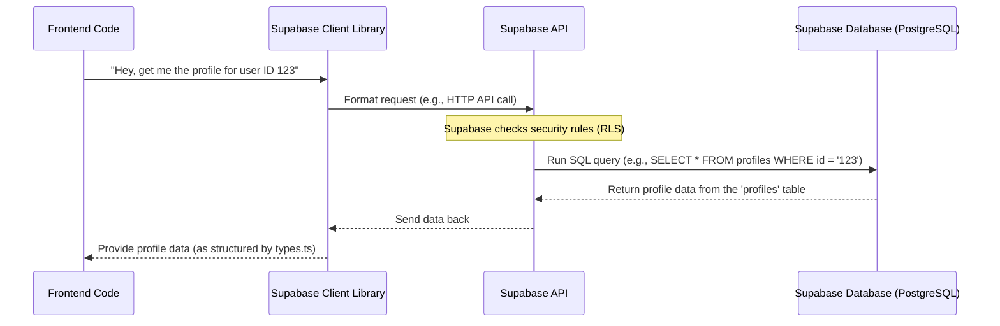

# Chapter 1: Supabase Integration

Welcome to the Focus Hub tutorial! In this first chapter, we're going to look at a fundamental part of our project: how we handle all the behind-the-scenes work like storing information, managing users, and handling files. Think of this as setting up the **server room** and **security system** for our application.

## What's the Problem Supabase Solves?

Building an application like Focus Hub involves more than just creating the buttons and screens you see. You also need a place to store data (like user posts, messages, files), manage user accounts (signing up, logging in), and handle things like profile pictures or shared documents. Building all of this from scratch is a big, complex job! You'd need to set up databases, write server code, secure everything, and maintain it constantly.

## Enter Supabase!

Supabase is what's known as a "Backend-as-a-Service" (BaaS). This means it provides all those necessary backend pieces for you, ready to go. Instead of building your own server room and security system from the ground up, Supabase gives you a pre-built one.

For the Focus Hub project, Supabase handles three main things:

1.  **Database:** This is where all our application's data lives. Posts, user profiles, chat messages, file information – it's all stored securely here, like files in a well-organized filing cabinet.
2.  **Authentication:** This manages users. It handles signing people up, logging them in, keeping their accounts secure, and making sure only authorized users can access certain data. Think of this as the security guard and key system for our server room.
3.  **File Storage:** This is where uploaded files (like profile pictures or shared documents) are stored. It's like a dedicated storage locker within our server room.

By using Supabase, we, as developers building the frontend (what the user sees and interacts with), can focus on making a great user experience without getting bogged down in complex backend infrastructure.

## How Focus Hub Connects to Supabase

Our application needs a way to "talk" to Supabase. We do this using a special library provided by Supabase, called the Supabase Client library.

You'll find the setup for connecting to Supabase in the `src/integrations/supabase/client.ts` file:

```typescript
// src/integrations/supabase/client.ts
import { createClient } from '@supabase/supabase-js';
import type { Database } from './types'; // We'll see this next

const SUPABASE_URL = "https://hfiltwodcwlqwxrwfjyp.supabase.co"; // This is your project's address
const SUPABASE_PUBLISHABLE_KEY = "eyJhbGciOiJIUzI1NiIsInR5cCI6IkpXVCJ9..."; // This key allows your app to talk to Supabase safely

export const supabase = createClient<Database>(SUPABASE_URL, SUPABASE_PUBLISHABLE_KEY);

// You can now use 'supabase' throughout your frontend to interact with your backend!
// e.g., supabase.from('profiles').select('*') to get user profiles
```

This small piece of code creates a `supabase` object. This object is our application's direct line to the Supabase backend. It knows the address (URL) of our specific Supabase project and has the special key needed to communicate.

## Understanding the Database Structure (A Peek)

Supabase uses a powerful type of database called PostgreSQL. The structure of our database (what tables exist, what information each table holds, how they relate to each other) is defined in the `supabase/migrations` folder. The `supabase/migrations/20250629133651_focus_hub.sql` file contains the full setup for Focus Hub.

Let's look at a tiny piece of that file, the definition for storing user profiles:

```sql
-- supabase/migrations/20250629133651_focus_hub.sql

-- ... other table definitions ...

-- 2. PROFILES (Enhanced version with all fields)
CREATE TABLE IF NOT EXISTS public.profiles (
  id UUID PRIMARY KEY REFERENCES auth.users(id) ON DELETE CASCADE,
  email TEXT NOT NULL,
  full_name TEXT,
  avatar_url TEXT,
  bio TEXT,
  location TEXT,
  website TEXT,
  settings JSONB,
  created_at TIMESTAMPTZ NOT NULL DEFAULT now(),
  updated_at TIMESTAMPTZ NOT NULL DEFAULT now()
);

-- ... more table definitions, functions, triggers, and security rules ...
```

This code tells Supabase to create a table named `profiles`. Each row in this table will represent a user's profile and store information like their name, email, avatar picture link, etc. The `id` links directly to the user's account created by Supabase Authentication.

## Keeping Our Code Informed: Database Types

Working with a database from our frontend code can sometimes be tricky because the code doesn't automatically know the exact structure of the tables and columns. This is where the `src/integrations/supabase/types.ts` file comes in handy.

This file is automatically generated by Supabase based on our database schema (like the SQL code we just saw). It provides TypeScript types that tell our frontend code the shape of the data it expects from Supabase. This helps prevent mistakes!

Here's a small snippet showing the generated type for the `profiles` table:

```typescript
// src/integrations/supabase/types.ts

export type Json = // ... definition for JSON type ...

export type Database = {
  public: {
    Tables: {
      // ... other table types ...
      profiles: {
        Row: { // This is the shape of data we get back from Supabase
          avatar_url: string | null
          bio: string | null
          created_at: string
          email: string
          full_name: string | null
          id: string
          location: string | null
          settings: Json | null
          updated_at: string
          website: string | null
          status: string | null
          last_seen: string | null
        }
        Insert: { /* ... type for inserting data ... */ }
        Update: { /* ... type for updating data ... */ }
        Relationships: [ /* ... how this table relates to others ... */ ]
      }
      // ... more table types ...
    }
    // ... Views, Functions, Enums types ...
  }
}

// ... helper types ...
```

This type definition (`Database`, and specifically `Database['public']['Tables']['profiles']['Row']`) allows our frontend code to understand exactly what properties (like `full_name`, `avatar_url`, etc.) a profile object should have and what type of data they hold (string, null, etc.). This makes writing code safer and easier.

## How a Request Works (Simplified)

Let's imagine the frontend needs to display a user's profile information. Here's a simple look at how that interaction works using Supabase:



In this diagram:
*   The **Frontend Code** is what you write to build the user interface.
*   The **Supabase Client Library** is the `supabase` object we created, acting as a translator.
*   The **Supabase API** is the public interface Supabase exposes, handling requests and applying security.
*   The **Supabase Database** is the actual PostgreSQL database where data is stored.

The client library simplifies making requests to the Supabase API, which then interacts with the database. This flow allows the frontend to retrieve, add, update, and delete data without needing direct database access (which is much safer!).

## Conclusion

In this chapter, we learned that Supabase is our project's powerful backend partner, providing a ready-made database, authentication, and file storage. We saw how our application connects to Supabase using a client library and got a brief look at how the database structure is defined and how its types are represented in our code.

Understanding how Supabase handles user accounts is crucial for building a secure application. In the next chapter, we'll dive deeper into Supabase's Authentication service and how we manage users in Focus Hub.

[Next Chapter: Authentication & User Management](02_authentication___user_management_.md)

---

<sub><sup>Generated by [AI Codebase Knowledge Builder](https://github.com/The-Pocket/Tutorial-Codebase-Knowledge).</sup></sub> <sub><sup>**References**: [[1]](https://github.com/HackyCoder0951/focus_hub/blob/e310dc085cf675c010a63c1dcc0eaef3442f8f9a/src/integrations/supabase/client.ts), [[2]](https://github.com/HackyCoder0951/focus_hub/blob/e310dc085cf675c010a63c1dcc0eaef3442f8f9a/src/integrations/supabase/types.ts), [[3]](https://github.com/HackyCoder0951/focus_hub/blob/e310dc085cf675c010a63c1dcc0eaef3442f8f9a/supabase/config.toml), [[4]](https://github.com/HackyCoder0951/focus_hub/blob/e310dc085cf675c010a63c1dcc0eaef3442f8f9a/supabase/migrations/20250629133651_focus_hub.sql)</sup></sub>