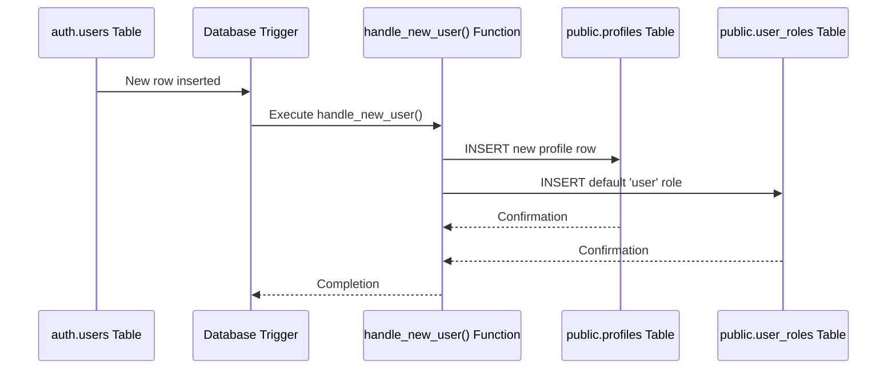
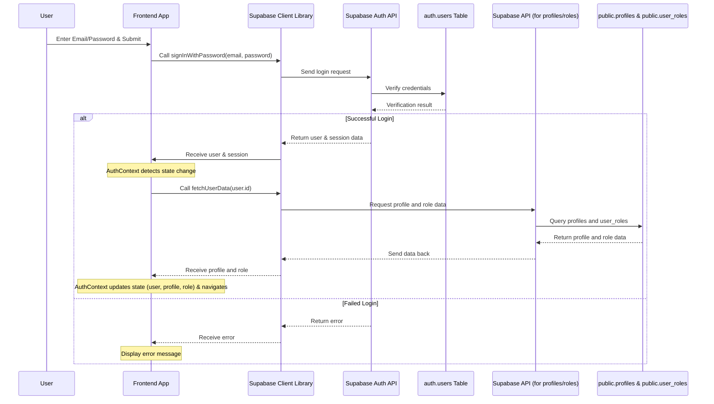

# Chapter 2: Authentication & User Management

Welcome back to the Focus Hub tutorial! In the [previous chapter](01_supabase_integration_.md), we got acquainted with Supabase as our project's backend partner, handling things like the database, file storage, and importantly, user authentication. We saw how our application connects to Supabase using the client library.

Now, let's dive deeper into the "security guard" part: **Authentication & User Management**.

## What Problem Are We Solving?

Imagine you're building a community platform like Focus Hub. People need to:

1.  **Sign up** to join the community (become a new member).
2.  **Sign in** to access their account and personal data (prove they are who they say they are).
3.  Stay signed in while they use the app (the system remembers them).
4.  Have their own unique profile and information (their name, picture, bio).
5.  Maybe have different permissions (like a regular "user" or a site "admin").

Handling all of this securely and reliably is complex. It involves managing passwords, protecting user data, verifying identities, and keeping track of who is currently logged in.

This is exactly what our **Authentication & User Management** abstraction, powered by Supabase Auth and some custom logic, helps us with. Think of it as the essential system that manages who gets through the front door and what they're allowed to do inside.

## Key Concepts

Supabase provides a ready-to-go Authentication service. This service handles the core aspects of user accounts:

*   **Signing Up:** Creating a new user account with email and password.
*   **Signing In:** Verifying a user's credentials and starting a session.
*   **Session Management:** Keeping track of logged-in users so they don't have to log in every time they open the app.
*   **Password Reset:** Helping users regain access if they forget their password.

While Supabase handles the *authentication* itself (the "proving who you are"), we also need **User Management**. This involves storing extra information about the user *after* they've authenticated, like their name, profile picture, bio, or their specific role in our application (user or admin).

In Focus Hub, we combine Supabase's built-in authentication (`auth.users` table) with our own custom tables in the public schema (`public.profiles` and `public.user_roles`) to achieve full user management.

*   `auth.users`: Managed by Supabase. Stores core authentication data (user ID, email, password hash, etc.). **You typically don't directly modify this table from the frontend.**
*   `public.profiles`: Our custom table storing public and private user profile data (name, avatar, bio, location, etc.). Each row is linked to an `auth.users` entry via the `id` which is a UUID.
*   `public.user_roles`: Our custom table storing the application role for each user (e.g., 'user', 'admin'). Also linked to `auth.users` via `user_id`.

## How Focus Hub Uses Authentication & User Management

Focus Hub uses Supabase Auth via the Supabase client library we set up in Chapter 1. We also wrap the Supabase Auth functionality in a React Context (`AuthContext.tsx`) to make it easy to access user information throughout our application.

Let's look at the core actions:

### 1. Signing Up (Register)

When a new user wants to join, they go to the Register page (`src/pages/Register.tsx`). They provide their name, email, and password.

Here's the simplified code snippet from `Register.tsx` that handles the signup:

```typescript
// src/pages/Register.tsx (simplified)
import { supabase } from "@/integrations/supabase/client";
import { useToast } from "@/hooks/use-toast"; // For showing messages

// ... inside the Register component ...

const handleSubmit = async (e) => {
  e.preventDefault();

  // ... get email, password, fullName, memberType from form state ...

  setIsLoading(true);

  // Call Supabase auth signup function
  const { error } = await supabase.auth.signUp({
    email: formData.email,
    password: formData.password,
    options: {
      emailRedirectTo: `${window.location.origin}/app`, // Where to redirect after email confirmation
      data: {
        full_name: formData.name,
        member_type: formData.memberType // Store initial profile data
      }
    }
  });

  if (error) {
    toast({ title: "Sign up failed", description: error.message, variant: "destructive" });
  } else {
    toast({ title: "Sign up successful!", description: "Please check your email to confirm your account." });
  }

  setIsLoading(false);
};
```

**Explanation:**

*   We use the `supabase.auth.signUp` function provided by the Supabase client library.
*   We pass the user's `email` and `password`.
*   The `options.data` field is special! Supabase allows you to pass initial data here which becomes available in the `auth.users` row's `raw_user_meta_data` column *before* the user is fully confirmed. This is useful for triggering server-side actions, like creating their profile.

### Behind the Scenes: Signup Flow

When `supabase.auth.signUp` is called, Supabase does a few things:

1.  It creates an entry in its internal `auth.users` table with the email, a hashed password, and the metadata you provided (name, member type).
2.  It sends a confirmation email to the user.
3.  Because we have a special **Trigger** set up in our database (defined in `supabase/migrations/...sql`), an action happens automatically when a new user is inserted into `auth.users`.

Let's visualize this automatic step:



**Explanation of the Trigger & Function:**

In our database schema (`supabase/migrations/...sql`), we have this:

```sql
-- supabase/migrations/...sql (simplified)

-- Function to handle new user signup
CREATE OR REPLACE FUNCTION public.handle_new_user()
RETURNS TRIGGER
LANGUAGE plpgsql
SECURITY DEFINER SET search_path = ''
AS $$
BEGIN
  -- Insert into profiles table using data from the new auth.users row
  INSERT INTO public.profiles (id, email, full_name)
  VALUES (
    new.id, -- Use the new user's ID from auth.users
    new.email,
    new.raw_user_meta_data ->> 'full_name' -- Get name from metadata
  );

  -- Assign default user role
  INSERT INTO public.user_roles (user_id, role)
  VALUES (new.id, 'user'); -- Assign 'user' role using the new user's ID

  RETURN new;
END;
$$;

-- Trigger to run the function AFTER inserting into auth.users
CREATE TRIGGER on_auth_user_created
  AFTER INSERT ON auth.users
  FOR EACH ROW EXECUTE FUNCTION public.handle_new_user();
```

This setup means that as soon as Supabase successfully creates an entry in `auth.users` for a new signup, our `handle_new_user` function runs. This function automatically creates the corresponding row in our `public.profiles` table (copying the user ID, email, and name) and adds a default entry in `public.user_roles` assigning them the 'user' role. This ensures every authenticated user in `auth.users` has a matching profile and role in our application-specific tables.

### 2. Signing In (Login)

Once a user has signed up and confirmed their email (if required), they can sign in via the Login page (`src/pages/Login.tsx`).

Here's the simplified code snippet for signing in:

```typescript
// src/pages/Login.tsx (simplified)
import { supabase } from "@/integrations/supabase/client";
import { useToast } from "@/hooks/use-toast"; // For showing messages

// ... inside the Login component ...

const handleSubmit = async (e) => {
  e.preventDefault();

  // ... get email, password from form state ...

  setIsLoading(true);

  // Call Supabase auth signin function
  const { error } = await supabase.auth.signInWithPassword({
    email: formData.email,
    password: formData.password,
  });

  if (error) {
    toast({ title: "Sign in failed", description: error.message, variant: "destructive" });
  } else {
    toast({ title: "Welcome back!", description: "You have been signed in successfully." });
    // Navigation is handled by AuthContext listener
  }

  setIsLoading(false);
};
```

**Explanation:**

*   We use `supabase.auth.signInWithPassword`.
*   Supabase verifies the email and password against its `auth.users` table.
*   If they match, Supabase creates a secure session for the user.

### Behind the Scenes: Login Flow



**Explanation:**

1.  The user submits the form on the `Login.tsx` page.
2.  The frontend calls `supabase.auth.signInWithPassword` via the `supabase` client object.
3.  The client library communicates with the Supabase Auth API.
4.  The Auth API checks the credentials against the `auth.users` table.
5.  If successful, the Auth API returns user information and a session token.
6.  The Supabase Client library receives this and updates its internal state. Crucially, it triggers an **authentication state change event**.
7.  Our `AuthContext` (explained next) listens for this event. When it detects a signed-in user, it *then* fetches the user's specific `profile` and `user_roles` data from our custom tables using the standard Supabase client data methods (as seen in Chapter 1).
8.  Once the profile and role are loaded, the `AuthContext` updates its state, making this information available throughout the app via the `useAuth` hook. This state change often triggers navigation to the main application area.

### 3. Managing the Session (`AuthContext.tsx`)

After logging in, users expect to stay logged in even if they close and reopen the browser (for a reasonable time). This is handled by **sessions**. A session is essentially a secure token that the browser stores, proving to the server that the user is still logged in without needing their password again.

Supabase Auth manages these sessions automatically. Our application uses a React Context (`src/contexts/AuthContext.tsx`) to keep track of the current user and session, making it easy for any part of the application to know if someone is logged in, who they are, and what their basic profile and role are.

Here's a simplified look at `AuthContext.tsx`:

```typescript
// src/contexts/AuthContext.tsx (simplified)
import React, { createContext, useContext, useEffect, useState } from 'react';
import { User, Session } from '@supabase/supabase-js';
import { supabase } from '@/integrations/supabase/client';

interface AuthContextType {
  user: User | null; // The basic Supabase user object
  session: Session | null; // The Supabase session object
  profile: any | null; // Our custom profile data
  userRole: string | null; // Our custom role data
  loading: boolean; // Is the context still loading user data?
  // ... signup, signin, signout functions ...
  isAdmin: boolean; // Helper flag
}

// ... createContext and useAuth hook ...

export const AuthProvider: React.FC<{ children: React.ReactNode }> = ({ children }) => {
  const [user, setUser] = useState<User | null>(null);
  const [session, setSession] = useState<Session | null>(null);
  const [profile, setProfile] = useState<any | null>(null);
  const [userRole, setUserRole] = useState<string | null>(null);
  const [loading, setLoading] = useState(true);

  // Effect to listen for auth state changes
  useEffect(() => {
    const { data: { subscription } } = supabase.auth.onAuthStateChange(
      async (event, session) => {
        setSession(session);
        setUser(session?.user ?? null);

        if (session?.user) {
          // If signed in, fetch profile and role
          await fetchUserData(session.user.id);
        } else {
          // If signed out, clear profile and role
          setProfile(null);
          setUserRole(null);
        }
        setLoading(false);
      }
    );

    // Also check for an existing session on mount
    supabase.auth.getSession().then(({ data: { session } }) => {
      setSession(session);
      setUser(session?.user ?? null);
      if (session?.user) {
        fetchUserData(session.user.id);
      }
      setLoading(false);
    });

    // Cleanup the subscription when the component unmounts
    return () => subscription.unsubscribe();
  }, []); // Empty dependency array means this runs once on mount

  // Function to fetch user profile and role
  const fetchUserData = async (userId: string) => {
    // Fetch profile from our 'profiles' table
    const { data: profileData } = await supabase
      .from('profiles')
      .select('*')
      .eq('id', userId)
      .single();
    setProfile(profileData);

    // Fetch role from our 'user_roles' table
    const { data: roleData } = await supabase
      .from('user_roles')
      .select('role')
      .eq('user_id', userId)
      .single();
    setUserRole(roleData?.role || 'user');
  };

  const isAdmin = userRole === 'admin';

  // ... signUp, signIn, signOut functions (wrapped calls to supabase.auth) ...

  const value = { user, session, profile, userRole, loading, signUp, signIn, signOut, isAdmin };

  return <AuthContext.Provider value={value}>{children}</AuthContext.Provider>;
};
```

**Explanation:**

*   The `AuthContext` stores the `user`, `session`, `profile`, and `userRole` state.
*   It uses `supabase.auth.onAuthStateChange` to subscribe to authentication events (like signing in, signing out, session refresh). When an event occurs, it updates the state.
*   When a user signs in or the app loads with an existing session, the `fetchUserData` function is called. This function queries our `public.profiles` and `public.user_roles` tables using the standard Supabase client (`supabase.from(...)`) to get the user's specific data and role.
*   The `useAuth` hook allows any component in the application (like the navigation bar or settings page) to easily access the current user (`user`), their profile details (`profile`), their role (`userRole`), and whether they are an admin (`isAdmin`).

### 4. Signing Out

Signing out is simple. It clears the user's session, effectively logging them out.

Here's the simplified code from `AuthContext.tsx` (used in `Settings.tsx` etc.):

```typescript
// src/contexts/AuthContext.tsx (simplified)
// ... inside AuthProvider ...

const signOut = async () => {
  try {
    const { error } = await supabase.auth.signOut();
    if (error) {
      toast({ title: "Sign out failed", description: error.message, variant: "destructive" });
    } else {
      toast({ title: "Signed out", description: "You have been signed out successfully." });
      // Navigation away from protected routes is handled by AuthContext listener
    }
  } catch (error: any) {
    toast({ title: "Sign out failed", description: error.message, variant: "destructive" });
  }
};
```

**Explanation:**

*   Calling `supabase.auth.signOut()` tells Supabase to invalidate the current user's session.
*   The `onAuthStateChange` listener in our `AuthContext` detects that the session is now `null` and clears the `user`, `profile`, and `userRole` states, effectively logging the user out within the application and potentially navigating them away from protected pages.

### 5. Using User/Profile/Role Data (e.g., Settings Page)

With the `AuthContext` providing the `user`, `profile`, and `isAdmin` status, frontend components can react accordingly.

For example, the `Settings.tsx` page needs to:
*   Show the current user's profile information.
*   Allow the user to update their profile.
*   Adjust available settings based on the user's role (e.g., hide admin-only settings).

Here's a snippet from `Settings.tsx` demonstrating this:

```typescript
// src/pages/Settings.tsx (simplified)
import { useAuth } from "@/contexts/AuthContext";
import { supabase } from "@/integrations/supabase/client";
// ... other imports ...

const Settings = () => {
  const { user, profile, isAdmin } = useAuth(); // Get user, profile, and role status
  const { toast } = useToast();

  const [profileData, setProfileData] = useState({ /* ... */ });

  // Load initial profile data when the profile becomes available
  useEffect(() => {
    if (profile) {
      setProfileData({
        name: profile.full_name || "",
        email: profile.email || user?.email || "",
        bio: profile.bio || "",
        website: profile.website || "",
        location: profile.location || ""
        // ... load other settings like notifications, privacy from profile.settings ...
      });
    }
  }, [profile, user]); // Re-run when profile or user changes

  const handleSaveProfile = async () => {
    if (!user) return; // Can only save if logged in
    const { error } = await supabase
      .from('profiles') // Update our custom profiles table
      .update({
        full_name: profileData.name,
        bio: profileData.bio,
        website: profileData.website,
        location: profileData.location,
        // ... save settings jsonb object ...
        settings: { /* ... current settings state ... */ }
      })
      .eq('id', user.id); // Only update the logged-in user's profile

    if (error) {
      toast({ title: 'Profile update failed', description: error.message, variant: 'destructive' });
    } else {
      toast({ title: 'Profile updated', description: 'Your profile has been updated.' });
    }
  };

  return (
    // ... JSX for the settings form ...
    <div>
        {/* Only show notifications/privacy tabs if not admin */}
        {!isAdmin && (
          <TabsTrigger value="notifications">Notifications</TabsTrigger>
        )}
        {!isAdmin && (
          <TabsTrigger value="privacy">Privacy</TabsTrigger>
        )}
        {/* ... rest of tabs */}
    </div>

    {/* ... form inputs pre-filled with profileData ... */}

    <Button onClick={handleSaveProfile}>Save Changes</Button>
    // ... rest of JSX ...
  );
};
```

**Explanation:**

*   `useAuth()` gives us easy access to the currently logged-in user's information (`user`, `profile`, `isAdmin`).
*   We use the `profile` data to initialize the form fields.
*   When the user clicks "Save Changes", we use `supabase.from('profiles').update(...)` to update the corresponding row in our `public.profiles` table.
*   The `.eq('id', user.id)` part is crucial! It ensures we *only* update the row where the `id` matches the logged-in user's ID. This is part of good security practice (though Row Level Security, covered in the next chapter, is the primary guard).
*   We use the `isAdmin` flag to conditionally show or hide parts of the UI (like certain settings tabs).

## Conclusion

In this chapter, we explored the core of **Authentication & User Management** in Focus Hub. We learned how Supabase Auth handles the complex process of signing users up, logging them in, and managing their sessions securely. We also saw how we integrate this with our own database tables (`public.profiles`, `public.user_roles`) to store application-specific user data and roles.

We built a simple `AuthContext` to provide the current user's state throughout the application, making it easy to personalize the user experience and control access based on whether a user is logged in and what their role is.

While Supabase handles *who* the user is, the next crucial step is controlling *what* authenticated users (and even non-users) are allowed to see and do with our data. In the next chapter, we'll dive into **Database Schema & RLS** ([Row Level Security](03_database_schema___rls_.md)), which acts as the fine-grained permission system for our database.

[Next Chapter: Database Schema & RLS](03_database_schema___rls_.md)

---

<sub><sup>Generated by [AI Codebase Knowledge Builder](https://github.com/The-Pocket/Tutorial-Codebase-Knowledge).</sup></sub> <sub><sup>**References**: [[1]](https://github.com/HackyCoder0951/focus_hub/blob/e310dc085cf675c010a63c1dcc0eaef3442f8f9a/src/contexts/AuthContext.tsx), [[2]](https://github.com/HackyCoder0951/focus_hub/blob/e310dc085cf675c010a63c1dcc0eaef3442f8f9a/src/pages/ForgotPassword.tsx), [[3]](https://github.com/HackyCoder0951/focus_hub/blob/e310dc085cf675c010a63c1dcc0eaef3442f8f9a/src/pages/Login.tsx), [[4]](https://github.com/HackyCoder0951/focus_hub/blob/e310dc085cf675c010a63c1dcc0eaef3442f8f9a/src/pages/Register.tsx), [[5]](https://github.com/HackyCoder0951/focus_hub/blob/e310dc085cf675c010a63c1dcc0eaef3442f8f9a/src/pages/Settings.tsx), [[6]](https://github.com/HackyCoder0951/focus_hub/blob/e310dc085cf675c010a63c1dcc0eaef3442f8f9a/supabase/migrations/20250629133651_focus_hub.sql)</sup></sub>