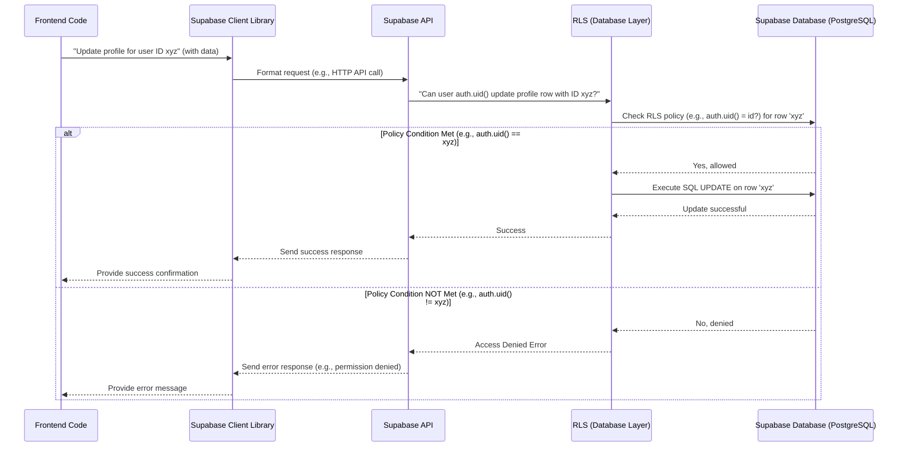

# Chapter 3: Database Schema & RLS

Welcome back to the Focus Hub tutorial! In the [previous chapter](02_authentication___user_management_.md), we learned how Supabase handles **Authentication & User Management**, giving users identities and allowing them to sign up and log in. We saw how we connect our authenticated users to their profile information stored in our database.

Knowing *who* the user is (authentication) is the first step in security. The next crucial step is controlling *what data* that user is allowed to see or change in the database. This is where **Database Schema** and **Row Level Security (RLS)** come in.

## What Problem Are We Solving?

Imagine our Focus Hub application has a database full of sensitive or personal information:

*   User profiles (`profiles` table)
*   Private chat messages (`chat_messages` table)
*   Files uploaded by users (`filemodels` table)
*   User roles (`user_roles` table)
*   Posts created by users (`posts` table)

If any user could just ask the database for *any* profile, *any* chat message, or *any* file, that would be a huge privacy and security problem!

We need a way to enforce rules like:

*   Users can only see their *own* profile information (but maybe everyone's name and avatar).
*   Users can only see messages in chats *they are a member of*.
*   Users can only update or delete files *they uploaded*.
*   Users can create new posts, but only update/delete *their own* posts.
*   Only 'admin' users can see or change other users' roles.

We could try to write checks for all these rules in our application code *before* we ask the database for data or send data to be saved. But this gets complicated quickly and isn't very secure – if someone bypassed our app code (e.g., using a different tool to connect to the database), all the data would be exposed.

This is where **Database Schema & RLS** provide a powerful solution.

## Key Concepts

### 1. Database Schema (The Blueprint)

Think of the database schema like the **blueprint** for a building. It shows:

*   What rooms (tables) exist.
*   What each room contains (columns/fields).
*   How rooms are connected (relationships between tables).

In our Focus Hub project, our database schema is defined in SQL files located in the `supabase/migrations` folder. These files tell Supabase exactly how to set up the PostgreSQL database.

For example, the main schema file (`supabase/migrations/20250629133651_focus_hub.sql`) defines tables like `profiles`, `posts`, `chat_messages`, etc.

Here's a simplified look at the `posts` table definition from that file:

```sql
-- supabase/migrations/20250629133651_focus_hub.sql

-- 4. POSTS
CREATE TABLE IF NOT EXISTS public.posts (
  id UUID PRIMARY KEY DEFAULT gen_random_uuid(),
  user_id UUID REFERENCES public.profiles(id) ON DELETE CASCADE, -- Links post to a user's profile
  content TEXT NOT NULL,
  media_url TEXT,
  created_at TIMESTAMPTZ NOT NULL DEFAULT now(),
  updated_at TIMESTAMPTZ NOT NULL DEFAULT now(),
  is_deleted BOOLEAN NOT NULL DEFAULT FALSE
);
```

This tells the database to create a table called `posts` with columns for `id`, `user_id`, `content`, etc. The `REFERENCES public.profiles(id)` part shows a relationship: each post is linked to a specific user's profile via the `user_id`.

Remember from [Chapter 1](01_supabase_integration_.md), Supabase uses this schema to automatically generate TypeScript types (`src/integrations/supabase/types.ts`), helping our frontend code understand the structure of the data it's working with.

### 2. Row Level Security (RLS) (The Smart Locks)

While the schema defines the structure, **Row Level Security (RLS)** defines the **access rules** directly on the tables themselves. It's like putting **smart locks** on every row (each individual post, each individual profile, each individual message) in your database tables.

When your application (or *anything* connecting to the database) tries to read, insert, update, or delete data, Supabase checks the RLS policies defined for that specific table and that specific action (SELECT, INSERT, UPDATE, DELETE).

*   If the RLS policy allows the action for that user and that row, the database proceeds.
*   If the RLS policy *denies* the action, the database simply prevents it from happening, often returning an empty result or an error, without exposing data the user shouldn't see.

This is a fundamental security feature because the rules are enforced by the database itself, not just by your application code.

## How Focus Hub Uses Database Schema & RLS

Focus Hub heavily relies on RLS to manage data access securely. Almost every table in our `public` schema has RLS enabled with specific policies.

Let's look at a common use case: A logged-in user viewing posts.

### Use Case: Viewing Posts

When a user is on the social feed, the application needs to fetch posts to display.

The frontend code uses the Supabase client like this:

```typescript
// Simplified example of fetching posts
import { supabase } from "@/integrations/supabase/client";

async function fetchPosts() {
  const { data, error } = await supabase
    .from('posts') // Select from the 'posts' table
    .select('*'); // Get all columns

  if (error) {
    console.error('Error fetching posts:', error.message);
    return [];
  }
  console.log('Fetched posts:', data);
  return data;
}
```

This code looks simple. It just asks for "all posts". But how does the database know if the user is allowed to see them? RLS!

Behind the scenes, when this request reaches Supabase, it checks the RLS policies defined for the `posts` table.

Let's look at the relevant RLS policy for `posts` from the migration file (`supabase/migrations/20250629133651_focus_hub.sql`):

```sql
-- supabase/migrations/20250629133651_focus_hub.sql

-- POSTS
ALTER TABLE public.posts ENABLE ROW LEVEL SECURITY; -- Enable RLS on the table

-- Policy allowing users to view posts
CREATE POLICY "Users can view posts" ON public.posts
FOR SELECT -- This policy applies to read (SELECT) operations
USING (true); -- The rule is "true" - always allowed for SELECT once RLS is enabled

-- ... other policies for INSERT, UPDATE, DELETE ...
```

**Explanation:**

1.  `ALTER TABLE public.posts ENABLE ROW LEVEL SECURITY;`: This line is crucial. By default, RLS is OFF. Enabling it means *no one* can access the table unless a policy explicitly allows it.
2.  `CREATE POLICY "Users can view posts" ON public.posts FOR SELECT USING (true);`: This creates a policy named "Users can view posts" on the `posts` table.
    *   `FOR SELECT`: This policy specifically applies when someone tries to *read* data (`SELECT`).
    *   `USING (true)`: This is the condition. It simply evaluates to `true`. Since the user making the request is authenticated (Supabase knows `auth.uid()` and `auth.role()` because they logged in), this condition is met for *all* rows. Therefore, the database allows the user to `SELECT` *all* posts.

This simple `USING (true)` policy makes the `posts` table effectively public for reading by *authenticated* users, while RLS is still enabled to protect against other operations (INSERT, UPDATE, DELETE) or different user roles (though in this specific `SELECT` policy, it allows anyone).

### Use Case: Updating Your Own Profile

Now, consider updating your profile information on the Settings page.

The frontend code might look like this:

```typescript
// Simplified example of updating profile
import { supabase } from "@/integrations/supabase/client";
import { useAuth } from "@/contexts/AuthContext"; // Get current user info

async function updateMyProfile(newProfileData) {
  const { user } = useAuth(); // Get the logged-in user

  if (!user) {
    console.error("User not logged in!");
    return; // Cannot update if not logged in
  }

  const { data, error } = await supabase
    .from('profiles') // Target the 'profiles' table
    .update(newProfileData) // The data to update with
    .eq('id', user.id); // IMPORTANT: Only update the row where ID matches logged-in user's ID

  if (error) {
    console.error('Error updating profile:', error.message);
  } else {
    console.log('Profile updated successfully');
  }
}
```

Even though our frontend code correctly uses `.eq('id', user.id)` to specify *which* row to update, the database needs its own security check. This is where RLS is crucial, preventing a malicious user from changing `user.id` in their request to try and update *someone else's* profile.

Let's look at the RLS policy for updating profiles:

```sql
-- supabase/migrations/20250629133651_focus_hub.sql

-- PROFILES
ALTER TABLE public.profiles ENABLE ROW LEVEL SECURITY; -- RLS enabled

-- Policy allowing users to update their own profile
CREATE POLICY "Users can update their own profile" ON public.profiles
FOR UPDATE -- Applies to update operations
USING (auth.uid() = id); -- The rule checks if the logged-in user's ID (auth.uid())
                         -- matches the 'id' column of the row they are trying to update.

-- ... other policies ...
```

**Explanation:**

*   `FOR UPDATE`: This policy applies when someone tries to *change* data (`UPDATE`).
*   `USING (auth.uid() = id)`: This is the condition checked *for each row* being updated. `auth.uid()` is a special Supabase function that returns the ID of the currently authenticated user (from the `auth.users` table). `id` refers to the `id` column of the row in the `profiles` table. This policy *only* allows an update if the logged-in user's ID matches the ID of the profile row they are attempting to update.

So, even if the frontend *tried* to update a different user's profile ID, the RLS policy would check `auth.uid() = id` for that row, find that `auth.uid()` (the logged-in user's ID) does *not* match the `id` of the target profile row, and the database would reject the update.

### The Flow with RLS

Here's a simplified diagram showing how RLS fits into the request flow:



Notice that the RLS check happens *within* the database layer, *after* the request reaches Supabase but *before* the actual database operation (UPDATE, DELETE, SELECT) is executed on the row(s). This is why RLS is so powerful for security.

### Other RLS Examples in Focus Hub

You'll find RLS policies throughout the migration files for different tables and different operations (SELECT, INSERT, UPDATE, DELETE). Here are a few examples of policy conditions you might see:

*   `USING (auth.uid() = user_id)`: User can only affect rows where the `user_id` column matches their authenticated ID (common for profiles, posts, files, messages).
*   `USING (true)`: Anyone (who passes any initial RLS check like being authenticated) can affect this row (e.g., viewing public posts).
*   `USING (auth.uid() = follower_id)` / `WITH CHECK (auth.uid() = follower_id)`: User can only insert/delete follows where *they* are the `follower_id`.
*   `USING (chat_id IN (SELECT chat_id FROM chat_members WHERE user_id = auth.uid()))`: User can only see messages in chats they are a member of.
*   `USING (public.has_role(auth.uid(), 'admin'))`: Only users with the 'admin' role can affect these rows. `public.has_role` is a custom SQL function we defined, referenced by the RLS policy.

You can explore the `supabase/migrations/...sql` files to see all the policies defined for each table. Pay attention to `ALTER TABLE ... ENABLE ROW LEVEL SECURITY;` at the start of each table's policies and the `FOR SELECT`, `FOR INSERT`, `FOR UPDATE`, `FOR DELETE` clauses on the `CREATE POLICY` statements, along with their `USING` and `WITH CHECK` conditions.

**Quick difference between `USING` and `WITH CHECK`:**

*   `USING`: Determines which *existing* rows a user is allowed to access (for SELECT) or affect (for UPDATE/DELETE).
*   `WITH CHECK`: Determines if a *new* row being inserted or an *updated* row meets certain criteria before being written to the database (for INSERT/UPDATE). The condition checks the *new* data. Often, for security, `WITH CHECK` is similar to `USING` (e.g., ensuring the `user_id` being inserted/updated belongs to the user performing the action).

## Conclusion

In this chapter, we learned about **Database Schema** as the blueprint defining our data structure and **Row Level Security (RLS)** as the critical security layer enforced at the database level. We saw how RLS policies act as smart locks on our data, ensuring users can only access or modify information according to predefined rules, based on their authenticated identity (`auth.uid()`) or role (`auth.role()`).

Understanding how schema and RLS work together in Supabase is fundamental to building a secure application. By enabling RLS and writing careful policies, we offload much of the data access control logic from our application code directly into the database, making our application more robust and easier to maintain.

Now that we understand how our data is structured and secured, let's explore how we can get real-time updates from the database. In the next chapter, we'll dive into **Real-time Data Synchronization**.

[Next Chapter: Real-time Data Synchronization](04_real_time_data_synchronization_.md)

---

<sub><sup>Generated by [AI Codebase Knowledge Builder](https://github.com/The-Pocket/Tutorial-Codebase-Knowledge).</sup></sub> <sub><sup>**References**: [[1]](https://github.com/HackyCoder0951/focus_hub/blob/e310dc085cf675c010a63c1dcc0eaef3442f8f9a/src/integrations/supabase/types.ts), [[2]](https://github.com/HackyCoder0951/focus_hub/blob/e310dc085cf675c010a63c1dcc0eaef3442f8f9a/supabase/migrations/20250629133651_focus_hub.sql), [[3]](https://github.com/HackyCoder0951/focus_hub/blob/e310dc085cf675c010a63c1dcc0eaef3442f8f9a/supabase/migrations/20250630024042_storage_and_file_policies.sql), [[4]](https://github.com/HackyCoder0951/focus_hub/blob/e310dc085cf675c010a63c1dcc0eaef3442f8f9a/supabase/migrations/20250701001000_posts_rls_authenticated.sql), [[5]](https://github.com/HackyCoder0951/focus_hub/blob/e310dc085cf675c010a63c1dcc0eaef3442f8f9a/supabase/migrations/20250702000000_qa_module_schema.sql)</sup></sub>