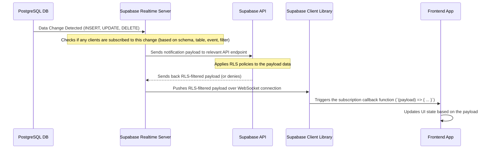

# Chapter 4: Real-time Data Synchronization

Welcome back to the Focus Hub tutorial! In the [previous chapter](03_database_schema___rls_.md), we delved into how our data is structured using the **Database Schema** and, crucially, how it's secured using **Row Level Security (RLS)** directly within the database. We now know *what* data exists and *who* is allowed to access or modify it.

But what happens when the data *does* change? If someone posts a new message in a chat you're viewing, or adds a comment to a post you're looking at, do you have to manually refresh the page to see it? That would feel slow and clunky in a modern application!

## What Problem Are We Solving?

Building an application that feels **live and responsive** means showing users updates as they happen.

Imagine you're using Focus Hub's chat feature. If your friend sends you a message, you want to see it pop up instantly, without clicking a "Refresh" button. Similarly, on the social feed, if a new post appears or someone likes an existing post, you want your view to update automatically.

This instant updating is **Real-time Data Synchronization**. It makes the application feel like it's "connected live" to what's happening on the server, pushing changes to you the moment they occur. Without it, the application feels static, like reading an old newspaper instead of watching a live news broadcast.

This is exactly what **Supabase's real-time subscriptions** help us achieve in Focus Hub.

## Key Concept: Subscriptions

Traditional web applications often work by the frontend *asking* the server for data whenever it needs it (a process called **polling**). This is like you constantly asking, "Is there any new mail yet? How about now? Now?".

Real-time synchronization, using subscriptions, is different. It's like telling the post office, "Deliver any new mail for me *immediately* when it arrives." You open a connection once, and the server sends data to you automatically when there's an update relevant to what you're interested in.

Supabase's real-time feature uses a technology called **WebSockets** to keep a persistent connection open between your application's frontend and the Supabase server. When data changes in your database tables that you've subscribed to, Supabase sends a notification down that connection, pushing the updated data to your application instantly.

## How Focus Hub Uses Real-time Subscriptions

In Focus Hub, we use real-time subscriptions primarily in modules where instant updates are critical, like the **Chat** and **Social Feed**.

Let's look at the Chat page (`src/pages/Chat.tsx`) as a concrete example. When you have a chat open, you need to see new messages appear as they are sent by others.

### Use Case: Receiving New Chat Messages in Real-time

When you open a specific chat conversation in Focus Hub:

1.  The application first fetches the existing messages (as we saw how to fetch data using `supabase.from()` in [Chapter 1](01_supabase_integration_.md)).
2.  Then, the application sets up a **real-time subscription** to listen for *new* messages in that specific chat.
3.  When another user sends a message to that same chat (which inserts a new row into the `chat_messages` table), Supabase detects the change.
4.  Because your application is subscribed to changes on `chat_messages` for that chat, Supabase pushes the new message data to your browser over the open connection.
5.  Your application receives the new message and adds it to the list of messages displayed on the screen, all without you doing anything!

Let's see how this looks in the `src/pages/Chat.tsx` code:

```typescript
// src/pages/Chat.tsx (simplified snippet)
import { useEffect, useState, useRef } from "react";
import { supabase } from "@/integrations/supabase/client";
import { useAuth } from "@/contexts/AuthContext";

// ... other imports and component setup ...

const Chat = () => {
  const { user } = useAuth();
  const [chats, setChats] = useState<Chat[]>([]); // State for the chat list sidebar
  const [selectedChat, setSelectedChat] = useState<string | null>(null); // State for the currently open chat ID
  const [messages, setMessages] = useState<ChatMessage[]>([]); // State for messages in the selected chat

  // ... other state variables ...

  // Effect to fetch initial messages AND set up subscription
  useEffect(() => {
    if (!selectedChat) return; // Only run if a chat is selected

    // Function to fetch initial messages
    const fetchMessages = async () => {
      // ... (code to fetch messages using supabase.from('chat_messages').select().eq('chat_id', selectedChat) ...)
      // This fetches existing messages when chat is opened
      // setMessages(data || []);
    };

    fetchMessages(); // Fetch initial messages

    // --- Real-time Subscription Setup ---
    const channel = supabase
      .channel('chat_messages_channel') // Give your channel a unique name
      .on(
        'postgres_changes', // We are listening for changes in the database (Postgres)
        {
          event: 'INSERT',    // Specifically listen for NEW rows being INSERTED
          schema: 'public',   // In the 'public' schema
          table: 'chat_messages', // On the 'chat_messages' table
          filter: `chat_id=eq.${selectedChat}` // IMPORTANT: Only listen for changes where chat_id matches the selected chat
        },
        (payload) => { // This function runs when a matching change occurs
          console.log('New message received:', payload);
          const newMessage = payload.new as ChatMessage; // 'payload.new' contains the inserted row data

          // Add the new message to our messages state
          setMessages(prev => [...prev, newMessage]);
        }
      )
      .subscribe(); // Start listening!

    // --- Cleanup ---
    // Return a function to unsubscribe when the component unmounts or selectedChat changes
    return () => {
      supabase.removeChannel(channel);
      console.log('Unsubscribed from chat_messages_channel.');
    };

  }, [selectedChat, user]); // Re-run this effect if selectedChat or user changes

  // ... handleSendMessage function etc. ...

  // ... JSX rendering chats and messages ...
};
```

**Explanation of the Real-time part:**

1.  **`useEffect(() => { ... }, [selectedChat, user]);`**: This React hook runs whenever the `selectedChat` ID or the `user` object changes. This ensures that when you switch to a different chat, the old subscription is cleaned up, and a *new* subscription is set up for the newly selected chat.
2.  **`supabase.channel('chat_messages_channel')`**: This creates or gets a reference to a "real-time channel". Channels help organize subscriptions. You can give them arbitrary names.
3.  **`.on('postgres_changes', { ... }, (payload) => { ... })`**: This is where you tell the channel *what* changes you want to listen for.
    *   `'postgres_changes'`: Specifies that we are interested in database changes.
    *   The object `{ event: 'INSERT', schema: 'public', table: 'chat_messages', filter: \`chat_id=eq.${selectedChat}\` }`: This is the core filter. We want `INSERT` events on the `chat_messages` table in the `public` schema, but *only* for rows where the `chat_id` column is equal (`eq`) to the `selectedChat` ID. This ensures we only get messages for the chat the user is currently viewing.
    *   `(payload) => { ... }`: This is the callback function that executes whenever a change matching the criteria occurs.
4.  **`(payload) => { ... }` body**:
    *   The `payload` object contains details about the change. For an `INSERT` event, `payload.new` holds the data of the newly inserted row (the new message!).
    *   `setMessages(prev => [...prev, newMessage]);`: This updates the local React state (`messages`) by taking the previous list of messages (`prev`) and adding the `newMessage` to the end. React then automatically re-renders the UI to show the new message.
5.  **`.subscribe()`**: This crucial call starts the real-time connection and begins listening for changes.
6.  **`return () => { supabase.removeChannel(channel); }`**: This is the cleanup function for the `useEffect`. When the `selectedChat` changes or the component unmounts, this function is called to properly close the real-time connection and stop listening. This prevents memory leaks and unnecessary connections.

### Real-time in the Social Feed (`src/pages/Feed.tsx`)

The Social Feed also uses real-time to update posts and like counts without refreshing.

```typescript
// src/pages/Feed.tsx (simplified snippet)
import { useEffect, useState } from "react";
import { supabase } from "@/integrations/supabase/client";

// ... other imports and component setup ...

const Feed = () => {
  const [posts, setPosts] = useState<any[]>([]); // State for the list of posts

  // Function to fetch posts (includes profile data and like counts)
  const fetchPosts = async () => {
    // ... (code to fetch posts with joined profiles and like counts)
    // setPosts(transformedData);
  };

  useEffect(() => {
    fetchPosts(); // Fetch initial posts on mount

    // --- Real-time Subscriptions ---
    const postsSubscription = supabase
      .channel('posts_changes') // Channel for post and like changes
      .on(
        'postgres_changes',
        {
          event: '*',          // Listen for ANY event (INSERT, UPDATE, DELETE)
          schema: 'public',
          table: 'posts',
          filter: 'is_deleted=eq.false' // Only listen for changes to non-deleted posts
        },
        (payload) => {
          console.log('Post change:', payload);
          fetchPosts(); // Refresh the entire post list on any post change
          // Note: A more complex app might update state more granularly
        }
      )
      .on(
        'postgres_changes',
        {
          event: '*',         // Listen for ANY event
          schema: 'public',
          table: 'likes'      // On the 'likes' table
        },
        (payload) => {
          console.log('Like change:', payload);
          const postId = (payload.new as any)?.post_id || (payload.old as any)?.post_id;
          if (!postId) return;

          // Fetch the latest like count for *only* the affected post
          supabase
            .from('likes')
            .select('*', { count: 'exact', head: true }) // Get count directly from DB
            .eq('post_id', postId)
            .then(({ count }) => {
              // Update the specific post's like count in state
              setPosts((prevPosts) =>
                prevPosts.map((post) =>
                  post.id === postId ? { ...post, likes_count: count || 0 } : post
                )
              );
            });
        }
      )
      .subscribe(); // Start listening!

    // --- Cleanup ---
    return () => {
      supabase.removeChannel(postsSubscription);
    };

  }, []); // Empty dependency array: runs once on mount, cleans up on unmount

  // ... JSX rendering posts ...
};
```

**Explanation:**

*   The `posts` subscription listens for `*` events on the `posts` table. When *any* change (insert, update, delete) occurs on a non-deleted post, it triggers `fetchPosts()`, which refetches the whole list of posts. This is a simpler approach than trying to update the list item by item based on the payload.
*   The `likes` subscription listens for `*` events on the `likes` table. When a like is added or removed, we get the `post_id` from the `payload`. Instead of refetching all posts, we perform a quick query to get the *exact* current count of likes for *just* that post and then update only that specific post object within our `posts` state. This is more efficient.
*   Both subscriptions use `useEffect` with an empty dependency array `[]`, meaning they are set up once when the `Feed` component mounts and cleaned up when it unmounts.

### Under the Hood: The Real-time Flow

When a change happens in the database that you are subscribed to, here's a simplified look at the path the data takes:



**Key Points:**

*   The change originates in the **PostgreSQL Database**.
*   The **Supabase Realtime Server** monitors the database's internal replication logs to detect changes.
*   It matches changes against active subscriptions.
*   The data for the change passes through the **Supabase API** layer, which is crucial because this is where your **RLS policies** are applied. Supabase ensures that the data in the real-time payload respects the same RLS rules as regular REST API requests. A user will only receive real-time data they are permitted to see according to RLS!
*   The RLS-filtered payload is then pushed to the subscribed **Supabase Client Library** in the user's browser.
*   Finally, the client library executes the callback function you defined in your `on()` method, allowing your **Frontend App** to update the UI.

## Important Considerations

*   **Cleanup:** Always use the `return () => { supabase.removeChannel(channel); }` pattern in your `useEffect` hooks to unsubscribe when components unmount. Failing to do this can cause performance issues and unexpected behavior.
*   **RLS Still Applies:** Supabase's real-time feature respects your RLS policies. If a user is not allowed to see or interact with a row according to your RLS rules ([Chapter 3](03_database_schema___rls_.md)), they will *not* receive real-time updates for that row, even if they are technically subscribed to the table. This is a critical security feature.
*   **Filtering:** You can filter which real-time events you receive using the `filter` option in the `.on()` method, as seen with `chat_id=eq.${selectedChat}`. This is more efficient than receiving all changes on a large table and filtering them yourself in the frontend.
*   **Performance:** For tables with very high write volume, receiving *all* changes might become overwhelming for the frontend. Consider if you truly need real-time updates for every table or every event type (`*`) or if polling is sufficient for less critical data.

## Conclusion

In this chapter, we explored the concept of **Real-time Data Synchronization** and how Focus Hub implements it using Supabase's powerful real-time subscriptions. We learned that by subscribing to changes in database tables, our application can receive instant updates, making the user experience dynamic and responsive, just like a live feed. We saw examples in the Chat and Social Feed modules and understood the flow of data from the database to the frontend, with RLS ensuring security.

Now that we've covered the core backend (Supabase integration, Auth, Schema, RLS, Real-time), it's time to look at how these pieces fit into the overall structure of the frontend application itself. In the next chapter, we'll dive into the **Frontend Application Structure**.

[Next Chapter: Frontend Application Structure](05_frontend_application_structure_.md)

---

<sub><sup>Generated by [AI Codebase Knowledge Builder](https://github.com/The-Pocket/Tutorial-Codebase-Knowledge).</sup></sub> <sub><sup>**References**: [[1]](https://github.com/HackyCoder0951/focus_hub/blob/e310dc085cf675c010a63c1dcc0eaef3442f8f9a/src/integrations/supabase/client.ts), [[2]](https://github.com/HackyCoder0951/focus_hub/blob/e310dc085cf675c010a63c1dcc0eaef3442f8f9a/src/pages/Chat.tsx), [[3]](https://github.com/HackyCoder0951/focus_hub/blob/e310dc085cf675c010a63c1dcc0eaef3442f8f9a/src/pages/Feed.tsx), [[4]](https://github.com/HackyCoder0951/focus_hub/blob/e310dc085cf675c010a63c1dcc0eaef3442f8f9a/supabase/migrations/20250629133651_focus_hub.sql)</sup></sub>