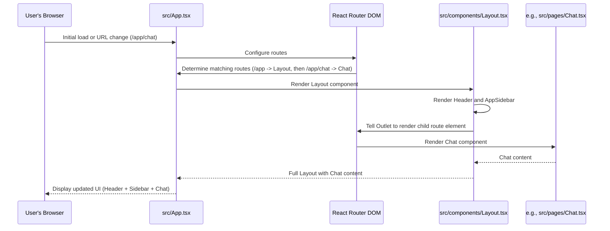

# Chapter 5: Frontend Application Structure

Welcome back to the Focus Hub tutorial! In our journey so far, we've set up our backend with Supabase, learned how to handle user accounts ([Chapter 2: Authentication & User Management](02_authentication___user_management_.md)), structured and secured our data with Database Schema and RLS ([Chapter 3: Database Schema & RLS](03_database_schema___rls_.md)), and even made our app feel alive with Real-time Data Synchronization ([Chapter 4: Real-time Data Synchronization](04_real_time_data_synchronization_.md)).

Now that we have a solid foundation for handling data and users, it's time to think about the part everyone actually sees and interacts with: the **Frontend Application Structure**.

## What Problem Are We Solving?

When you use an application like Focus Hub, you don't just see one screen. You see a social feed, a chat page, a profile page, settings, etc. You navigate between these different views.

How do we organize all these different screens and make it easy for users to move between them?

*   We need a way to show different **pages** (like the Feed page, the Chat page) depending on what the user wants to do.
*   We need to display consistent elements, like a **header** at the top and a **sidebar** on the side, no matter which page the user is currently viewing within the main application area.
*   We want moving between pages to feel fast and smooth, without the entire website reloading every time you click a link.

This is where our **Frontend Application Structure** comes in. It defines how our user interface is organized, how different "pages" are displayed, and how navigation works.

## Key Concepts

Our frontend structure relies on a few core ideas:

1.  **React Components:** Think of these as reusable building blocks for our user interface. A button is a component, a user profile card is a component, an entire page like the "Settings" view is a component made up of smaller components.
2.  **Pages:** In the context of our structure, a "page" is typically a main component that represents a full screen or view within the application (e.g., `Feed.tsx`, `Chat.tsx`, `Profile.tsx`).
3.  **React Router DOM:** This is a popular library for React that helps manage **navigation**. Instead of traditional website navigation where clicking a link requests a *new* HTML page from the server, React Router handles it within the browser. It updates the URL in the address bar but then swaps out only the necessary components on the page, making transitions feel instantaneous.
4.  **Layout Component:** Many pages in our application share common elements like the header bar at the top and the sidebar on the left. A `Layout` component acts like a container or "shell". It renders these common elements and then has a special spot where it shows the content of the *currently active* page.

## Use Case: Navigating the Application

Let's walk through a simple example: A user is on the **Feed** page and clicks "Chat" in the sidebar navigation. We want the view to change to show the Chat interface, but the Header and Sidebar should remain visible in their positions.

Here's a simplified look at how the structure handles this:

1.  The user clicks a navigation link (like "Chat") in the Sidebar.
2.  This link is specifically set up to work with **React Router**.
3.  React Router intercepts the click. It sees the link points to `/app/chat`.
4.  React Router looks at its configuration (defined in `App.tsx`) and finds the component associated with the path `/app/chat`, which is our `Chat.tsx` page component.
5.  Because `/app/chat` is a route nested *inside* the `/app` route, React Router knows it should render the `Chat` component *within* the `Layout` component.
6.  The `Layout` component stays on the screen (Header and Sidebar visible), and React Router replaces the old content (the Feed component) with the new content (the Chat component) in the Layout's designated area.

This process gives the user the feeling of seamlessly moving between different sections of the app without a full page reload.

## How Focus Hub Uses React Router and the Layout

Let's look at the key files that set up this structure:

### 1. The Main Application File (`src/App.tsx`)

This is the entry point that sets up the fundamental structure and routing.

```typescript
// src/App.tsx (simplified)
import { BrowserRouter, Routes, Route } from "react-router-dom";
import { AuthProvider } from "@/contexts/AuthContext";
import { ProtectedRoute } from "@/components/ProtectedRoute";
import Index from "./pages/Index";
import Login from "./pages/Login";
import Register from "./pages/Register";
// ... other imports for pages ...
import Layout from "./components/Layout";
import Feed from "./pages/Feed"; // Import a page component
import Chat from "./pages/Chat"; // Import another page component

const App = () => (
  // ... ThemeProvider, TooltipProvider, QueryClientProvider ...
  <BrowserRouter>
    <AuthProvider> {/* Auth context wraps everything needing user info */}
      <Routes> {/* Contains all possible routes */}
        {/* Public Routes (accessible without login) */}
        <Route path="/" element={<Index />} />
        <Route path="/login" element={<Login />} />
        <Route path="/register" element={<Register />} />
        {/* ... other public routes ... */}

        {/* Protected Routes (require login) */}
        <Route path="/app" element={ /* This is the main app route */
          <ProtectedRoute> {/* Check if user is logged in (from Chapter 2) */}
            <Layout /> {/* If logged in, render the Layout component */}
          </ProtectedRoute>
        }>
          {/* Routes NESTED within /app will render INSIDE the Layout */}
          <Route index element={<AppRedirect />} /> {/* Default route for /app */}
          <Route path="feed" element={<Feed />} /> {/* Renders Feed at /app/feed */}
          <Route path="chat" element={<Chat />} /> {/* Renders Chat at /app/chat */}
          <Route path="profile" element={<Profile />} /> {/* Renders Profile at /app/profile */}
          {/* ... other protected page routes ... */}
        </Route>

        {/* Fallback route for pages not found */}
        <Route path="*" element={<NotFound />} />
      </Routes>
    </AuthProvider>
  </BrowserRouter>
  // ... closing tags ...
);

export default App;
```

**Explanation:**

*   `BrowserRouter`: This component wraps the entire application and enables React Router's navigation features using standard browser URLs.
*   `Routes`: This component holds all the individual route definitions. React Router looks inside `Routes` to find the best match for the current URL.
*   `Route`: Each `Route` defines a path (`path="/app"`, `path="feed"`) and the component to render (`element={<Layout />}`).
*   **Nested Routes:** Notice how the `<Route path="/app" ...>` acts as a parent. The routes defined *inside* it (`<Route path="feed" ... />`, `<Route path="chat" ... />`) are nested routes. When the URL matches a nested path (like `/app/chat`), the component for the parent route (`Layout`) is rendered, and the component for the nested route (`Chat`) is rendered *inside* it.
*   **`ProtectedRoute`:** This is a component we use (leveraging our `AuthContext` from Chapter 2) to ensure that routes inside it (`/app` and its children) can only be accessed by logged-in users. If a user tries to go to `/app/chat` but isn't logged in, `ProtectedRoute` will redirect them to the login page.

### 2. The Layout Component (`src/components/Layout.tsx`)

This component provides the consistent "shell" for the main application area.

```typescript
// src/components/Layout.tsx (simplified)
import { Outlet } from "react-router-dom";
import { AppSidebar } from "./AppSidebar"; // Our sidebar component
import Header from "./Header"; // Our header component
// ... other imports ...

const Layout = () => {
  // ... state for search, etc. ...

  return (
    <div className="min-h-screen flex w-full">
      {/* The Sidebar is always rendered */}
      <AppSidebar />

      {/* This section contains the header and the main content area */}
      {/* SidebarInset is a helper component for spacing based on the sidebar */}
      <SidebarInset>
        {/* The Header is always rendered */}
        <Header search={search} setSearch={setSearch} />

        {/* The main content area */}
        <main className="flex-1 p-4 md:p-6">
          {/* This is where React Router renders the matching NESTED route component (e.g., Feed, Chat) */}
          <Outlet />
        </main>
      </SidebarInset>
    </div>
  );
};

export default Layout;
```

**Explanation:**

*   `AppSidebar` and `Header`: These components are included directly in the `Layout`. Because `Layout` is rendered for any route starting with `/app`, the Sidebar and Header will always be visible when you're in the main application section.
*   `Outlet`: This is a special component provided by React Router. When `Layout` is rendered as part of a nested route match (like `/app/chat`), React Router looks at the child route (`path="chat"`) and renders its element (`<Chat />`) right where the `<Outlet />` is placed in the parent component's JSX (`Layout`).

So, when the user navigates to `/app/chat`, React Router renders the `Layout`, and inside the `Layout`'s `<main>` area, it renders the `Chat` component via the `<Outlet />`.

### 3. Navigation Links (`src/components/AppSidebar.tsx`)

Components like the sidebar need links that work with React Router.

```typescript
// src/components/AppSidebar.tsx (simplified)
import { NavLink } from "react-router-dom"; // Import NavLink
// ... other imports ...

export function AppSidebar() {
  // ... auth check, navigation data ...

  return (
    // ... sidebar structure ...
    <nav className="flex flex-1 flex-col">
      <ul role="list" className="-mx-2 space-y-1">
        {navigation.map((item) => (
          <li key={item.name}>
            {/* Use NavLink for navigation */}
            <NavLink
              to={item.href} // The path to navigate to (e.g., "/app/chat")
              end={item.href === "/app"} // Helps with active link styling
              className={({ isActive }) => // Function to apply different styles based on active state
                cn(
                  isActive
                    ? "bg-primary text-primary-foreground"
                    : "text-muted-foreground hover:text-foreground hover:bg-muted",
                  "group flex gap-x-3 rounded-md p-2 text-sm leading-6 font-medium transition-colors"
                )
              }
            >
              {/* ... Icon and Name ... */}
              <item.icon className="h-6 w-6 shrink-0" aria-hidden="true" />
              {item.name}
            </NavLink>
          </li>
        ))}
      </ul>
    </nav>
    // ... rest of sidebar ...
  );
}
```

**Explanation:**

*   `NavLink`: This component from `react-router-dom` is similar to a standard `<a>` tag, but it's specifically designed for navigation within a React Router application. When clicked, it uses the browser's History API to change the URL and lets React Router handle the component swapping, preventing a full page reload.
*   `to={item.href}`: Specifies the path the link should navigate to (e.g., `/app/feed`, `/app/chat`).
*   `className={({ isActive }) => ...}`: `NavLink` provides an `isActive` flag to the className function, allowing us to style the link differently when it matches the current route, visually indicating which page the user is on.

### 4. Page Components (`src/pages/Feed.tsx`, `src/pages/Chat.tsx`, etc.)

These are the components that contain the specific content for each page.

```typescript
// src/pages/Feed.tsx (simplified)
import { useAuth } from "@/contexts/AuthContext";
// ... other imports and component logic (like fetching posts from Chapter 4) ...

const Feed = () => {
  const { user, profile, loading: authLoading } = useAuth();
  // ... state for posts, etc. ...

  // ... useEffect for fetching data (from Chapter 4) ...
  // ... JSX to render the feed content ...

  if (authLoading) {
    return <div>Loading...</div>; // Or a spinner
  }

  return (
    <div className="space-y-6">
      <h1 className="text-2xl font-bold">Social Feed</h1>
      {/* ... UI for creating new posts ... */}
      <div className="space-y-4">
        {/* ... Map over posts state to render Post components ... */}
      </div>
    </div>
  );
};

export default Feed;
```

**Explanation:**

*   These components contain the unique UI and logic for their specific page (e.g., the Feed component fetches and displays posts).
*   They don't need to know *where* they are being rendered in the overall structure; they just focus on providing their content. React Router and the `Layout` component handle placing them correctly via the `<Outlet />`.

## The Structure Flow (Simplified)

Here's a simple diagram showing how these pieces work together when a user navigates:



This flow illustrates how `App.tsx` sets up the rules, `React Router` matches the URL to the rules, `Layout.tsx` provides the consistent shell, and the specific page component (like `Chat.tsx`) provides the dynamic content that swaps in and out via the `<Outlet />`.

## Conclusion

In this chapter, we learned how our frontend application is structured using **React Components** and **React Router DOM**. We saw how `App.tsx` sets up the main routing rules, how the `Layout` component provides a consistent header and sidebar around the content, and how React Router uses the `<Outlet />` component to dynamically display the correct "page" component based on the current URL. We also understood how `NavLink` enables smooth, in-browser navigation.

This structure provides a clear separation of concerns: the `Layout` handles the overall frame, React Router handles swapping out the content, and individual page components focus only on their specific view.

Now that we understand the overall structure, let's look closer at the building blocks themselves. In the next chapter, we'll explore the **UI Component Library (shadcn/ui)** that provides ready-made, customizable components for building our application's interface.

[Next Chapter: UI Component Library (shadcn/ui)](06_ui_component_library__shadcn_ui__.md)

---

<sub><sup> </sup></sub> <sub><sup>**References**: [[1]](https://github.com/HackyCoder0951/focus_hub/blob/e310dc085cf675c010a63c1dcc0eaef3442f8f9a/src/App.tsx), [[2]](https://github.com/HackyCoder0951/focus_hub/blob/e310dc085cf675c010a63c1dcc0eaef3442f8f9a/src/components/AppSidebar.tsx), [[3]](https://github.com/HackyCoder0951/focus_hub/blob/e310dc085cf675c010a63c1dcc0eaef3442f8f9a/src/components/Header.tsx), [[4]](https://github.com/HackyCoder0951/focus_hub/blob/e310dc085cf675c010a63c1dcc0eaef3442f8f9a/src/components/Layout.tsx), [[5]](https://github.com/HackyCoder0951/focus_hub/blob/e310dc085cf675c010a63c1dcc0eaef3442f8f9a/src/components/Sidebar.tsx), [[6]](https://github.com/HackyCoder0951/focus_hub/blob/e310dc085cf675c010a63c1dcc0eaef3442f8f9a/src/main.tsx)</sup></sub>