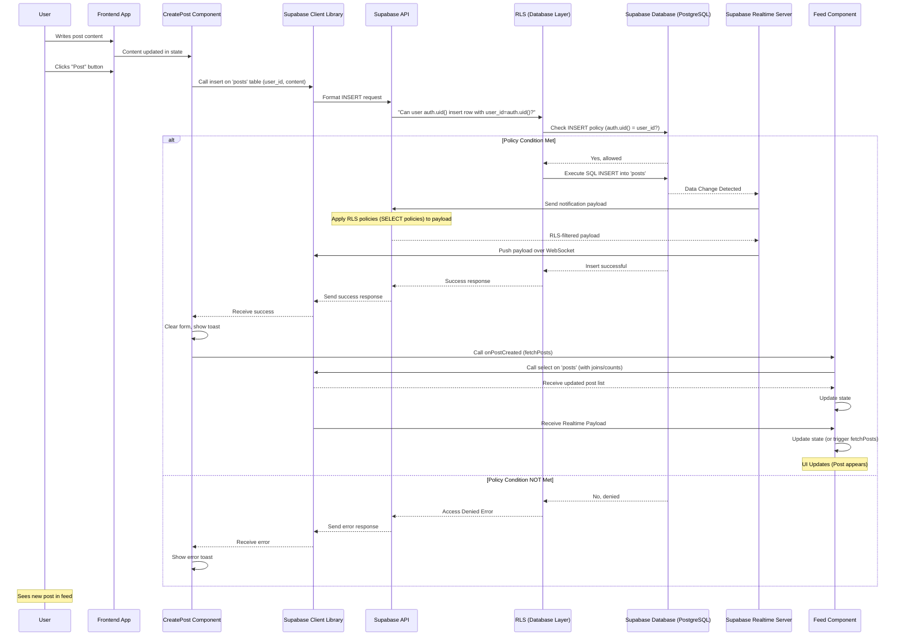

# Chapter 7: Social Feed Module

Welcome back to the Focus Hub tutorial! In the last few chapters, we've built a strong foundation: connecting our app to Supabase for backend services ([Chapter 1: Supabase Integration](01_supabase_integration_.md)), handling user accounts securely ([Chapter 2: Authentication & User Management](02_authentication___user_management_.md)), structuring and protecting our data with schema and RLS ([Chapter 3: Database Schema & RLS](03_database_schema___rls_.md)), making our app feel alive with real-time updates ([Chapter 4: Real-time Data Synchronization](04_real_time_data_synchronization_.md)), organizing our frontend ([Chapter 5: Frontend Application Structure](05_frontend_application_structure_.md)), and using pre-built UI pieces ([Chapter 6: UI Component Library (shadcn/ui)](06_ui_component_library__shadcn_ui__.md)).

Now, let's bring all these pieces together to build the core social interaction area: the **Social Feed Module**.

## What Problem Are We Solving?

Think of the Social Feed as the bustling town square of Focus Hub. It's the central place where everyone gathers to:

*   **Share:** Users want to post updates, thoughts, or links.
*   **See what others are doing:** Users want to view posts from other members.
*   **Interact:** Users want to react to posts (like them) and discuss them (comment).

Without a Social Feed, Focus Hub wouldn't be much of a community platform! This module needs to display content created by users and allow other users to engage with it.

This requires fetching data (posts, likes, comments), displaying it nicely, and handling user actions securely and efficiently.

## Key Concepts

The Social Feed Module is built around a few core database tables we defined in [Chapter 3: Database Schema & RLS](03_database_schema___rls_.md):

*   **`posts` table:** This is where the main content of each update is stored (the text, any attached image/file URL). Each post is linked to the user who created it via the `user_id`.
*   **`likes` table:** This table records which user has liked which post. It simply stores a link between a `user_id` and a `post_id`.
*   **`comments` table:** This table stores discussions under each post. Each comment is linked to a `post_id` and the `user_id` of the commenter. Comments can also reply to other comments using a `parent_id`.

On the frontend, the main components that make this module work are:

*   **`Feed` page (`src/pages/Feed.tsx`):** This is the main screen component that orchestrates fetching and displaying all the posts.
*   **`PostCard` component (`src/components/PostCard.tsx`):** This reusable component is responsible for displaying a single post, including the author's info, the content, media, like count, comment count, and action buttons (like, comment, share, edit/delete).
*   **`CreatePost` component (`src/components/CreatePost.tsx`):** This component provides the input area for users to write and publish new posts.

Let's see how these pieces work together to display the main feed.

## Use Case: Displaying the Feed of Posts

When a user navigates to the `/app/feed` page, the application needs to:

1.  Fetch the latest posts from the `posts` table.
2.  For each post, get the author's profile information (name, avatar) from the `profiles` table.
3.  For each post, get the current count of likes from the `likes` table.
4.  Display all this information using the `PostCard` component.
5.  Keep the list updated in real-time as new posts are created or likes are added/removed.

This all happens within the `Feed.tsx` page component.

### Fetching Posts

The `Feed.tsx` component uses a function, `fetchPosts`, to get the data from Supabase.

```typescript
// src/pages/Feed.tsx (simplified fetchPosts function)
import { supabase } from "@/integrations/supabase/client";

const fetchPosts = async () => {
  // Fetch posts with user profiles and like counts
  const { data, error } = await supabase
    .from('posts')
    .select(`
      *,
      profiles: profiles (
        full_name,
        avatar_url
      ),
      likes_count:likes(count)
    `)
    .eq('is_deleted', false) // Only get posts that aren't marked as deleted
    .order('created_at', { ascending: false }); // Show newest first

  if (error) {
    console.error('Error fetching posts:', error);
    return [];
  }

  // Transform the data to include likes count directly
  const transformedPosts = data?.map(post => ({
    ...post,
    likes_count: post.likes_count?.[0]?.count || 0 // Extract the count value
  })) || [];

  return transformedPosts; // Return the list of posts
};
```

**Explanation:**

*   We use `supabase.from('posts')` to target the `posts` table. ([Chapter 1: Supabase Integration](01_supabase_integration_.md))
*   The `.select(...)` part is powerful!
    *   `*`: Selects all columns from the `posts` table itself.
    *   `profiles: profiles (...)`: This tells Supabase to also fetch data from the `profiles` table that is *related* to each post via the `user_id`. We specify which `profiles` columns we want (`full_name`, `avatar_url`). Supabase handles the "joining" of these tables based on the foreign key relationship (`posts.user_id` references `profiles.id`) automatically because the tables are structured correctly in our schema ([Chapter 3: Database Schema & RLS](03_database_schema___rls_.md)).
    *   `likes_count:likes(count)`: This is a clever way to get the number of likes for each post directly from the database. We tell Supabase to look at the related `likes` rows for this post and give us a `count` of them, aliasing the result as `likes_count`.
*   `.eq('is_deleted', false)` filters out posts that have been "soft-deleted" (marked as deleted but not actually removed from the database yet).
*   `.order('created_at', { ascending: false })` sorts the posts so the newest ones appear at the top.
*   Finally, we transform the returned data slightly because the `likes(count)` query returns an array `[{ count: X }]`, and we want to simplify it to just the number `X`.

This function is called when the `Feed` component first loads using a `useEffect` hook.

```typescript
// src/pages/Feed.tsx (simplified useEffect)
import { useEffect, useState } from "react";

const Feed = () => {
  const [posts, setPosts] = useState<any[]>([]);
  const [loading, setLoading] = useState(true);
  // ... useAuth, useOutletContext for search ...

  useEffect(() => {
    const loadPosts = async () => {
      setLoading(true);
      const fetchedPosts = await fetchPosts(); // Call the fetch function
      setPosts(fetchedPosts); // Update the state with the fetched data
      setLoading(false);
    };

    loadPosts();

    // ... Real-time subscriptions (explained below) ...

    return () => {
      // ... Cleanup subscriptions ...
    };
  }, []); // Empty dependency array means this runs once when the component mounts

  // ... rest of component logic ...
};
```

**Explanation:**

*   We use `useState` to create a state variable `posts` to hold the list of posts and a `loading` state.
*   The `useEffect` hook runs when the `Feed` component first appears on the screen.
*   Inside the effect, we call `fetchPosts`, and once the data is retrieved, we update the `posts` state using `setPosts`. This makes React re-render the component to display the posts.

### Displaying the Posts

Once the `posts` state is populated, the component's JSX uses the `map` function to loop through the array and render a `PostCard` component for each post.

```jsx
// src/pages/Feed.tsx (simplified JSX)
import PostCard from "@/components/PostCard"; // Import the PostCard component

const Feed = () => {
  // ... state and effects ...

  // Apply search filter (from Chapter 5 context)
  const filteredPosts = posts.filter(post => {
    const content = post.content?.toLowerCase() || "";
    const author = post.profiles?.full_name?.toLowerCase() || "";
    const query = search.toLowerCase();
    return content.includes(query) || author.includes(query);
  });

  return (
    <div className="max-w-2xl mx-auto space-y-6">
      {/* Create Post component is often at the top */}
      {user && <CreatePost onPostCreated={handlePostCreated} />}

      <div className="space-y-6">
        {/* Conditional rendering based on loading/data */}
        {loading ? (
           // ... Loading spinner UI ...
        ) : filteredPosts.length === 0 ? (
           // ... "No posts found" message UI ...
        ) : (
          // Map through the filtered posts and render PostCard for each
          filteredPosts.map((post) => (
            <PostCard
              key={post.id} // Unique key for each list item
              post={post}   // Pass the post data down to PostCard
              onPostUpdated={fetchPosts} // Pass a callback to refetch posts after update/delete
            />
          ))
        )}
      </div>
       {/* ... "You're all caught up" message ... */}
    </div>
  );
};
```

**Explanation:**

*   We filter the posts based on the search query from the layout context ([Chapter 5: Frontend Application Structure](05_frontend_application_structure_.md)).
*   We use conditional rendering to show a loading state, an empty state message, or the list of posts.
*   `filteredPosts.map(...)` iterates over the array of posts.
*   For each `post` object, we render a `<PostCard />` component.
*   `key={post.id}` is required by React when rendering lists.
*   `post={post}` passes the entire post data object (including profile info and like count fetched earlier) as a "prop" to the `PostCard`.
*   `onPostUpdated={fetchPosts}` passes the `fetchPosts` function as a prop. The `PostCard` can call this function after a user updates or deletes a post to refresh the list in the `Feed`.

### Real-time Updates in the Feed

As discussed in [Chapter 4: Real-time Data Synchronization](04_real_time_data_synchronization_.md), the feed needs to update automatically. The `useEffect` hook in `Feed.tsx` also sets up subscriptions.

```typescript
// src/pages/Feed.tsx (simplified real-time subscriptions)
import { supabase } from "@/integrations/supabase/client";
import { useEffect } from "react"; // Already imported above

const Feed = () => {
  // ... state and initial fetch ...
  const [posts, setPosts] = useState<any[]>([]);
  const fetchPosts = async () => { /* ... */ }; // Defined above

  useEffect(() => {
    fetchPosts(); // Initial fetch

    // Set up real-time subscriptions
    const postsSubscription = supabase
      .channel('feed_changes') // Channel name
      .on(
        'postgres_changes',
        { event: '*', schema: 'public', table: 'posts', filter: 'is_deleted=eq.false' },
        (payload) => {
          console.log('Post change received:', payload);
          // Instead of trying to update granularly, just refetch all posts
          fetchPosts();
        }
      )
      .on(
        'postgres_changes',
        { event: '*', schema: 'public', table: 'likes' },
        (payload) => {
          console.log('Like change received:', payload);
          const postId = (payload.new as any)?.post_id || (payload.old as any)?.post_id;
          if (!postId) return;
          
          // Fetch the latest like count for *only* the affected post
          supabase
            .from('likes')
            .select('*', { count: 'exact', head: true })
            .eq('post_id', postId)
            .then(({ count }) => {
              // Update the specific post's like count in state
              setPosts((prevPosts) =>
                prevPosts.map((post) =>
                  post.id === postId ? { ...post, likes_count: count || 0 } : post
                )
              );
            });
        }
      )
      .subscribe();

    // Cleanup subscription on unmount
    return () => {
      supabase.removeChannel(postsSubscription);
    };
  }, []); // Runs once on mount

  // ... rest of component ...
};
```

**Explanation:**

*   We subscribe to changes on the `posts` table. When *any* change happens (`event: '*'`), we simply re-run `fetchPosts` to get the latest data. This is simple and effective for a feed where the order might change.
*   We *also* subscribe to changes on the `likes` table. When a like is added or removed, we find the `post_id` affected by the change.
*   Instead of refetching *all* posts for a like change, we efficiently query Supabase for just the *new* like count for that single post (`.select('*', { count: 'exact', head: true }).eq('post_id', postId)`).
*   We then update the `posts` state by mapping over the existing posts and only changing the `likes_count` for the post that was liked/unliked. This is a more targeted state update for like changes.
*   The cleanup function ensures the subscription is removed when the component is no longer displayed.

## Use Case: Creating a New Post

Users need a way to share their thoughts. This is handled by the `CreatePost.tsx` component, which is typically displayed at the top of the `Feed`.

```jsx
// src/components/CreatePost.tsx (simplified JSX and handleSubmit)
import { useState } from "react";
import { supabase } from "@/integrations/supabase/client";
import { useAuth } from "@/contexts/AuthContext"; // Get logged-in user

const CreatePost = ({ onPostCreated }) => {
  const [content, setContent] = useState("");
  const [isSubmitting, setIsSubmitting] = useState(false);
  const { user } = useAuth(); // Get the current user
  // ... state for image upload, emoji picker ...

  const handleSubmit = async (e) => {
    e.preventDefault();
    
    if (!user) {
      // Show error: Must be logged in (shouldn't happen if protected)
      return;
    }

    if (!content.trim()) {
      // Show error: Content is required
      return;
    }

    setIsSubmitting(true);
    let imageUrl = null; // Handle image upload (simplified)

    try {
      // Optional: Upload image to storage (details skipped for brevity)
      // ... image upload logic ...

      // Insert the new post into the 'posts' table
      const { error } = await supabase
        .from('posts')
        .insert({
          user_id: user.id, // Link the post to the current user
          content: content.trim(),
          image_url: imageUrl, // Include image URL if uploaded
        });

      if (error) {
        throw error;
      }

      // Show success message (toast)
      // Clear the form
      setContent("");
      // ... clear image/emoji state ...
      
      // Notify the Feed component that a post was created
      if (onPostCreated) {
        onPostCreated(); // This will trigger the Feed to refetch
      }
    } catch (error: any) {
      console.error('Error creating post:', error);
      // Show error message (toast)
    } finally {
      setIsSubmitting(false);
    }
  };

  return (
    <Card> {/* shadcn/ui Card */}
      <CardContent> {/* shadcn/ui CardContent */}
        <div className="flex gap-4">
          <Avatar> {/* shadcn/ui Avatar */}
             {/* User avatar */}
          </Avatar>
          <div className="flex-1">
            <form onSubmit={handleSubmit} className="space-y-4">
              <Textarea {/* shadcn/ui Textarea */}
                placeholder="What's on your mind?"
                value={content}
                onChange={(e) => setContent(e.target.value)}
                disabled={isSubmitting}
              />
              {/* ... Image preview UI ... */}
              <div className="flex items-center justify-between">
                <div className="flex gap-2">
                   {/* ... Image upload button (using label + hidden input) ... */}
                   {/* ... Emoji button ... */}
                </div>
                <Button type="submit" disabled={!content.trim() || isSubmitting}> {/* shadcn/ui Button */}
                  {isSubmitting ? 'Posting...' : 'Post'}
                </Button>
              </div>
              {/* ... Emoji picker UI ... */}
            </form>
          </div>
        </div>
      </CardContent>
    </Card>
  );
};
```

**Explanation:**

*   We use `useState` for the post content and submitting state.
*   `useAuth()` provides access to the currently logged-in `user` object ([Chapter 2: Authentication & User Management](02_authentication___user_management_.md)).
*   The `handleSubmit` function is triggered when the form is submitted.
*   It checks if the user is logged in and if the content is not empty.
*   It calls `supabase.from('posts').insert({...})` to add a new row to the `posts` table. The `user_id` is taken from the logged-in user object (`user.id`).
*   If an image is selected, it's uploaded to Supabase Storage first, and the resulting public URL is saved in the `image_url` column. (File storage integration could be a separate chapter, but we use the Supabase client's storage methods here).
*   Crucially, the RLS policy for `INSERT` on the `posts` table ([Chapter 3: Database Schema & RLS](03_database_schema___rls_.md)) ensures that a user can *only* insert a post if the `user_id` being inserted matches their own `auth.uid()`. This prevents users from creating posts pretending to be someone else.
*   After a successful insert, the form is cleared, a success message is shown, and the `onPostCreated` prop (which is `fetchPosts` from the `Feed` component) is called. This tells the `Feed` component to refresh its list to include the new post.
*   We use `shadcn/ui` components like `Card`, `CardContent`, `Avatar`, `Textarea`, and `Button` for the UI elements.

## Use Case: Interacting with Posts (Liking, Commenting, Editing, Deleting)

The `PostCard.tsx` component handles displaying a single post and all interactions related to it.

```jsx
// src/components/PostCard.tsx (simplified)
import { useState, useEffect } from "react";
import { supabase } from "@/integrations/supabase/client";
import { useAuth } from "@/contexts/AuthContext";
import { useToast } from "@/hooks/use-toast";
import { Heart, MoreHorizontal } from "lucide-react";
import { Button } from "@/components/ui/button";
import { DropdownMenu, DropdownMenuTrigger, DropdownMenuContent, DropdownMenuItem } from "@/components/ui/dropdown-menu";
import { Dialog, DialogContent, DialogTitle } from "@/components/ui/dialog";
import { Textarea } from "@/components/ui/textarea";

const PostCard = ({ post, onPostUpdated }) => {
  const { user } = useAuth();
  const { toast } = useToast();
  const [isLiked, setIsLiked] = useState(false);
  const [likesCount, setLikesCount] = useState(post.likes_count || 0); // Initial count from fetched data
  const [editing, setEditing] = useState(false);
  const [editContent, setEditContent] = useState(post.content);
  const [confirmingDelete, setConfirmingDelete] = useState(false);
  const [comments, setComments] = useState<any[]>([]); // State for comments

  const isOwner = user && user.id === post.user_id; // Check if the logged-in user is the post author

  // Check if the current user has liked this specific post
  useEffect(() => {
    const checkLikeStatus = async () => {
      if (!user) return; // Cannot like if not logged in
      const { data } = await supabase
        .from('likes')
        .select('id')
        .eq('post_id', post.id)
        .eq('user_id', user.id)
        .single(); // Try to fetch a single like record

      setIsLiked(!!data); // If data exists, user has liked it
    };
    checkLikeStatus();
  }, [user, post.id]); // Re-run if user or post changes

  // Handle liking/unliking
  const handleLike = async () => {
    if (!user) {
      // Show toast error: Must be logged in
      return;
    }

    try {
      if (isLiked) {
        // Unlike: Delete the like entry
        await supabase.from('likes').delete().eq('post_id', post.id).eq('user_id', user.id);
        setIsLiked(false);
        setLikesCount(prev => Math.max(prev - 1, 0));
      } else {
        // Like: Insert a new like entry
        await supabase.from('likes').insert({ post_id: post.id, user_id: user.id });
        setIsLiked(true);
        setLikesCount(prev => prev + 1);
      }
      // Real-time subscription in Feed handles updating other users' counts
      // We update local state optimistically here for speed
    } catch (error: any) {
      console.error('Error toggling like:', error);
      // Show toast error
    }
  };

  // Handle editing a post
  const handleEdit = async (e) => {
    e.preventDefault();
    // Check if owner (redundant if UI hides, but good backend practice)
    if (!isOwner || !editContent.trim()) return;
    // ... set loading state ...
    await supabase.from('posts').update({ content: editContent }).eq('id', post.id);
    // ... unset loading state, exit editing mode ...
    if (onPostUpdated) onPostUpdated(); // Tell Feed to refetch
  };

  // Handle deleting a post
  const handleDelete = async () => {
     // Check if owner
     if (!isOwner) return;
     // ... set loading state ...
     // Use soft delete (setting is_deleted to true) rather than hard delete
     await supabase.from('posts').update({ is_deleted: true }).eq('id', post.id);
     // ... unset loading state, close dialog ...
     if (onPostUpdated) onPostUpdated(); // Tell Feed to refetch (which filters deleted posts)
  };

  // Fetch comments for this post
  useEffect(() => {
    const fetchComments = async () => {
      const { data } = await supabase
        .from('comments')
        .select(`*, profiles(full_name, avatar_url)`) // Select comments and author profiles
        .eq('post_id', post.id)
        .is('parent_id', null) // Only fetch top-level comments for simplicity
        .order('created_at', { ascending: true });
      setComments(data || []);
    };
    fetchComments();
    // Note: Real-time for comments would be set up here too
  }, [post.id]); // Re-run when post changes

  // Handle adding a new comment
  const handleAddComment = async (e) => {
    e.preventDefault();
    if (!user || !commentInput.trim()) return;
    // ... set loading state ...
    await supabase.from('comments').insert({ post_id: post.id, user_id: user.id, content: commentInput.trim() });
    // ... clear input, unset loading state ...
    // Refetch comments to show the new one
    // ... fetchComments() again ...
  };


  return (
    <Card> {/* shadcn/ui Card */}
      <CardContent> {/* shadcn/ui CardContent */}
        {/* Author Avatar and Name */}
        <div className="flex items-start gap-3">
          <Avatar> {/* shadcn/ui Avatar */}
            <AvatarImage src={post.profiles?.avatar_url} />
            <AvatarFallback>{post.profiles?.full_name?.charAt(0) || "?"}</AvatarFallback>
          </Avatar>
          <div className="flex-1">
            {/* Post Header with Author Name, Timestamp, and Options */}
            <div className="flex items-center justify-between">
               {/* ... Author name and timestamp ... */}
               <DropdownMenu> {/* shadcn/ui DropdownMenu */}
                 <DropdownMenuTrigger asChild>
                   <Button variant="ghost" size="icon"><MoreHorizontal /></Button>
                 </DropdownMenuTrigger>
                 <DropdownMenuContent>
                   {isOwner && <DropdownMenuItem onClick={() => setEditing(true)}>Edit</DropdownMenuItem>}
                   {isOwner && <DropdownMenuItem onClick={() => setConfirmingDelete(true)}>Delete</DropdownMenuItem>}
                   {/* ... other options like Copy Link ... */}
                 </DropdownMenuContent>
               </DropdownMenu>
            </div>

            {/* Post Content (editable if editing) */}
            <div className="mt-3">
              {editing ? (
                 <form onSubmit={handleEdit}> {/* Edit form */}
                    <Textarea value={editContent} onChange={e => setEditContent(e.target.value)} />
                    {/* ... Save/Cancel buttons ... */}
                 </form>
              ) : (
                 <p>{post.content}</p> // Display content
              )}
              {/* ... Media display (image, file preview) ... */}
            </div>

            {/* Action Buttons (Like, Comment, Share) */}
            <div className="flex items-center justify-between mt-4 pt-2 border-t">
              <Button variant="ghost" size="sm" onClick={handleLike}> {/* Like Button */}
                <Heart className={isLiked ? "fill-current text-red-500" : ""} />
                {likesCount} {/* Display like count */}
              </Button>
              <Button variant="ghost" size="sm"> {/* Comment Button */}
                <MessageCircle />
                {comments.length} {/* Display comment count (top-level) */}
              </Button>
              {/* ... Share Button ... */}
            </div>

            {/* Comments Section */}
            <div className="mt-3">
               {/* ... Display fetched comments using map ... */}
               {/* Add Comment Input (if user logged in) */}
               {user && (
                 <form onSubmit={handleAddComment} className="flex gap-2 items-center mt-3">
                   <Avatar>{/* User Avatar */}</Avatar>
                   <input type="text" placeholder="Add a comment..." value={commentInput} onChange={e => setCommentInput(e.target.value)} />
                   <Button type="submit" size="sm">Post</Button>
                 </form>
               )}
            </div>
          </div>
        </div>

        {/* Delete Confirmation Dialog */}
        <Dialog open={confirmingDelete} onOpenChange={setConfirmingDelete}> {/* shadcn/ui Dialog */}
          <DialogContent>
            <DialogTitle>Delete post?</DialogTitle>
            <p>Are you sure you want to permanently remove this post?</p>
            <div className="flex justify-end gap-2 mt-4">
              <Button variant="outline" onClick={() => setConfirmingDelete(false)}>Cancel</Button>
              <Button variant="destructive" onClick={handleDelete}>Delete</Button>
            </div>
          </DialogContent>
        </Dialog>
      </CardContent>
    </Card>
  );
};
```

**Explanation:**

*   The `PostCard` component receives the `post` object as a prop, containing all the post data, profile info, and the initial like count.
*   It uses `useState` for local UI state like whether the user has liked the post (`isLiked`), the current displayed like count (`likesCount`), whether the post is being edited (`editing`), etc.
*   An `useEffect` hook checks the `likes` table when the component loads to see if the *currently logged-in user* (`user` from `useAuth`) has already liked *this specific post* (`post.id`).
*   `handleLike` function toggles the like status. It performs an `INSERT` or `DELETE` operation on the `likes` table using `supabase.from('likes')`.
    *   The RLS policies on the `likes` table ([Chapter 3: Database Schema & RLS](03_database_schema___rls_.md)) are critical here:
        *   `FOR INSERT WITH CHECK (auth.uid() = user_id)`: Ensures a user can *only* insert a like for themselves.
        *   `FOR DELETE USING (auth.uid() = user_id)`: Ensures a user can *only* delete a like they created.
    *   We update the `isLiked` state and `likesCount` state immediately (`setIsLiked`, `setLikesCount`) to make the UI feel responsive (this is called "optimistic UI"). The real-time subscription in the `Feed` component will eventually confirm or correct the count based on the actual database change.
*   `handleEdit` and `handleDelete` functions allow the post owner to update or delete their post.
    *   `isOwner = user && user.id === post.user_id` checks if the logged-in user's ID matches the `user_id` of the post.
    *   The RLS policies for `UPDATE` and `DELETE` on the `posts` table ([Chapter 3: Database Schema & RLS](03_database_schema___rls_.md)) enforce that a user can *only* update or delete rows where their `auth.uid()` matches the `user_id` column. This is the real security check, preventing users from modifying others' posts even if they somehow bypassed the `isOwner` check in the frontend.
    *   We use a "soft delete" (`update { is_deleted: true }`) instead of permanently removing the row (`delete`). This can be useful for moderation or recovery, and the `Feed` component's fetch query (`.eq('is_deleted', false)`) filters them out.
    *   Calling `onPostUpdated()` after edit/delete triggers the `fetchPosts` in the parent `Feed` component, refreshing the list to reflect the change (e.g., the deleted post disappears).
*   The comments section fetches comments related to the post and allows adding new comments, following a similar pattern of fetching from the `comments` table and inserting new rows.
*   Various `shadcn/ui` components (`Button`, `DropdownMenu`, `Dialog`, `Textarea`) are used to build the interactive elements.

## Under the Hood: Social Feed Data Flow

Let's visualize the flow for creating a post and how it appears in the feed:



This diagram shows how creating a post involves interacting with the database via the Supabase client, how RLS ensures security *at the database level*, and how Supabase's real-time feature pushes the change back to the frontend, allowing the `Feed` component to update instantly without a manual refresh. The `onPostCreated` callback provides a fallback or additional trigger for the parent component to refresh.

Interactions like Liking, Editing, and Deleting follow similar patterns, involving the Supabase client calling `update` or `delete` on the `likes` or `posts` tables, with RLS policies strictly controlling whether the action is allowed based on the logged-in user's ID. Real-time subscriptions keep the UI consistent across all users viewing the same post.

## Conclusion

In this chapter, we built the heart of Focus Hub's social interaction: the **Social Feed Module**. We learned how it uses the `posts`, `likes`, and `comments` database tables and relies on Supabase's data fetching, RLS for security, and real-time capabilities for a live user experience. We saw how the `Feed` page component orchestrates the fetching and display, and how the `PostCard` and `CreatePost` components handle rendering individual posts and allowing users to share and interact.

We've combined many concepts from previous chapters to create a dynamic and interactive feature. Now that users can share and interact via posts, let's look at another key communication feature: direct messaging. In the next chapter, we'll dive into the **Chat System Module**.

[Next Chapter: Chat System Module](08_chat_system_module_.md)

---

<sub><sup> </sup></sub> <sub><sup>**References**: [[1]](https://github.com/HackyCoder0951/focus_hub/blob/e310dc085cf675c010a63c1dcc0eaef3442f8f9a/src/components/CreatePost.tsx), [[2]](https://github.com/HackyCoder0951/focus_hub/blob/e310dc085cf675c010a63c1dcc0eaef3442f8f9a/src/components/PostCard.tsx), [[3]](https://github.com/HackyCoder0951/focus_hub/blob/e310dc085cf675c010a63c1dcc0eaef3442f8f9a/src/pages/Feed.tsx), [[4]](https://github.com/HackyCoder0951/focus_hub/blob/e310dc085cf675c010a63c1dcc0eaef3442f8f9a/supabase/migrations/20250629133651_focus_hub.sql), [[5]](https://github.com/HackyCoder0951/focus_hub/blob/e310dc085cf675c010a63c1dcc0eaef3442f8f9a/supabase/migrations/20250629202129_posts_data.sql)</sup></sub>