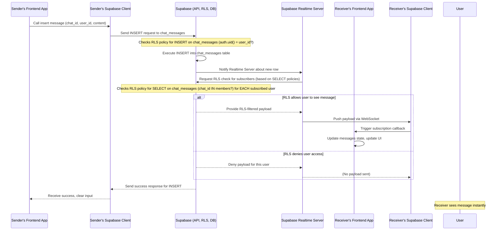

# Chapter 8: Chat System Module

Welcome back to the Focus Hub tutorial! In the [previous chapter](07_social_feed_module_.md), we brought together many of our core concepts to build the Social Feed, allowing users to share updates and interact publicly. While public sharing is great, users also need a way to communicate privately or in smaller groups.

This is where the **Chat System Module** comes in.

## What Problem Are We Solving?

Imagine you want to send a private message to a friend, discuss something with a small team, or ask a specific question to a mentor without posting it publicly on the feed. The Social Feed isn't designed for these kinds of direct, often sensitive, conversations.

We need a dedicated space within Focus Hub where users can have real-time, one-on-one or group conversations. This system needs to:

*   Allow users to start new conversations (either with one other person or a group).
*   Display a list of their existing conversations.
*   Show messages within a selected conversation.
*   Let users send new messages.
*   Make new messages appear instantly as they arrive.
*   Handle adding/removing members in group chats and managing who can see what (privacy!).

This is exactly what our **Chat System Module** provides. Think of it as the private messaging service integrated directly into Focus Hub.

## Key Concepts

The Chat System Module is built around a few core concepts and database tables:

1.  **Conversations (`chats` table):** Represents a single chat instance. It stores basic info like whether it's a group chat (`is_group`) and the group name (`name`).
    ```sql
    -- Simplified from supabase/migrations/...sql
    CREATE TABLE IF NOT EXISTS public.chats (
      id UUID PRIMARY KEY DEFAULT gen_random_uuid(),
      is_group BOOLEAN NOT NULL DEFAULT FALSE,
      name TEXT, -- Only for group chats
      created_at TIMESTAMPTZ NOT NULL DEFAULT now()
    );
    ```
    *   Analogy: Like creating a new room for a conversation.

2.  **Participants (`chat_members` table):** Links users to specific chats. This table tracks which user (`user_id`) is a member of which chat (`chat_id`). It also stores when they joined and, for groups, if they are an admin (`is_admin`).
    ```sql
    -- Simplified from supabase/migrations/...sql
    CREATE TABLE IF NOT EXISTS public.chat_members (
      id UUID PRIMARY KEY DEFAULT gen_random_uuid(),
      chat_id UUID REFERENCES public.chats(id) ON DELETE CASCADE, -- Which chat
      user_id UUID REFERENCES public.profiles(id) ON DELETE CASCADE, -- Which user
      joined_at TIMESTAMPTZ NOT NULL DEFAULT now(),
      is_admin BOOLEAN DEFAULT FALSE, -- For group chats
      UNIQUE(chat_id, user_id) -- A user can only be in a chat once
    );
    ```
    *   Analogy: Like a list of people invited into a specific room. Direct messages are just rooms with exactly two people listed here.

3.  **Messages (`chat_messages` table):** Stores the actual content of each message. Each message is linked to a specific chat (`chat_id`) and the user who sent it (`user_id`). It holds the message text (`content`) and potentially a link to a file (`media_url`).
    ```sql
    -- Simplified from supabase/migrations/...sql
    CREATE TABLE IF NOT EXISTS public.chat_messages (
      id UUID PRIMARY KEY DEFAULT gen_random_uuid(),
      chat_id UUID REFERENCES public.chats(id) ON DELETE CASCADE, -- Which chat it belongs to
      user_id UUID REFERENCES public.profiles(id) ON DELETE CASCADE, -- Who sent it
      content TEXT, -- The message text
      media_url TEXT, -- Optional link to a file
      created_at TIMESTAMPTZ NOT NULL DEFAULT now()
    );
    ```
    *   Analogy: The notes or conversations exchanged *inside* the room.

On the frontend, the main interface for this module is the **Chat page (`src/pages/Chat.tsx`)**. It uses components like:

*   The list showing all the user's conversations.
*   The area displaying messages for the currently selected chat.
*   An input field to type and send new messages.
*   A component to start a new chat (`CreateChat.tsx`).

This module heavily relies on Supabase features we've already covered:

*   **Data Fetching:** To get lists of chats, members, and messages ([Chapter 1: Supabase Integration](01_supabase_integration_.md)).
*   **Authentication & User Management:** To know *who* the current user is and link messages/memberships to their profile ([Chapter 2: Authentication & User Management](02_authentication___user_management_.md)).
*   **Database Schema & RLS:** To define the structure and, *crucially*, ensure users can *only* see conversations and messages they are members of ([Chapter 3: Database Schema & RLS](03_database_schema___rls_.md)).
*   **Real-time Data Synchronization:** To receive new messages instantly without refreshing ([Chapter 4: Real-time Data Synchronization](04_real_time_data_synchronization_.md)).
*   **UI Component Library:** To build the visual interface elements like cards, buttons, inputs, and avatars ([Chapter 6: UI Component Library (shadcn/ui)](06_ui_component_library__shadcn_ui__.md)).

## Use Case: Sending and Receiving Messages

Let's focus on the core interaction: sending a message and seeing it appear instantly, both for the sender and the recipient(s).

When a user has a chat open and types a message:

1.  The user types in the message input field.
2.  They click the "Send" button (or press Enter).
3.  The frontend code takes the message content and the ID of the currently selected chat.
4.  It sends this data to Supabase to insert a new row into the `chat_messages` table.
5.  Supabase performs the insertion, checking RLS policies to ensure the user is allowed to send a message to that chat.
6.  Supabase's real-time feature detects the new message in the database.
7.  It pushes this new message data to all users who are currently *subscribed* to changes in that specific chat's `chat_messages` table.
8.  The frontend of each subscribed user receives the new message data and adds it to the displayed list of messages.

Let's look at simplified code snippets from `src/pages/Chat.tsx` demonstrating these steps.

### Fetching Initial Messages

When a chat is selected, the app loads the history:

```typescript
// src/pages/Chat.tsx (simplified snippet for fetching messages)
import { useEffect, useState } from "react";
import { supabase } from "@/integrations/supabase/client";

const Chat = () => {
  const [selectedChat, setSelectedChat] = useState<string | null>(null);
  const [messages, setMessages] = useState<ChatMessage[]>([]);
  // ... other state ...

  // Effect to fetch initial messages when a chat is selected
  useEffect(() => {
    if (!selectedChat) return; // Only run if a chat is selected

    const fetchMessages = async () => {
      // set setLoadingMessages(true); // Indicate loading
      const { data, error } = await supabase
        .from('chat_messages') // Target the messages table
        .select(`
          *,
          profiles: user_id (full_name, avatar_url) // Also get sender's info
        `)
        .eq('chat_id', selectedChat) // IMPORTANT: Filter for messages in the selected chat
        .order('created_at', { ascending: true }); // Show oldest first

      // set setLoadingMessages(false); // Stop loading

      if (error) {
        console.error('Error fetching messages:', error);
        // Show error toast
        setMessages([]);
        return;
      }
      setMessages(data || []); // Update state with fetched messages
    };

    fetchMessages();

    // ... Real-time subscription setup will go here (shown next) ...

    return () => {
      // ... Cleanup subscription ...
    };

  }, [selectedChat]); // Re-run this effect if selectedChat changes

  // ... rest of component ...
};
```

*   We use `supabase.from('chat_messages')` and `select` to retrieve data.
*   The `*, profiles: user_id (...)` part fetches the message content (`*`) and joins the `profiles` table ([Chapter 3: Database Schema & RLS](03_database_schema___rls_.md)) using the `user_id` to get the sender's name and avatar.
*   `.eq('chat_id', selectedChat)` is crucial to only get messages for the *currently open* chat.
*   `.order('created_at', { ascending: true })` sorts messages chronologically.
*   The fetched messages update the `messages` state, which React then renders.

### Sending a New Message

When the user submits the message input:

```typescript
// src/pages/Chat.tsx (simplified snippet for sending a message)
import { useState } from "react";
import { supabase } from "@/integrations/supabase/client";
import { useAuth } from "@/contexts/AuthContext"; // Get logged-in user

const Chat = () => {
  // ... state for messages, selectedChat etc. ...
  const { user } = useAuth(); // Get the current user
  const [newMessage, setNewMessage] = useState("");

  const handleSendMessage = async (e: React.FormEvent) => {
    e.preventDefault();
    // Check if message is empty or user/chat are not selected
    if (!newMessage.trim() || !user || !selectedChat) return;

    // setIsTyping(true); // Indicate sending state

    try {
      const { error } = await supabase
        .from('chat_messages') // Target the messages table
        .insert({ // Insert a new row
          chat_id: selectedChat, // Link to the current chat
          user_id: user.id, // Link to the logged-in user
          content: newMessage.trim() // The message text
          // media_url could be added here if sending files
        });

      if (error) {
        throw error;
      }

      setNewMessage(""); // Clear the input field

    } catch (error: any) {
      console.error('Error sending message:', error);
      // Show error toast
    } finally {
      // setIsTyping(false); // End sending state
    }
  };

  // ... rest of component, including JSX for input form ...
};
```

*   `handleSendMessage` is called when the form is submitted.
*   It uses `supabase.from('chat_messages').insert({...})` to create a new message record in the database.
*   The `chat_id` and `user_id` are essential for linking the message correctly.
*   The RLS policy on `chat_messages` for `INSERT` ([Chapter 3: Database Schema & RLS](03_database_schema___rls_.md)) requires `auth.uid() = user_id`. This ensures a user can *only* insert messages that appear to come from their own account. It does *not* check if they are a member of the chat at this stage; the membership check is handled by the `SELECT` policy and the `chat_members` table structure.

### Receiving New Messages in Real-time

To see messages appear instantly, we set up a real-time subscription:

```typescript
// src/pages/Chat.tsx (simplified snippet for real-time)
import { useEffect, useState } from "react";
import { supabase } from "@/integrations/supabase/client";

const Chat = () => {
  const [selectedChat, setSelectedChat] = useState<string | null>(null);
  const [messages, setMessages] = useState<ChatMessage[]>([]);
  const { user } = useAuth();
  const fetchChats = async () => { /* ... fetch chats logic ... */ }; // Need this to update last message in sidebar

  // Effect to fetch messages AND set up subscription
  useEffect(() => {
    if (!selectedChat || !user) return; // Need selected chat and logged-in user

    // ... initial fetchMessages() call ...

    // --- Real-time Subscription Setup ---
    const channel = supabase
      .channel(`chat:${selectedChat}`) // Unique channel name per chat
      .on(
        'postgres_changes', // Listen for database changes
        {
          event: 'INSERT',    // Specifically NEW rows
          schema: 'public',   // In the public schema
          table: 'chat_messages', // On the chat_messages table
          filter: `chat_id=eq.${selectedChat}` // ONLY for the currently selected chat
        },
        async (payload) => { // This runs when a matching message is inserted
          console.log('New message received:', payload);
          // Fetch full message data including profile info, as payload.new might be minimal
          const { data: newMessageData } = await supabase
             .from('chat_messages')
             .select(`*, profiles: user_id (full_name, avatar_url)`)
             .eq('id', (payload.new as any).id)
             .single();

          if (newMessageData) {
            // Add the new message to our messages state
            setMessages(prev => [...prev, newMessageData as ChatMessage]);
            // Scroll to bottom (separate useEffect handles this based on messages change)
          }

          // Also refresh the chat list in the sidebar to show the latest message preview
          fetchChats(); // This updates the last message in the chat list
        }
      )
      .subscribe(); // Start listening!

    // --- Cleanup ---
    // Return a function to unsubscribe when the component unmounts or selectedChat changes
    return () => {
      supabase.removeChannel(channel); // Clean up the subscription
      console.log(`Unsubscribed from chat:${selectedChat}.`);
    };

  }, [selectedChat, user]); // Re-run effect if chat or user changes

  // ... rest of component ...
};
```

*   We use `supabase.channel(...)` and `.on(...)` to subscribe to `INSERT` events on the `chat_messages` table, specifically filtering by the `selectedChat` ID ([Chapter 4: Real-time Data Synchronization](04_real_time_data_synchronization_.md)). Using a channel name like `chat:${selectedChat}` helps manage subscriptions for different chats.
*   When a new message matching the filter arrives (sent by *any* member of the chat, including the current user from another device!), the callback function runs.
*   We fetch the full message data using the new message's ID from the payload to ensure we have the profile information (Supabase Realtime payload might not include joins by default).
*   We update the local `messages` state with the new message, causing the UI to re-render and show it.
*   We also call `fetchChats()` to update the sidebar, showing the new message content as the "last message" preview.
*   The `return` function handles cleaning up the subscription when the component changes chat or unmounts.

This combination of fetching existing messages and subscribing to new ones provides a seamless, real-time chat experience.

## Under the Hood: Chat Message Flow with RLS and Real-time

Here's a simplified diagram showing the path of a message from sender to receiver(s):



**Key Points:**

*   When the sender inserts the message, the RLS policy on `chat_messages` for `INSERT` checks their identity (`auth.uid() = user_id`).
*   When the Supabase Realtime server is about to push the new message data to subscribers, it *re-applies RLS policies*, but this time the `SELECT` policies for the `chat_messages` table.
*   The `SELECT` RLS policy on `chat_messages` in our schema ([Chapter 3: Database Schema & RLS](03_database_schema___rls_.md)) is typically `USING (chat_id IN (SELECT chat_id FROM chat_members WHERE user_id = auth.uid()))`. This is crucial: it means a user can *only* see messages (whether fetching or via real-time) if the message's `chat_id` is in the list of chats that *they* are a member of according to the `chat_members` table.
*   This combination ensures that chat messages remain private to the members of that specific conversation.

## Other Chat Module Features

The Chat module includes other features leveraging these concepts:

*   **Creating Chats (`CreateChat.tsx`):** This component allows users to select other users and create either a direct message (DM) chat (which creates a `chat` with `is_group = false` and two entries in `chat_members`) or a group chat (creates `chat` with `is_group = true`, a `name`, and multiple entries in `chat_members`). The creator is automatically added as the initial member (and admin for groups).
    ```typescript
    // src/components/CreateChat.tsx (simplified snippet for creating a chat)
    const handleCreateChat = async () => {
      // ... checks for user, selectedUsers, groupName ...
      // setLoading(true);
      try {
        // 1. Create the chat entry
        const { data: chat, error: chatError } = await supabase
          .from('chats')
          .insert({ is_group: isGroup, name: isGroup ? groupName.trim() : null })
          .select() // Select the newly created chat data
          .single();

        if (chatError) throw chatError;

        // 2. Add members (including creator)
        const membersToInsert = selectedUsers.map(userId => ({
          chat_id: chat.id,
          user_id: userId,
          is_admin: isGroup && userId === user.id // Creator is admin for groups
        }));
         // Add creator if not already selected (e.g., for DM start)
         if (!selectedUsers.includes(user.id)) {
             membersToInsert.push({
                 chat_id: chat.id,
                 user_id: user.id,
                 is_admin: isGroup // Creator is admin for groups
             });
         }
        
        const { error: membersError } = await supabase
          .from('chat_members')
          .insert(membersToInsert);

        if (membersError) throw membersError;

        // ... Reset form, close dialog ...
        // Notify parent (Chat page) that a new chat was created
        onChatCreated(chat.id); // Parent will refetch chats and select the new one

      } catch (error: any) {
        console.error('Error creating chat:', error);
        // Show error toast
      } finally {
        // setLoading(false);
      }
    };
    ```
*   **Joining Chats:** Currently, joining is handled during creation or adding members in a group. The `chat_members` table `INSERT` policy (`auth.uid() = user_id`) allows a user to add *themselves* to a chat member list. Group admins have additional policies allowing them to add *other* users (`public.is_group_admin(auth.uid(), chat_id)` - a custom function check in RLS).
*   **Leaving Groups/Deleting Chats:** Users can remove themselves from a chat's `chat_members` entry. For groups, special logic (sometimes handled by a database function like `leave_group` provided in migrations or by frontend logic checking remaining members) ensures that if the last admin leaves, another member is promoted, and if the last member leaves, the chat is cleaned up. The `chat_members` DELETE policy (`auth.uid() = user_id`) ensures a user can only remove *themselves*.
*   **Group Management:** Group admins can add/remove members and change the group name. These actions involve `INSERT`, `UPDATE`, and `DELETE` operations on the `chat_members` and `chats` tables, protected by RLS policies that check if the performing user is an admin of that specific chat (`public.is_group_admin(auth.uid(), chat_id)`).
*   **File Attachments:** The `chat_messages` table has a `media_url` column. Sending a file involves uploading it to Supabase Storage first, then inserting a message row where the `media_url` is the public URL of the uploaded file. The UI then renders this as an image or a downloadable link. (Supabase Storage itself has its own security rules).
*   **Typing Indicators:** The `chat_members` table includes a `typing` boolean column. The frontend updates this column via an `UPDATE` call when a user types. Other users in the same chat can subscribe to `UPDATE` events on the `chat_members` table for other users in that chat to show "User X is typing...".
*   **Online Status:** The `profiles` table has a `last_seen` timestamp. The frontend periodically updates this timestamp for the current user. In a direct message, the app can fetch the `last_seen` of the *other* member and compare it to the current time to show "online" or "last seen..." (as seen in the `Chat.tsx` code).

## Conclusion

In this chapter, we explored the **Chat System Module**, learning how it enables private and group conversations within Focus Hub. We saw how it leverages the `chats`, `chat_members`, and `chat_messages` database tables and relies heavily on Supabase's data fetching, RLS for ensuring chat privacy based on membership, and Real-time subscriptions for instant message delivery. We looked at the core flow of sending and receiving messages and briefly touched upon features like chat creation and group management, highlighting how RLS policies enforce the necessary permissions at the database level.

With communication channels established, both public and private, let's turn our attention to sharing other valuable resources within the community. In the next chapter, we'll dive into the **Resource Sharing Module**.

[Next Chapter: Resource Sharing Module](09_resource_sharing_module_.md)

---

<sub><sup>Generated by [AI Codebase Knowledge Builder](https://github.com/The-Pocket/Tutorial-Codebase-Knowledge).</sup></sub> <sub><sup>**References**: [[1]](https://github.com/HackyCoder0951/focus_hub/blob/e310dc085cf675c010a63c1dcc0eaef3442f8f9a/src/components/ChatNotification.tsx), [[2]](https://github.com/HackyCoder0951/focus_hub/blob/e310dc085cf675c010a63c1dcc0eaef3442f8f9a/src/components/CreateChat.tsx), [[3]](https://github.com/HackyCoder0951/focus_hub/blob/e310dc085cf675c010a63c1dcc0eaef3442f8f9a/src/pages/Chat.tsx), [[4]](https://github.com/HackyCoder0951/focus_hub/blob/e310dc085cf675c010a63c1dcc0eaef3442f8f9a/supabase/migrations/20250629133651_focus_hub.sql), [[5]](https://github.com/HackyCoder0951/focus_hub/blob/e310dc085cf675c010a63c1dcc0eaef3442f8f9a/supabase/migrations/20250630000000_leave_group_function.sql)</sup></sub>