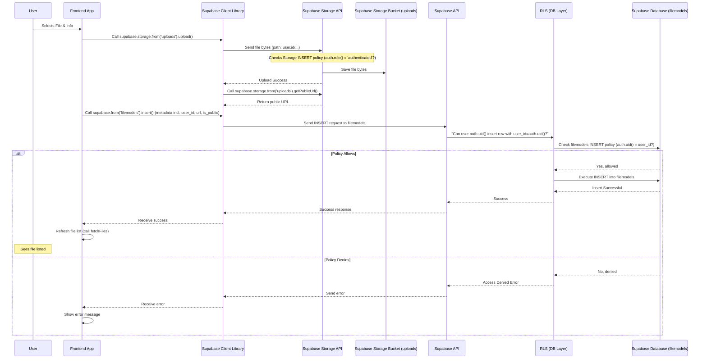
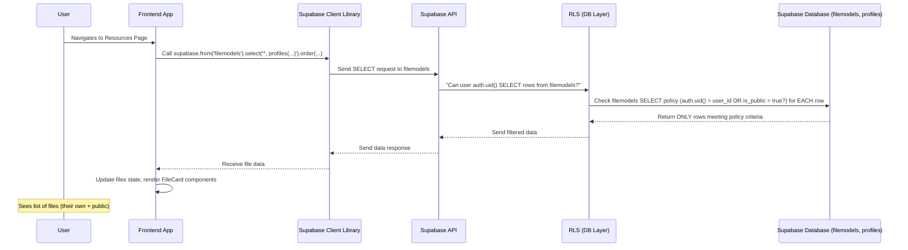

# Chapter 9: Resource Sharing Module

Welcome back to the Focus Hub tutorial! In our recent chapters, we've built ways for users to connect through social posts ([Chapter 7: Social Feed Module](07_social_feed_module_.md)) and private messages ([Chapter 8: Chat System Module](08_chat_system_module_.md)). These are great for sharing updates and conversations, but what about sharing actual *files*? Documents, presentations, useful code snippets, images, or videos that aren't meant for a specific post or chat?

## What Problem Are We Solving?

Imagine you want to share a PDF guide about effective studying techniques with the entire community, or upload a video recording of a workshop that members can watch anytime. The Social Feed isn't the right place for evergreen resources, and forcing people to download files sent one-by-one in chat is inefficient.

We need a dedicated place where users can:

1.  **Upload** various types of files.
2.  Control the **visibility** of these files (e.g., make them public for everyone, or keep them private).
3.  **Browse** files uploaded by others (if they are public) or files they uploaded themselves.
4.  **Search and filter** through available resources to find what they need.
5.  **Preview** certain file types directly in the app.
6.  **Download** files.
7.  **Manage** their own uploaded files (edit description, change visibility, delete).

This is the purpose of the **Resource Sharing Module**. It acts like a shared digital library or a central filing cabinet where valuable assets for the community can be stored, organized, and accessed.

## Key Concepts

This module relies on two main components from our backend and one dedicated area in our frontend:

1.  **Supabase Storage Buckets:** This is where the actual file *bytes* (the content of the file) are stored securely. We use two main buckets related to files:
    *   `uploads`: Used specifically for the files uploaded through the main "Resources" feature.
    *   `post-media`: Used for images/videos attached directly to social feed posts ([Chapter 7: Social Feed Module](07_social_feed_module_.md)). While conceptually related, this module focuses on the `uploads` bucket.

2.  **`filemodels` Table:** Storing just the file bytes isn't enough. We need to know *about* the file – its original name, type, size, who uploaded it, when, and its visibility (public or private). This **metadata** is stored in a dedicated database table called `filemodels`. Each row in `filemodels` corresponds to a file stored in a Supabase Storage bucket and includes columns like `user_id`, `file_url` (the link to the file in storage), `file_name`, `file_type`, `file_size`, `description`, and `is_public`.

3.  **The `Resources` Page (`src/pages/Resources.tsx`):** This is the main frontend page component where users interact with the module. It provides the interface for uploading new files, displaying the list of existing files, and offering features like search, filter, sort, preview, and management actions.

This module ties together our knowledge of:
*   **Supabase Integration:** Using the Supabase client to interact with both the database (`filemodels` table) and Storage (`uploads` bucket) ([Chapter 1: Supabase Integration](01_supabase_integration_.md)).
*   **Authentication & User Management:** Identifying the logged-in user (`user_id`) to link uploaded files to their account and control who can manage which files ([Chapter 2: Authentication & User Management](02_authentication___user_management_.md)).
*   **Database Schema & RLS:** Defining the `filemodels` table structure and, critically, setting up Row Level Security (RLS) policies on *both* the `filemodels` table and the `storage.objects` table (for the `uploads` bucket) to control who can see/access which file metadata and bytes ([Chapter 3: Database Schema & RLS](03_database_schema___rls_.md)).
*   **Frontend Application Structure:** The `Resources` page fits within the main application layout ([Chapter 5: Frontend Application Structure](05_frontend_application_structure_.md)).
*   **UI Component Library:** Using components like `Card`, `Button`, `Input`, `Dialog`, `Tabs`, `Badge`, etc., to build the interface ([Chapter 6: UI Component Library (shadcn/ui)](06_ui_component_library__shadcn_ui__.md)).

## Use Case: Uploading and Browsing Files

Let's walk through the primary user flow: a user uploads a file, and then they (and others) can see it listed on the Resources page.

### 1. Uploading a File

When a user wants to add a file to the resources:

1.  They click the "Upload File" button on the `Resources` page, which opens a dialog (using `shadcn/ui`'s `Dialog` component).
2.  They select a file from their computer using a file input (`<input type="file">`).
3.  They optionally add a description and decide if the file should be public or private (using a checkbox, `is_public`).
4.  They click the "Upload File" button within the dialog.

The frontend code in `src/pages/Resources.tsx` handles the upload process:

```typescript
// src/pages/Resources.tsx (simplified upload function)
import { supabase } from "@/integrations/supabase/client";
import { useAuth } from "@/contexts/AuthContext";
import { useToast } from "@/hooks/use-toast"; // For messages

const Resources = () => {
  const { user } = useAuth(); // Get logged-in user
  const { toast } = useToast();
  const [selectedFile, setSelectedFile] = useState<File | null>(null);
  const [fileDescription, setFileDescription] = useState("");
  const [isPublic, setIsPublic] = useState(false);
  const [isUploading, setIsUploading] = useState(false);

  // Function triggered by clicking the upload button
  const handleUpload = async () => {
    if (!user || !selectedFile) {
      // Show error: Need file and logged-in user
      toast({ title: "Error", description: "Please select a file.", variant: "destructive" });
      return;
    }

    setIsUploading(true); // Show loading state

    try {
      // 1. Upload the file bytes to Supabase Storage
      const fileExt = selectedFile.name.split('.').pop();
      // Store files under user ID folder for organization and RLS filtering
      const fileName = `${user.id}/${Date.now()}.${fileExt}`; 

      const { data: uploadData, error: uploadError } = await supabase.storage
        .from('uploads') // Specify the 'uploads' bucket
        .upload(fileName, selectedFile); // Upload with unique path

      if (uploadError) throw uploadError;

      // 2. Get the public URL of the uploaded file
      // Note: 'uploads' bucket is public read, so publicUrl is always available
      const { data: urlData } = supabase.storage
        .from('uploads')
        .getPublicUrl(fileName);

      // 3. Save the file metadata to the 'filemodels' table
      const { error: dbError } = await supabase
        .from('filemodels')
        .insert({
          user_id: user.id, // Link to the uploader
          file_url: urlData.publicUrl, // The URL from storage
          file_name: selectedFile.name,
          file_type: selectedFile.type,
          file_size: selectedFile.size,
          description: fileDescription.trim() || null,
          is_public: isPublic, // Save visibility setting
        });

      if (dbError) throw dbError;

      // Success!
      toast({ title: "Success", description: "File uploaded successfully." });
      // Reset form state and close dialog (or show success state)
      // Call fetchFiles() to refresh the list below
      fetchFiles(); // Assumes fetchFiles is defined elsewhere in the component
      setDialogOpen(false); // Close the upload dialog
      // ... reset other state like selectedFile, description, isPublic ...

    } catch (error: any) {
      console.error('Error uploading file:', error);
      toast({
        title: "Upload failed",
        description: error.message || "Something went wrong.",
        variant: "destructive",
      });
    } finally {
      setIsUploading(false);
    }
  };

  // ... rest of component state and logic ...
  // fetchFiles function is defined here
  // JSX for the upload dialog, file list, etc.
};
```

**Explanation:**

*   We get the logged-in `user` using `useAuth()` ([Chapter 2: Authentication & User Management](02_authentication___user_management_.md)).
*   We use `supabase.storage.from('uploads').upload(...)` to send the selected `selectedFile` to the `uploads` bucket in Supabase Storage. We create a unique path that includes the user's ID (`user.id/`) and a timestamp to keep files organized and ensure unique names.
*   After successful upload, `supabase.storage.from('uploads').getPublicUrl(fileName)` gets the public link to the file. Note that the `uploads` bucket RLS policy allows public *read* access (Policy: `"Public read access to uploads" ON storage.objects FOR SELECT USING (bucket_id = 'uploads');`). However, we also have RLS that lets users see *their own* files in storage even if they aren't marked public, and public files regardless of who uploaded them.
*   Finally, `supabase.from('filemodels').insert({...})` saves all the file's details (metadata), including the storage URL and the `is_public` flag, to our `filemodels` database table. The `user_id` links it to the uploader.
*   **RLS Check:** The RLS policy on `filemodels` for `INSERT` (`CREATE POLICY "Users can insert files" ON public.filemodels FOR INSERT WITH CHECK (auth.uid() = user_id);`) is essential here. It automatically verifies that the `user_id` value being inserted into the new row matches the ID of the currently authenticated user (`auth.uid()`). This prevents a user from trying to create a `filemodels` entry that claims another user uploaded the file.

### 2. Browsing and Discovering Files

After a file is uploaded, users should see it (if they have permission) on the `Resources` page.

When the `Resources` page loads or when an action (like upload or delete) happens, it fetches the list of files:

```typescript
// src/pages/Resources.tsx (simplified fetchFiles function)
import { supabase } from "@/integrations/supabase/client";

const Resources = () => {
  const [files, setFiles] = useState<any[]>([]);
  const [loading, setLoading] = useState(true);

  // Function to fetch files from the database
  const fetchFiles = async () => {
    setLoading(true);
    try {
      const { data, error } = await supabase
        .from('filemodels') // Target the filemodels table
        .select('*, profiles: user_id (full_name, avatar_url)') // Get file data and uploader's profile
        .order('created_at', { ascending: false }); // Show newest first

      if (error) {
        console.error('Error fetching files:', error);
        // Show error toast
        return;
      }

      setFiles(data || []); // Update state with fetched data
    } catch (error) {
      console.error('Error fetching files:', error);
      // Show error toast
    } finally {
      setLoading(false);
    }
  };

  // Fetch files when the component mounts
  useEffect(() => {
    fetchFiles();
  }, []); // Empty dependency array means this runs once on mount

  // ... state, handleUpload, etc. ...

  // Filter, sort, and display files
  const filteredFiles = files.filter(/* ... search/filter logic ... */).sort(/* ... sort logic ... */);

  return (
    // ... Header, Upload Dialog, Search/Filter UI ...

    {/* Files Display Area */}
    {loading ? (
       // ... Loading spinner ...
    ) : filteredFiles.length === 0 ? (
       // ... No files message ...
    ) : (
      <div className="grid grid-cols-1 md:grid-cols-2 lg:grid-cols-3 gap-6">
        {filteredFiles.map((file) => (
          // Render FileCard component for each file
          <FileCard
            key={file.id}
            file={file} // Pass the file data
            // Pass down handlers for actions like preview, edit, delete
            onPreview={/* ... handler ... */}
            onEdit={/* ... handler ... */}
            onDelete={/* ... handler ... */}
            canManageFile={/* ... check if current user is owner ... */}
          />
        ))}
      </div>
    )}
    // ... Preview, Delete, Edit Dialogs ...
  );
};
```

**Explanation:**

*   The `useEffect` hook calls `fetchFiles` when the page loads.
*   `supabase.from('filemodels').select('*, profiles: user_id (...)')` fetches data from the `filemodels` table and joins it with the `profiles` table using the `user_id` to get the uploader's name and avatar.
*   **Crucial RLS Check:** The RLS policy on the `filemodels` table for `SELECT` (`CREATE POLICY "Users can view own and public files" ON public.filemodels FOR SELECT USING (auth.uid() = user_id OR is_public = true);`) is automatically applied by Supabase. This policy ensures that when the `select` query runs, the database *only* returns rows (file metadata) where:
    1.  The `user_id` matches the logged-in user's ID (`auth.uid()`), OR
    2.  The `is_public` column is true.
    This is how the backend enforces that users can only see their own files and any file marked as public, without the frontend needing to add complex filtering logic for permissions (though frontend filtering is still used for search, type, and explicit visibility filters chosen by the user).
*   The fetched and filtered files are mapped to render `FileCard` components, each displaying information about a single file using `shadcn/ui` components like `Card`, `Badge`, and `Avatar`.

### 3. Previewing and Downloading Files

When a user clicks "Preview" or "Download" on a file card:

1.  The `FileCard` component (or the list view in `Resources.tsx`) calls the appropriate handler function (`handlePreview` or a link's `href`) using the `file_url` from the `filemodels` data.
2.  For preview, the `handlePreview` function might fetch the file content (e.g., using `fetch` for text files) or simply display the URL in an appropriate tag (``, `<video>`, `<iframe>`).
3.  For download, the link's `href` is set to the `file_url`, often with a `download` attribute.

```typescript
// src/pages/Resources.tsx (simplified preview/download logic)
const Resources = () => {
  // ... state and fetch logic ...

  // Handler for previewing
  const handlePreview = async (file: any) => {
    // set previewFile state, open preview dialog
    setPreviewFile(file);
    setPreviewOpen(true);

    // If it's a text file, fetch content for display
    if (file.file_type?.startsWith('text/')) {
      // ... fetch text content from file.file_url ...
      // ... setTextContent ...
    }
  };

  // Render the appropriate preview UI based on file type
  const renderPreview = () => {
    if (!previewFile) return null;
    // Check file.file_type or file.file_name extension
    if (previewFile.file_type?.startsWith('image/')) {
      return ;
    }
    if (previewFile.file_type?.startsWith('video/')) {
      return <video controls src={previewFile.file_url} />;
    }
    if (previewFile.file_type?.includes('pdf')) {
       return <iframe src={previewFile.file_url} title={previewFile.file_name} />;
    }
    // ... handle text, etc. ...
    // Default: show message and download button
    return (
       <div>Cannot preview this file type. <a href={previewFile.file_url}>Download instead</a></div>
    );
  };

  return (
    // ... File list rendering FileCard ...
    // In FileCard or List View JSX:
    // <Button onClick={() => onPreview(file)} disabled={!canPreview(file)}><Eye /></Button>
    // <a href={file.file_url} download target="_blank"><Button><Download /></Button></a>

    // ... Preview Dialog using shadcn/ui Dialog ...
    <Dialog open={previewOpen} onOpenChange={setPreviewOpen}>
       <DialogContent>{renderPreview()}</DialogContent>
    </Dialog>
    // ... other dialogs ...
  );
};
```

**Explanation:**

*   The `file_url` obtained from the `filemodels` table ([Chapter 3: Database Schema & RLS](03_database_schema___rls_.md)) is a direct link to the file stored in Supabase Storage.
*   Clicking a download link with this URL and the `download` attribute triggers the browser to download the file.
*   Clicking a preview button triggers the `handlePreview` function, which uses the `file_url` to display the file content if the type is supported (image, video, PDF, text).
*   **Storage RLS Check:** When the browser requests the `file_url` from Supabase Storage, the **Storage RLS policies** are checked *again*. The relevant policy (`CREATE POLICY "Allow file viewing" ON storage.objects FOR SELECT USING (bucket_id = 'uploads' AND (auth.uid()::text = (storage.foldername(name))[1] OR EXISTS (... is_public = true)))`) verifies that the user making the HTTP request to the storage URL is either:
    1.  The owner of the file (matching `auth.uid()` to the user ID in the storage path), OR
    2.  The file has an associated `filemodels` entry marked `is_public = true`.
    This prevents unauthorized users from accessing private files *even if they somehow got the direct URL*.

### 4. Managing Files (Edit/Delete)

Users can edit the description or visibility of their own files and delete them.

```typescript
// src/pages/Resources.tsx (simplified edit/delete logic)
import { supabase } from "@/integrations/supabase/client";
import { useAuth } from "@/contexts/AuthContext";

const Resources = () => {
  const { user } = useAuth();
  // ... state for files, loading, dialogs ...
  const [editFile, setEditFile] = useState<any>(null);
  const [editDescription, setEditDescription] = useState("");
  const [editIsPublic, setEditIsPublic] = useState(false);
  const [deleteFile, setDeleteFile] = useState<any>(null);

  // Check if the logged-in user is the owner of the file
  const canManageFile = (file: any) => {
    return user && file.user_id === user.id;
  };

  // Handle file editing
  const handleEditFile = async () => {
    if (!editFile || !user || !canManageFile(editFile)) return; // Basic check

    // setIsUpdating(true);
    try {
      // Update the row in the 'filemodels' table
      const { error } = await supabase
        .from('filemodels')
        .update({
          description: editDescription.trim() || null,
          is_public: editIsPublic,
        })
        .eq('id', editFile.id); // ONLY update the selected file's row

      if (error) throw error;

      toast({ title: "Success", description: "File updated." });
      fetchFiles(); // Refresh the list
      setEditDialogOpen(false); // Close dialog
    } catch (error: any) {
      console.error('Error updating file:', error);
      toast({ title: "Update failed", description: error.message, variant: "destructive" });
    } // finally { setIsUpdating(false); }
  };

  // Handle file deletion
  const handleDeleteFile = async () => {
    if (!deleteFile || !user || !canManageFile(deleteFile)) return; // Basic check

    // setIsDeleting(true);
    try {
      // Delete the row from the 'filemodels' table
      // This triggers a database function to delete from Storage (explained below)
      const { error } = await supabase
        .from('filemodels')
        .delete()
        .eq('id', deleteFile.id); // ONLY delete the selected file's row

      if (error) throw error;

      toast({ title: "Success", description: "File deleted." });
      fetchFiles(); // Refresh the list
      setDeleteDialogOpen(false); // Close dialog
    } catch (error: any) {
      console.error('Error deleting file:', error);
      toast({ title: "Delete failed", description: error.message, variant: "destructive" });
    } // finally { setIsDeleting(false); }
  };

  return (
    // ... File list mapping to FileCard ...
    // In FileCard or List View:
    // {canManageFile(file) && <Button onClick={() => openEditDialog(file)}><Edit /></Button>}
    // {canManageFile(file) && <Button onClick={() => openDeleteDialog(file)}><Trash2 /></Button>}

    // ... Edit Dialog calling handleEditFile ...
    // ... Delete Dialog calling handleDeleteFile ...
  );
};
```

**Explanation:**

*   `canManageFile(file)` is a simple frontend check based on the file's `user_id` and the logged-in user's ID to decide whether to show the Edit/Delete buttons.
*   `handleEditFile` performs an `UPDATE` on the `filemodels` table for the specific file ID.
*   **RLS Check:** The RLS policy on `filemodels` for `UPDATE` (`CREATE POLICY "Users can update their own files" ON public.filemodels FOR UPDATE USING (auth.uid() = user_id);`) ensures that the user can *only* update a file if its `user_id` matches their own ID.
*   `handleDeleteFile` performs a `DELETE` on the `filemodels` table for the specific file ID.
*   **RLS Check:** The RLS policy on `filemodels` for `DELETE` (`CREATE POLICY "Users can delete their own files" ON public.filemodels FOR DELETE USING (auth.uid() = user_id);`) ensures the user can *only* delete a file if its `user_id` matches their own ID.
*   **Automatic Storage Cleanup:** Deleting the `filemodels` entry needs to also remove the actual file from Supabase Storage to save space. We could do this from the frontend using `supabase.storage.from('uploads').remove(...)`, but a more robust way is using a database **trigger**. The migration file includes a trigger (`file_deletion_trigger`) on the `filemodels` table that automatically runs a function (`handle_file_deletion`) *after* a row is deleted. This function then uses Supabase's internal functions to delete the corresponding file from the `uploads` bucket. This ensures cleanup happens even if the delete wasn't initiated from this specific frontend code.

## Under the Hood: Data and Storage Flow

Here are simplified diagrams illustrating the upload and browsing flows:

### Upload Flow



### Browsing Flow



## Conclusion

In this chapter, we explored the **Resource Sharing Module**, learning how it provides a centralized space for users to upload, share, and discover files. We saw how this module cleverly combines **Supabase Storage** (for the actual file bytes) with a **`filemodels` database table** (for file metadata), using **Row Level Security (RLS)** on *both* to enforce privacy and ownership. We walked through the process of uploading a file and browsing the existing library, highlighting how the `Resources` page orchestrates these interactions using the Supabase client, and how RLS policies and a database trigger ensure security and data integrity behind the scenes.

With sharing and communication features built, let's move on to another way users can interact and find help within the community. In the next chapter, we'll dive into the **Q&A Module**.

[Next Chapter: Q&A Module](10_q_a_module_.md)

---

<sub><sup>Generated by [AI Codebase Knowledge Builder](https://github.com/The-Pocket/Tutorial-Codebase-Knowledge).</sup></sub> <sub><sup>**References**: [[1]](https://github.com/HackyCoder0951/focus_hub/blob/e310dc085cf675c010a63c1dcc0eaef3442f8f9a/src/components/FileCard.tsx), [[2]](https://github.com/HackyCoder0951/focus_hub/blob/e310dc085cf675c010a63c1dcc0eaef3442f8f9a/src/pages/Resources.tsx), [[3]](https://github.com/HackyCoder0951/focus_hub/blob/e310dc085cf675c010a63c1dcc0eaef3442f8f9a/supabase/migrations/20250629133651_focus_hub.sql), [[4]](https://github.com/HackyCoder0951/focus_hub/blob/e310dc085cf675c010a63c1dcc0eaef3442f8f9a/supabase/migrations/20250630024042_storage_and_file_policies.sql), [[5]](https://github.com/HackyCoder0951/focus_hub/blob/e310dc085cf675c010a63c1dcc0eaef3442f8f9a/supabase/migrations/20250701000000_post_media_bucket.sql)</sup></sub>