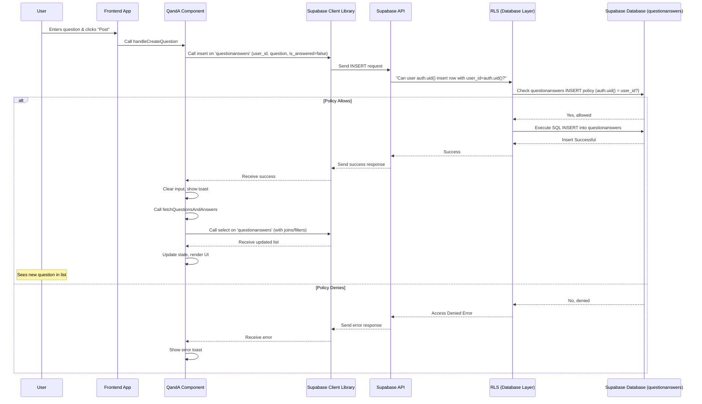

# Chapter 10: Q&A Module

Welcome back to the Focus Hub tutorial! In our previous chapters, we've built features for public sharing ([Chapter 7: Social Feed Module](07_social_feed_module_.md)) and private conversations ([Chapter 8: Chat System Module](08_chat_system_module_.md)), and even a shared library for files ([Chapter 9: Resource Sharing Module](09_resource_sharing_module_.md)). Now, let's create a dedicated space for community members to tap into each other's knowledge: the **Q&A Module**.

## What Problem Are We Solving?

Imagine you're working on a project and get stuck on a specific technical problem, or you need advice on a career path. While you could ask in a chat, a Q&A system provides a structured way to:

1.  **Ask** a clear question that others can easily find.
2.  Receive multiple **answers** from different people with varied perspectives.
3.  Help the community by making these questions and answers **searchable** and available for future users with similar problems.
4.  Identify the most helpful answers through **voting**.
5.  Discuss answers further with **comments**.

This is exactly the goal of the **Q&A Module**. It transforms scattered questions and answers into a growing knowledge base, like a community-driven FAQ or forum focused on specific topics.

## Key Concepts

The Q&A Module is built around several key pieces in our database and on the frontend:

*   **Q&A Content (`questionanswers` table):** This table is used to store *both* the initial questions asked by users *and* the answers provided to those questions. Each entry includes the content (either the question or the answer), a link to the user who created it (`user_id`), and flags to distinguish questions from answers.
*   **Answer Votes (`answer_votes` table):** A separate table that keeps track of which user (`user_id`) voted on which answer (`answer_id`) and whether it was an upvote (+1) or downvote (-1).
*   **Question Votes (`question_votes` table):** Similar to answer votes, but tracks votes directly on the original questions.
*   **Answer Comments (`answer_comments` table):** A table for discussions *under* specific answers. Each comment links to the answer it's about (`answer_id`), the user who commented (`user_id`), and potentially another comment (`parent_comment_id`) for replies.
*   **The `QandA` Page (`src/pages/QandA.tsx`):** This is the main screen in the frontend where users see lists of questions, view details, ask new questions, post answers, vote, and comment.

This module brings together many concepts we've learned: using Supabase for data storage ([Chapter 1: Supabase Integration](01_supabase_integration_.md)), identifying users ([Chapter 2: Authentication & User Management](02_authentication___user_management_.md)), protecting data with RLS ([Chapter 3: Database Schema & RLS](03_database_schema___rls_.md)), structuring the frontend with React and routing ([Chapter 5: Frontend Application Structure](05_frontend_application_structure_.md)), and building the UI with components ([Chapter 6: UI Component Library (shadcn/ui)](06_ui_component_library__shadcn_ui__.md)).

## Use Case: Asking a Question and Getting Answers

Let's trace the journey of a question: A user has a question, asks it, and later sees answers appear.

### 1. Asking a Question

When a user wants to ask something, they go to the Q&A page and click the "Ask Question" button. This typically opens a dialog box.

They type their question into a text area and click "Post Question". The frontend code in `src/pages/QandA.tsx` handles this:

```typescript
// src/pages/QandA.tsx (simplified snippet)
import { supabase } from "@/integrations/supabase/client";
import { useAuth } from "@/contexts/AuthContext"; // Get logged-in user

const QandA = () => {
  const { user } = useAuth(); // Get the current user
  const [newQuestion, setNewQuestion] = useState("");
  const [isCreatingQuestion, setIsCreatingQuestion] = useState(false);
  // ... other state variables ...

  const handleCreateQuestion = async () => {
    if (!user) return; // Check if logged in
    if (!newQuestion.trim()) return; // Check if input is empty

    setIsCreatingQuestion(true); // Disable button, show loading

    try {
      // Insert a new row into the 'questionanswers' table
      const { error } = await supabase
        .from('questionanswers')
        .insert({
          user_id: user.id,         // Link the question to the current user
          question: newQuestion.trim(), // Save the question text
          is_answered: false,      // Mark this entry as an unanswered question
          // answer and other fields will be null initially
        });

      if (error) throw error;

      // Success! Show toast, clear input, refresh list
      console.log('Question posted!'); // Or show success toast
      setNewQuestion(""); // Clear the input
      fetchQuestionsAndAnswers(); // Refresh the main question list
      // Close the dialog
    } catch (error: any) {
      console.error('Error creating question:', error);
      // Show error toast
    } finally {
      setIsCreatingQuestion(false); // Re-enable button
    }
  };

  // ... rest of component logic and JSX ...
};
```

**Explanation:**

*   We use `useAuth()` to get the logged-in `user`'s information ([Chapter 2: Authentication & User Management](02_authentication___user_management_.md)).
*   The `handleCreateQuestion` function is called on form submission.
*   It calls `supabase.from('questionanswers').insert({...})` to add a new record to the `questionanswers` table.
*   We include the `user.id` to mark who asked the question and the question text in the `question` column. `is_answered` is set to `false` to signify it's an open question.
*   **RLS Check:** The RLS policy for `INSERT` on the `questionanswers` table ([Chapter 3: Database Schema & RLS](03_database_schema___rls_.md)) ensures that a user can *only* insert a row if the `user_id` being inserted matches their `auth.uid()`. This prevents someone from posting a question pretending to be another user.
*   After a successful insert, we clear the input and call `fetchQuestionsAndAnswers` (a function defined elsewhere in the component) to reload the list of questions, showing the newly added one.

### 2. Viewing Questions

When a user visits the `QandA` page, the application needs to fetch the list of existing questions and their answers. The `fetchQuestionsAndAnswers` function handles this:

```typescript
// src/pages/QandA.tsx (simplified fetchQuestionsAndAnswers function)
import { useEffect, useState } from "react";
import { supabase } from "@/integrations/supabase/client";

const QandA = () => {
  const [questions, setQuestions] = useState<any[]>([]);
  const [allAnswers, setAllAnswers] = useState<any[]>([]); // Store all answers separately
  const [loading, setLoading] = useState(true);
  // ... other state ...

  const fetchQuestionsAndAnswers = async () => {
    setLoading(true);
    try {
      // Fetch questions (rows with is_answered = false)
      const { data: questionData, error: qError } = await supabase
        .from('questionanswers')
        .select('*, profiles: user_id (full_name, avatar_url)') // Get question details and author profile
        .eq('is_answered', false) // Filter for question entries
        .order('created_at', { ascending: false }); // Show recent questions first

      if (qError) throw qError;

      // Fetch answers (rows with is_answered = true)
      const { data: answerData, error: aError } = await supabase
        .from('questionanswers')
        .select('*, profiles: user_id (full_name, avatar_url)') // Get answer details and author profile
        .eq('is_answered', true) // Filter for answer entries
        .order('created_at', { ascending: true }); // Show answers chronologically

      if (aError) throw aError;

      setQuestions(questionData || []); // Store questions
      setAllAnswers(answerData || []); // Store all answers

      // Note: Votes and comments are fetched separately or joined as needed.
      // The actual code fetches votes here too (see full code)

    } catch (error) {
      console.error('Error fetching Q&A:', error);
      // Show error toast
    } finally {
      setLoading(false);
    }
  };

  // Fetch data when the component mounts or search query changes
  useEffect(() => {
    fetchQuestionsAndAnswers();
  }, []); // Or [searchQuery] for live filtering

  // ... rest of component logic and JSX ...
};
```

**Explanation:**

*   We use `useState` to store the list of questions (`questions`) and a separate list of all answers (`allAnswers`).
*   The `fetchQuestionsAndAnswers` function queries the `questionanswers` table twice: once for rows where `is_answered` is false (the questions) and once for rows where `is_answered` is true (the answers).
*   `select('*, profiles: user_id (...)')` fetches the content and joins with the `profiles` table to get the author's name and avatar ([Chapter 3: Database Schema & RLS](03_database_schema___rls_.md)).
*   **RLS Check:** The RLS policy for `SELECT` on the `questionanswers` table (`CREATE POLICY "Users can view questions" ON public.questionanswers FOR SELECT USING (true);`) allows *any* user (even non-logged-in, if configured, but typically authenticated users via `auth.uid()` check) to see all question and answer entries. This is appropriate for a public Q&A section.

The fetched `questions` list is then rendered in the component's JSX, typically mapping over the array to display each question card:

```jsx
// src/pages/QandA.tsx (simplified JSX loop for questions)
// ... inside the component render function ...
{loading ? (
  // Loading spinner
) : questions.length === 0 ? (
  <div className="text-center py-10 text-muted-foreground">No questions found.</div>
) : (
  // Map through fetched questions
  questions.map((question) => {
    // Filter answers relevant to this question (matching question text - simplified)
    const answersForThisQuestion = allAnswers.filter(ans => ans.question === question.question);
    return (
      // Use a Card component for each question (from shadcn/ui)
      <Card key={question.id} className="hover:shadow-md transition-shadow cursor-pointer mb-6">
        <CardContent className="p-6">
          <div className="flex gap-4">
            {/* Vote Section (Question) */}
            <div className="flex flex-col items-center space-y-1 min-w-[60px]">
              {/* Upvote button using shadcn/ui Button */}
              {/* Display question vote count */}
              {/* Downvote button */}
            </div>
            {/* Question Content Area */}
            <div className="flex-1 space-y-3">
              <div className="flex items-center gap-2">
                {/* Question Title */}
                <h3 className="font-semibold text-lg">
                  {question.question}
                </h3>
                {!question.is_answered && (
                   <Badge variant="secondary" className="text-xs">Unanswered</Badge>
                )}
                {/* Edit/Delete Options (if user is owner) */}
              </div>
              {/* ... Brief preview of an answer or "No answer yet" ... */}
               <p className="text-muted-foreground text-sm line-clamp-2">
                 {answersForThisQuestion.length > 0 ? answersForThisQuestion[0].answer : "No answer yet."}
               </p>
              {/* Author and Answer Count Info */}
              <div className="flex items-center justify-between text-sm text-muted-foreground">
                <div className="flex items-center gap-4">
                  {/* Author Avatar and Name */}
                  <Avatar className="h-6 w-6"> {/* shadcn/ui Avatar */}
                     <AvatarImage src={question.profiles?.avatar_url} />
                     <AvatarFallback>{question.profiles?.full_name?.charAt(0)}</AvatarFallback>
                   </Avatar>
                  <span>{question.profiles?.full_name}</span>
                  <span>{question.created_at ? new Date(question.created_at).toLocaleDateString() : ''}</span>
                </div>
                {/* Answer Count */}
                <div className="flex items-center gap-1">
                  <MessageCircle className="h-4 w-4" /> {/* Lucide icon */}
                  <span>{answersForThisQuestion.length} answers</span>
                </div>
              </div>
              {/* Area to display full answers and answer form */}
              {/* ... Render Answers and Answer Form below the question ... */}
               <div className="pt-2">
                 {/* ... Loop through answersForThisQuestion and display ... */}
                 {/* Answer Input Form */}
                 <Textarea placeholder="Write your answer..." /> {/* shadcn/ui Textarea */}
                 <Button>Post Answer</Button> {/* shadcn/ui Button */}
               </div>
            </div>
          </div>
        </CardContent>
      </Card>
    );
  })
)}
// ... rest of JSX ...
```

*   We use `map` to render a `Card` for each `question`.
*   Inside the card, we display the question text, author info, and the count of answers found for this question by filtering the `allAnswers` array based on the question *text* (matching the code's logic, though a foreign key would be more robust).
*   We also include sections for voting, displaying individual answers, and an input form to submit a new answer, all using `shadcn/ui` components ([Chapter 6: UI Component Library (shadcn/ui)](06_ui_component_library__shadcn_ui__.md)).

### 3. Submitting an Answer

When a user provides an answer to a question:

```typescript
// src/pages/QandA.tsx (simplified snippet for submitting answer)
import { supabase } from "@/integrations/supabase/client";
import { useAuth } from "@/contexts/AuthContext";

const QandA = () => {
  const { user } = useAuth();
  const [newAnswer, setNewAnswer] = useState("");
  const [isSubmittingAnswer, setIsSubmittingAnswer] = useState(false);
  // ... other state ...

  const handleSubmitAnswer = async (questionObj) => { // Pass the question object
    if (!user) return; // Check if logged in
    if (!newAnswer.trim()) return; // Check if input is empty

    setIsSubmittingAnswer(true);

    try {
      // Insert a new row into questionanswers for the answer
      const { error } = await supabase
        .from('questionanswers')
        .insert({
          user_id: user.id,         // Link the answer to the current user
          question: questionObj.question, // Link back to the *original question text*
          answer: newAnswer.trim(),   // Save the answer content
          is_answered: true,       // Mark this entry as an answer
        });

      if (error) throw error;

      // Success! Show toast, clear input, refresh answers for this question
      console.log('Answer posted!'); // Or show success toast
      setNewAnswer(""); // Clear the input
      // Refresh just the answers (or all Q&A if simpler)
      fetchQuestionsAndAnswers(); // Or a function to fetch only answers for this question
    } catch (error: any) {
      console.error('Error posting answer:', error);
      // Show error toast
    } finally {
      setIsSubmittingAnswer(false);
    }
  };

  // ... rest of component ...
};
```

*   The `handleSubmitAnswer` function is triggered when the user clicks the "Post Answer" button.
*   It also calls `supabase.from('questionanswers').insert({...})`, but this time it fills the `answer` column, sets `is_answered` to `true`, and crucially, uses the `question` text from the *original question object* (`questionObj.question`) to associate the answer with the correct question.
*   The RLS policy for `INSERT` on `questionanswers` again ensures `auth.uid() = user_id`.
*   After insertion, the input is cleared, and the list is refreshed.

### 4. Voting on Answers

Users can vote on answers to signal their helpfulness. This uses the `answer_votes` table.

```typescript
// src/pages/QandA.tsx (simplified snippet for voting)
import { supabase } from "@/integrations/supabase/client";
import { useAuth } from "@/contexts/AuthContext";

const QandA = () => {
  const { user } = useAuth();
  const [answerVotes, setAnswerVotes] = useState<{ [answerId: string]: number }>({}); // Total votes per answer
  const [userVotes, setUserVotes] = useState<{ [answerId: string]: number }>({});     // User's vote per answer (1, -1, or 0)
  // ... other state ...

  // handleVote called from upvote/downvote buttons on an answer
  const handleVote = async (answerId: string, type: 1 | -1) => {
    if (!user) {
      // Show toast error: Must be logged in
      return;
    }
    // Optional: Prevent voting if already voted (or allow changing vote with more complex logic)
    // const currentUserVote = userVotes[answerId] || 0;
    // if (currentUserVote !== 0) return;

    // Use upsert to insert a new vote or update if the user already voted on this answer
    await (supabase.from as any)('answer_votes').upsert({ // Note: Table name 'answer_votes' assumed from code
      answer_id: answerId,
      user_id: user.id,
      vote_type: type, // 1 for upvote, -1 for downvote
    });

    // --- Optimistic UI Update ---
    // Update local state instantly before the database change is confirmed
    // This makes the UI feel faster
    setUserVotes(prev => ({ ...prev, [answerId]: type }));
    setAnswerVotes(prev => ({
      ...prev,
      [answerId]: (prev[answerId] || 0) + type // Add the vote type
    }));
    // Note: If allowing changing votes, this logic becomes more complex (subtract old vote, add new)
  };

  // Votes are initially fetched in fetchQuestionsAndAnswers
  // RLS ensures users can only see votes they are allowed to see (often all votes for visibility)

  return (
    // ... JSX rendering answer cards ...
    // Inside answer card, on vote buttons:
    // <Button onClick={() => handleVote(answer.id, 1)}>Upvote ({answerVotes[answer.id] || 0})</Button>
    // <Button onClick={() => handleVote(answer.id, -1)}>Downvote</Button>
    // ...
  );
};
```

**Explanation:**

*   The `handleVote` function takes the answer ID and the vote type (+1 or -1).
*   It uses `supabase.from('answer_votes').upsert({...})`. `upsert` is a convenient Supabase function that tries to `INSERT` a row. If a row with the unique constraints already exists (in this case, the unique constraint on `user_id` and `answer_id` in the `answer_votes` table schema), it instead performs an `UPDATE`. This simplifies the logic for voting (you don't need to check if a vote exists before inserting).
*   The RLS policy on `answer_votes` for `INSERT`/`UPSERT` ([Chapter 3: Database Schema & RLS](03_database_schema___rls_.md)) ensures `auth.uid() = user_id`. A user can only insert a vote record linked to their own ID.
*   We update the local state (`userVotes` and `answerVotes`) immediately *before* the `await` call finishes. This is an **optimistic UI update** – we assume the database call will succeed and update the UI instantly, making the application feel more responsive. If an error *does* occur, you'd need to revert the UI state (error handling skipped for brevity).
*   Question voting (`handleQuestionVote`) works similarly using `question_votes`.

### 5. Commenting on Answers

Users can add comments to answers using the `answer_comments` table.

```typescript
// src/pages/QandA.tsx (simplified snippet for commenting)
import { supabase } from "@/integrations/supabase/client";
import { useAuth } from "@/contexts/AuthContext";

const QandA = () => {
  const { user } = useAuth();
  const [commentInput, setCommentInput] = useState("");
  const [commentLoading, setCommentLoading] = useState(false);
  // Assume selectedAnswer holds the current answer being commented on
  // ... other state ...

  const handleAddComment = async (e: React.FormEvent) => { // Pass the event
    e.preventDefault(); // Prevent page reload
    if (!user || !commentInput.trim() || !selectedAnswer) return;

    setCommentLoading(true);

    try {
      // Insert a new row into answer_comments
      await (supabase.from as any)("answer_comments").insert({ // Note: Table name 'answer_comments' assumed from code
        answer_id: selectedAnswer.id, // Link to the answer
        user_id: user.id,           // Link to the current user
        comment: commentInput.trim(), // The comment text
        parent_comment_id: null,     // For top-level comments
      });

      console.log("Comment added!"); // Or show toast
      setCommentInput(""); // Clear input
      // Refresh comments for the current answer
      fetchAnswerComments(selectedAnswer.id); // Assumes fetchAnswerComments exists
    } catch (error: any) {
      console.error('Error adding comment:', error);
      // Show error toast
    } finally {
      setCommentLoading(false);
    }
  };

  // fetchAnswerComments function is needed to load comments
  // The buildCommentTree and CommentThread components handle displaying nested comments

  return (
    // ... JSX rendering answer cards ...
    // Inside answer card, below answer content/votes:
    // Comment list display area ({CommentThread({ comments: buildCommentTree(answerComments) })})
    // Comment input form:
    // {user && (
    //    <form onSubmit={handleAddComment}>
    //       <input value={commentInput} onChange={e => setCommentInput(e.target.value)} />
    //       <Button type="submit">Post Comment</Button>
    //    </form>
    // )}
    // ...
  );
};
```

**Explanation:**

*   The `handleAddComment` function is triggered by the comment form submission.
*   It uses `supabase.from('answer_comments').insert({...})` to add a new comment row.
*   It links the comment to the `answer_id` of the currently selected answer and the `user_id` of the logged-in user. `parent_comment_id` is set to `null` for top-level comments (replying to comments involves setting this to the parent comment's ID).
*   The RLS policy on `answer_comments` for `INSERT` ([Chapter 3: Database Schema & RLS](03_database_schema___rls_.md)) ensures `auth.uid() = user_id`.
*   After insertion, the input is cleared, and `fetchAnswerComments` is called to refresh the list of comments for the current answer.

Editing and deleting questions, answers, and comments follow similar patterns using `supabase.from(...).update()` or `supabase.from(...).delete()`, relying on the corresponding RLS policies (`auth.uid() = user_id`) to ensure users can only modify or delete content they own.

## Under the Hood: Q&A Data Flow

Here's a simplified look at the flow when a user asks a question:



This diagram shows the flow for asking a question, involving the frontend component interacting with the database via the Supabase client, RLS enforcing the security rule that a user can only post on behalf of themselves, and finally, the frontend refreshing the list to display the new question. Answering, voting, and commenting follow similar patterns, interacting with their respective tables and RLS policies.

The RLS policies for this module typically follow the pattern seen in previous chapters:

*   **`questionanswers` (SELECT):** `USING (true)` - Anyone can view questions and answers.
*   **`questionanswers` (INSERT/UPDATE/DELETE):** `USING (auth.uid() = user_id)` / `WITH CHECK (auth.uid() = user_id)` - Users can only create, edit, or delete their *own* questions/answers.
*   **`answer_votes`, `question_votes` (INSERT/UPSERT):** `WITH CHECK (auth.uid() = user_id)` - Users can only record votes for themselves.
*   **`answer_comments` (INSERT):** `WITH CHECK (auth.uid() = user_id)` - Users can only post comments as themselves.
*   **`answer_comments` (DELETE):** `USING (auth.uid() = user_id)` - Users can only delete their own comments.

These RLS rules are defined in the database schema migration files ([Chapter 3: Database Schema & RLS](03_database_schema___rls_.md)) and automatically enforced by Supabase whenever the frontend attempts a database operation.

## Conclusion

In this chapter, we explored the **Q&A Module**, adding a structured way for community members to ask and answer questions. We learned how it uses the `questionanswers` table (for core Q&A content), `answer_votes`, `question_votes`, and `answer_comments` tables (for interactions) to build a collaborative knowledge base. We saw how the `QandA` page orchestrates fetching, displaying, and submitting content, relying on the Supabase client for data operations, RLS for security (ensuring users only modify their own content), and UI components for the user interface.

With the Q&A module complete, Focus Hub now has several key features for community interaction: public posts, private chat, resource sharing, and knowledge exchange.

This marks the end of our initial tutorial chapters covering the core modules of Focus Hub. You've built a solid foundation using Supabase and modern frontend practices!

---

<sub><sup>Generated by [AI Codebase Knowledge Builder](https://github.com/The-Pocket/Tutorial-Codebase-Knowledge).</sup></sub> <sub><sup>**References**: [[1]](https://github.com/HackyCoder0951/focus_hub/blob/e310dc085cf675c010a63c1dcc0eaef3442f8f9a/src/pages/QandA.tsx), [[2]](https://github.com/HackyCoder0951/focus_hub/blob/e310dc085cf675c010a63c1dcc0eaef3442f8f9a/supabase/migrations/20250629133651_focus_hub.sql), [[3]](https://github.com/HackyCoder0951/focus_hub/blob/e310dc085cf675c010a63c1dcc0eaef3442f8f9a/supabase/migrations/20250629202043_qna_data.sql), [[4]](https://github.com/HackyCoder0951/focus_hub/blob/e310dc085cf675c010a63c1dcc0eaef3442f8f9a/supabase/migrations/20250702000000_qa_module_schema.sql)</sup></sub>