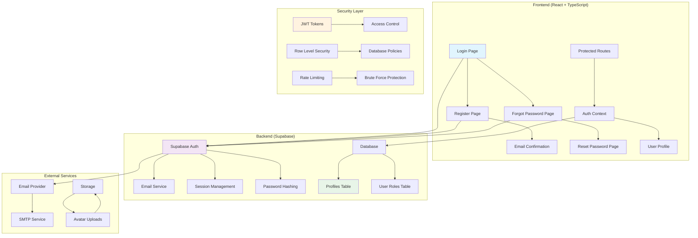
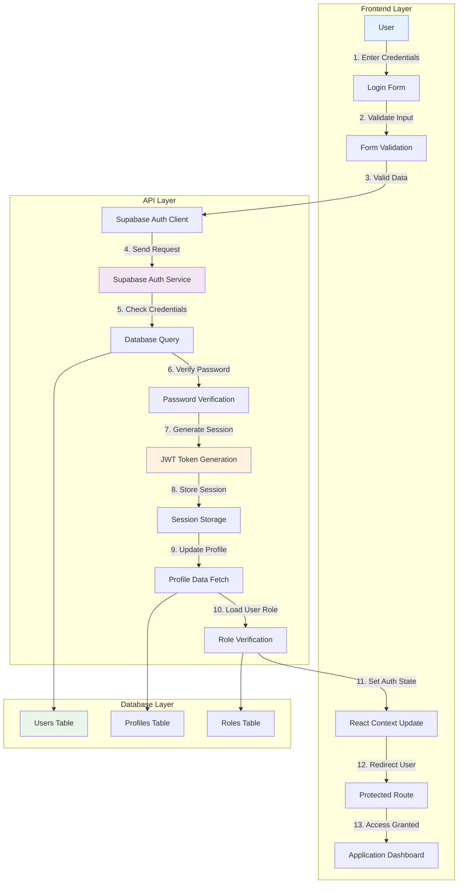
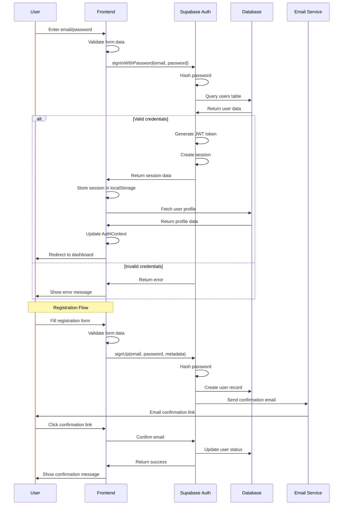
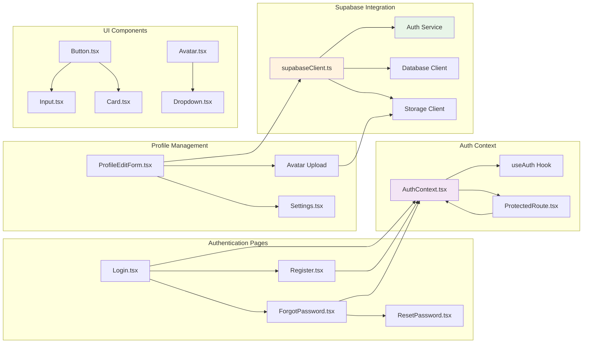
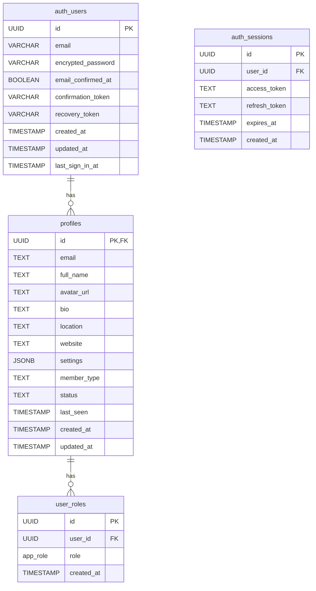
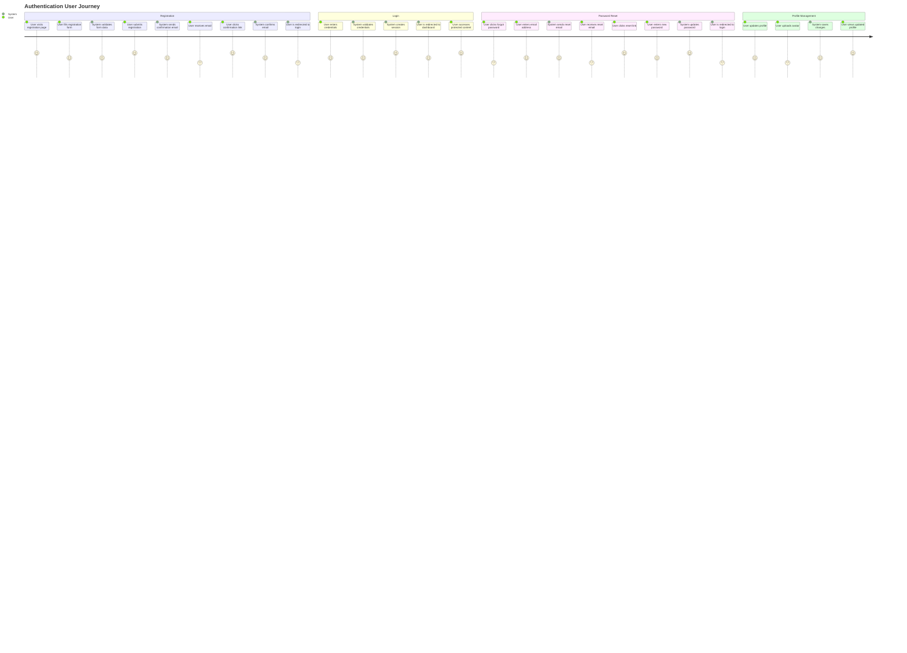
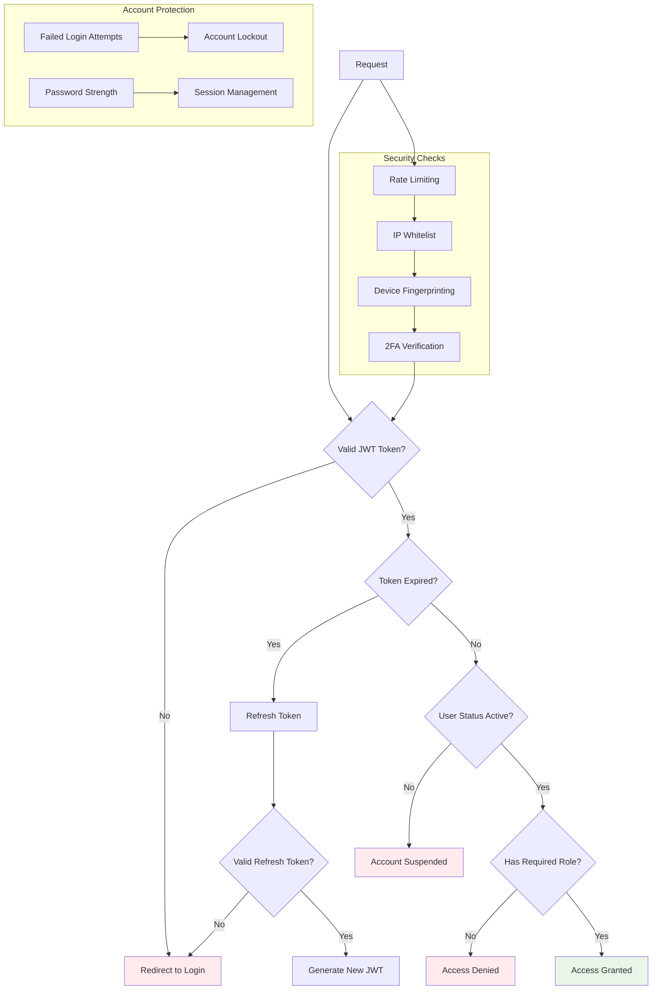
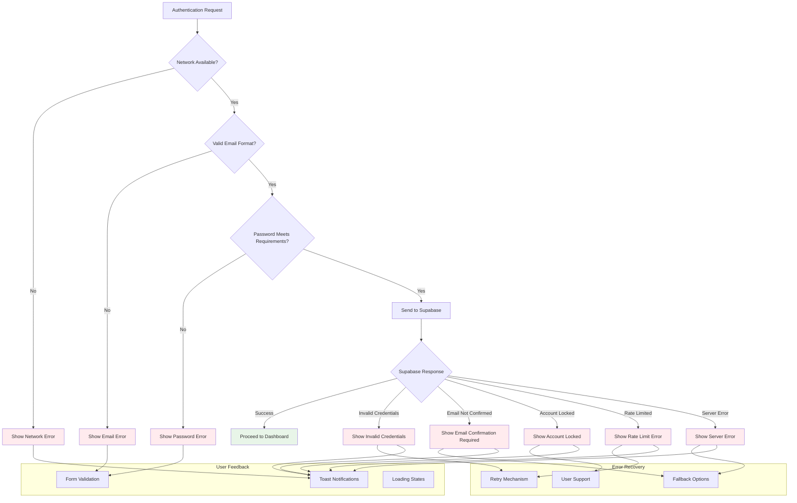

# Authentication System Flow Diagrams
## Focus Hub Social Learning Platform

---

## Table of Contents

1. [System Architecture Diagram](#1-system-architecture-diagram)
2. [Data Flow Diagram](#2-data-flow-diagram)
3. [Sequence Diagram](#3-sequence-diagram)
4. [Component Interaction Diagram](#4-component-interaction-diagram)
5. [Database Schema Diagram](#5-database-schema-diagram)
6. [User Journey Flow](#6-user-journey-flow)
7. [Security Flow Diagram](#7-security-flow-diagram)
8. [Error Handling Flow](#8-error-handling-flow)

---

## 1. System Architecture Diagram

---

## 2. Data Flow Diagram

---

## 3. Sequence Diagram

---

## 4. Component Interaction Diagram

---

## 5. Database Schema Diagram

---

## 6. User Journey Flow

---

## 7. Security Flow Diagram

---

## 8. Error Handling Flow

---

*These diagrams provide comprehensive visualization of the authentication system architecture, data flow, security measures, and user interactions in the Focus Hub platform.* 