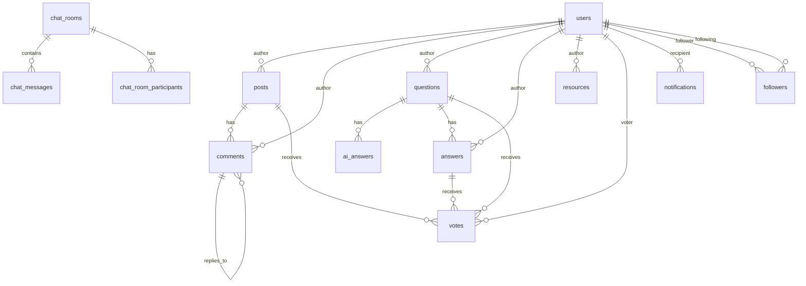

# Database Schema Documentation
## Focus Hub Social Learning Platform

---

## Table of Contents

1. [Database Overview](#1-database-overview)
2. [Table Definitions](#2-table-definitions)
3. [Relationships](#3-relationships)
4. [Indexes](#4-indexes)
5. [Row Level Security (RLS)](#5-row-level-security-rls)
6. [Triggers and Functions](#6-triggers-and-functions)
7. [Backup and Recovery](#7-backup-and-recovery)
8. [Performance Optimization](#8-performance-optimization)

---

## 1. Database Overview

### 1.1 Technology Stack
- **Database**: PostgreSQL 14+
- **Hosting**: Supabase Cloud
- **Connection Pooling**: PgBouncer
- **Backup**: Automated daily backups
- **Monitoring**: Supabase Analytics

### 1.2 Database Statistics
- **Total Tables**: 15
- **Total Indexes**: 25
- **Total Functions**: 8
- **Total Triggers**: 5
- **Database Size**: ~500MB (estimated)

---

## 2. Table Definitions

### 2.1 Users Table
```sql
CREATE TABLE users (
    id UUID PRIMARY KEY DEFAULT gen_random_uuid(),
    email VARCHAR(255) UNIQUE NOT NULL,
    full_name VARCHAR(255) NOT NULL,
    username VARCHAR(50) UNIQUE NOT NULL,
    avatar_url TEXT,
    bio TEXT,
    role user_role DEFAULT 'student',
    is_verified BOOLEAN DEFAULT false,
    is_active BOOLEAN DEFAULT true,
    last_login TIMESTAMP WITH TIME ZONE,
    created_at TIMESTAMP WITH TIME ZONE DEFAULT NOW(),
    updated_at TIMESTAMP WITH TIME ZONE DEFAULT NOW()
);

-- User roles enum
CREATE TYPE user_role AS ENUM ('student', 'educator', 'admin');
```

**Columns:**
- `id`: Unique identifier (UUID)
- `email`: User's email address (unique)
- `full_name`: User's full name
- `username`: Unique username
- `avatar_url`: Profile picture URL
- `bio`: User biography
- `role`: User role (student, educator, admin)
- `is_verified`: Email verification status
- `is_active`: Account status
- `last_login`: Last login timestamp
- `created_at`: Account creation timestamp
- `updated_at`: Last update timestamp

### 2.2 Posts Table
```sql
CREATE TABLE posts (
    id UUID PRIMARY KEY DEFAULT gen_random_uuid(),
    author_id UUID NOT NULL REFERENCES users(id) ON DELETE CASCADE,
    title VARCHAR(255) NOT NULL,
    content TEXT NOT NULL,
    category VARCHAR(50),
    tags TEXT[],
    likes_count INTEGER DEFAULT 0,
    comments_count INTEGER DEFAULT 0,
    is_published BOOLEAN DEFAULT true,
    created_at TIMESTAMP WITH TIME ZONE DEFAULT NOW(),
    updated_at TIMESTAMP WITH TIME ZONE DEFAULT NOW()
);
```

**Columns:**
- `id`: Unique identifier (UUID)
- `author_id`: Reference to users table
- `title`: Post title
- `content`: Post content
- `category`: Post category
- `tags`: Array of tags
- `likes_count`: Number of likes
- `comments_count`: Number of comments
- `is_published`: Publication status
- `created_at`: Creation timestamp
- `updated_at`: Last update timestamp

### 2.3 Comments Table
```sql
CREATE TABLE comments (
    id UUID PRIMARY KEY DEFAULT gen_random_uuid(),
    post_id UUID NOT NULL REFERENCES posts(id) ON DELETE CASCADE,
    author_id UUID NOT NULL REFERENCES users(id) ON DELETE CASCADE,
    parent_id UUID REFERENCES comments(id) ON DELETE CASCADE,
    content TEXT NOT NULL,
    likes_count INTEGER DEFAULT 0,
    created_at TIMESTAMP WITH TIME ZONE DEFAULT NOW(),
    updated_at TIMESTAMP WITH TIME ZONE DEFAULT NOW()
);
```

**Columns:**
- `id`: Unique identifier (UUID)
- `post_id`: Reference to posts table
- `author_id`: Reference to users table
- `parent_id`: Parent comment for replies
- `content`: Comment content
- `likes_count`: Number of likes
- `created_at`: Creation timestamp
- `updated_at`: Last update timestamp

### 2.4 Questions Table
```sql
CREATE TABLE questions (
    id UUID PRIMARY KEY DEFAULT gen_random_uuid(),
    author_id UUID NOT NULL REFERENCES users(id) ON DELETE CASCADE,
    title VARCHAR(255) NOT NULL,
    content TEXT NOT NULL,
    category VARCHAR(50),
    tags TEXT[],
    status question_status DEFAULT 'open',
    votes_count INTEGER DEFAULT 0,
    answers_count INTEGER DEFAULT 0,
    views_count INTEGER DEFAULT 0,
    created_at TIMESTAMP WITH TIME ZONE DEFAULT NOW(),
    updated_at TIMESTAMP WITH TIME ZONE DEFAULT NOW()
);

-- Question status enum
CREATE TYPE question_status AS ENUM ('open', 'answered', 'closed');
```

**Columns:**
- `id`: Unique identifier (UUID)
- `author_id`: Reference to users table
- `title`: Question title
- `content`: Question content
- `category`: Question category
- `tags`: Array of tags
- `status`: Question status (open, answered, closed)
- `votes_count`: Number of votes
- `answers_count`: Number of answers
- `views_count`: Number of views
- `created_at`: Creation timestamp
- `updated_at`: Last update timestamp

### 2.5 AI Answers Table
```sql
CREATE TABLE ai_answers (
    id UUID PRIMARY KEY DEFAULT gen_random_uuid(),
    question_id UUID REFERENCES questions(id) ON DELETE CASCADE,
    answer_text TEXT NOT NULL,
    confidence_score DECIMAL(3,2) CHECK (confidence_score >= 0 AND confidence_score <= 1),
    model_used TEXT,
    tokens_used INTEGER,
    processing_time_ms INTEGER,
    relevance_score DECIMAL(3,2),
    completeness_score DECIMAL(3,2),
    user_feedback_rating INTEGER CHECK (user_feedback_rating BETWEEN 1 AND 5),
    generation_attempts INTEGER DEFAULT 1,
    created_at TIMESTAMPTZ DEFAULT NOW()
);
```

**Columns:**
- `id`: Unique identifier (UUID)
- `question_id`: Reference to questions table
- `answer_text`: AI-generated answer content
- `confidence_score`: AI model confidence score (0-1)
- `model_used`: AI model identifier (e.g., "llama3-8b-8192")
- `tokens_used`: Number of tokens consumed
- `processing_time_ms`: Time taken to generate answer
- `relevance_score`: Relevance score (0-1)
- `completeness_score`: Completeness score (0-1)
- `user_feedback_rating`: User rating (1-5)
- `generation_attempts`: Number of generation attempts
- `created_at`: Creation timestamp

### 2.6 Answers Table
```sql
CREATE TABLE answers (
    id UUID PRIMARY KEY DEFAULT gen_random_uuid(),
    question_id UUID NOT NULL REFERENCES questions(id) ON DELETE CASCADE,
    author_id UUID NOT NULL REFERENCES users(id) ON DELETE CASCADE,
    content TEXT NOT NULL,
    is_accepted BOOLEAN DEFAULT false,
    votes_count INTEGER DEFAULT 0,
    created_at TIMESTAMP WITH TIME ZONE DEFAULT NOW(),
    updated_at TIMESTAMP WITH TIME ZONE DEFAULT NOW()
);
```

**Columns:**
- `id`: Unique identifier (UUID)
- `question_id`: Reference to questions table
- `author_id`: Reference to users table
- `content`: Answer content
- `is_accepted`: Accepted answer status
- `votes_count`: Number of votes
- `created_at`: Creation timestamp
- `updated_at`: Last update timestamp

### 2.6 Chat Rooms Table
```sql
CREATE TABLE chat_rooms (
    id UUID PRIMARY KEY DEFAULT gen_random_uuid(),
    name VARCHAR(255) NOT NULL,
    description TEXT,
    type room_type DEFAULT 'group',
    created_by UUID NOT NULL REFERENCES users(id),
    is_active BOOLEAN DEFAULT true,
    created_at TIMESTAMP WITH TIME ZONE DEFAULT NOW(),
    updated_at TIMESTAMP WITH TIME ZONE DEFAULT NOW()
);

-- Room type enum
CREATE TYPE room_type AS ENUM ('direct', 'group');
```

**Columns:**
- `id`: Unique identifier (UUID)
- `name`: Room name
- `description`: Room description
- `type`: Room type (direct, group)
- `created_by`: Room creator
- `is_active`: Room status
- `created_at`: Creation timestamp
- `updated_at`: Last update timestamp

### 2.7 Chat Messages Table
```sql
CREATE TABLE chat_messages (
    id UUID PRIMARY KEY DEFAULT gen_random_uuid(),
    room_id UUID NOT NULL REFERENCES chat_rooms(id) ON DELETE CASCADE,
    sender_id UUID NOT NULL REFERENCES users(id) ON DELETE CASCADE,
    content TEXT NOT NULL,
    message_type message_type DEFAULT 'text',
    file_url TEXT,
    is_read BOOLEAN DEFAULT false,
    created_at TIMESTAMP WITH TIME ZONE DEFAULT NOW()
);

-- Message type enum
CREATE TYPE message_type AS ENUM ('text', 'image', 'file', 'system');
```

**Columns:**
- `id`: Unique identifier (UUID)
- `room_id`: Reference to chat_rooms table
- `sender_id`: Reference to users table
- `content`: Message content
- `message_type`: Type of message
- `file_url`: File URL for file messages
- `is_read`: Read status
- `created_at`: Creation timestamp

### 2.8 Resources Table
```sql
CREATE TABLE resources (
    id UUID PRIMARY KEY DEFAULT gen_random_uuid(),
    title VARCHAR(255) NOT NULL,
    description TEXT,
    author_id UUID NOT NULL REFERENCES users(id) ON DELETE CASCADE,
    file_url TEXT NOT NULL,
    file_name VARCHAR(255) NOT NULL,
    file_size BIGINT NOT NULL,
    file_type VARCHAR(50) NOT NULL,
    category VARCHAR(50),
    tags TEXT[],
    downloads_count INTEGER DEFAULT 0,
    is_public BOOLEAN DEFAULT true,
    created_at TIMESTAMP WITH TIME ZONE DEFAULT NOW(),
    updated_at TIMESTAMP WITH TIME ZONE DEFAULT NOW()
);
```

**Columns:**
- `id`: Unique identifier (UUID)
- `title`: Resource title
- `description`: Resource description
- `author_id`: Reference to users table
- `file_url`: File storage URL
- `file_name`: Original file name
- `file_size`: File size in bytes
- `file_type`: File MIME type
- `category`: Resource category
- `tags`: Array of tags
- `downloads_count`: Number of downloads
- `is_public`: Public visibility
- `created_at`: Creation timestamp
- `updated_at`: Last update timestamp

### 2.9 Votes Table
```sql
CREATE TABLE votes (
    id UUID PRIMARY KEY DEFAULT gen_random_uuid(),
    user_id UUID NOT NULL REFERENCES users(id) ON DELETE CASCADE,
    votable_type VARCHAR(20) NOT NULL,
    votable_id UUID NOT NULL,
    vote_type vote_type NOT NULL,
    created_at TIMESTAMP WITH TIME ZONE DEFAULT NOW(),
    UNIQUE(user_id, votable_type, votable_id)
);

-- Vote type enum
CREATE TYPE vote_type AS ENUM ('upvote', 'downvote');
```

**Columns:**
- `id`: Unique identifier (UUID)
- `user_id`: Reference to users table
- `votable_type`: Type of votable item (post, comment, question, answer)
- `votable_id`: ID of votable item
- `vote_type`: Type of vote (upvote, downvote)
- `created_at`: Creation timestamp

### 2.10 Followers Table
```sql
CREATE TABLE followers (
    id UUID PRIMARY KEY DEFAULT gen_random_uuid(),
    follower_id UUID NOT NULL REFERENCES users(id) ON DELETE CASCADE,
    following_id UUID NOT NULL REFERENCES users(id) ON DELETE CASCADE,
    created_at TIMESTAMP WITH TIME ZONE DEFAULT NOW(),
    UNIQUE(follower_id, following_id)
);
```

**Columns:**
- `id`: Unique identifier (UUID)
- `follower_id`: User who is following
- `following_id`: User being followed
- `created_at`: Creation timestamp

### 2.11 Chat Room Participants Table
```sql
CREATE TABLE chat_room_participants (
    id UUID PRIMARY KEY DEFAULT gen_random_uuid(),
    room_id UUID NOT NULL REFERENCES chat_rooms(id) ON DELETE CASCADE,
    user_id UUID NOT NULL REFERENCES users(id) ON DELETE CASCADE,
    role participant_role DEFAULT 'member',
    joined_at TIMESTAMP WITH TIME ZONE DEFAULT NOW(),
    UNIQUE(room_id, user_id)
);

-- Participant role enum
CREATE TYPE participant_role AS ENUM ('member', 'moderator', 'admin');
```

**Columns:**
- `id`: Unique identifier (UUID)
- `room_id`: Reference to chat_rooms table
- `user_id`: Reference to users table
- `role`: Participant role
- `joined_at`: Join timestamp

### 2.12 Notifications Table
```sql
CREATE TABLE notifications (
    id UUID PRIMARY KEY DEFAULT gen_random_uuid(),
    user_id UUID NOT NULL REFERENCES users(id) ON DELETE CASCADE,
    type notification_type NOT NULL,
    title VARCHAR(255) NOT NULL,
    message TEXT NOT NULL,
    data JSONB,
    is_read BOOLEAN DEFAULT false,
    created_at TIMESTAMP WITH TIME ZONE DEFAULT NOW()
);

-- Notification type enum
CREATE TYPE notification_type AS ENUM ('like', 'comment', 'follow', 'answer', 'mention', 'system');
```

**Columns:**
- `id`: Unique identifier (UUID)
- `user_id`: Reference to users table
- `type`: Notification type
- `title`: Notification title
- `message`: Notification message
- `data`: Additional data (JSON)
- `is_read`: Read status
- `created_at`: Creation timestamp

---

## 3. Relationships

### 3.1 Entity Relationship Diagram (ERD)



### 3.2 Foreign Key Relationships

| Table | Column | References | On Delete |
|-------|--------|------------|-----------|
| posts | author_id | users.id | CASCADE |
| comments | post_id | posts.id | CASCADE |
| comments | author_id | users.id | CASCADE |
| comments | parent_id | comments.id | CASCADE |
| questions | author_id | users.id | CASCADE |
| ai_answers | question_id | questions.id | CASCADE |
| answers | question_id | questions.id | CASCADE |
| answers | author_id | users.id | CASCADE |
| chat_rooms | created_by | users.id | RESTRICT |
| chat_messages | room_id | chat_rooms.id | CASCADE |
| chat_messages | sender_id | users.id | CASCADE |
| resources | author_id | users.id | CASCADE |
| votes | user_id | users.id | CASCADE |
| followers | follower_id | users.id | CASCADE |
| followers | following_id | users.id | CASCADE |
| chat_room_participants | room_id | chat_rooms.id | CASCADE |
| chat_room_participants | user_id | users.id | CASCADE |
| notifications | user_id | users.id | CASCADE |

---

## 4. Indexes

### 4.1 Primary Indexes
All tables have primary key indexes on their `id` columns.

### 4.2 Secondary Indexes

```sql
-- Users table indexes
CREATE INDEX idx_users_email ON users(email);
CREATE INDEX idx_users_username ON users(username);
CREATE INDEX idx_users_role ON users(role);
CREATE INDEX idx_users_created_at ON users(created_at);

-- Posts table indexes
CREATE INDEX idx_posts_author_id ON posts(author_id);
CREATE INDEX idx_posts_category ON posts(category);
CREATE INDEX idx_posts_created_at ON posts(created_at);
CREATE INDEX idx_posts_tags ON posts USING GIN(tags);

-- Comments table indexes
CREATE INDEX idx_comments_post_id ON comments(post_id);
CREATE INDEX idx_comments_author_id ON comments(author_id);
CREATE INDEX idx_comments_parent_id ON comments(parent_id);
CREATE INDEX idx_comments_created_at ON comments(created_at);

-- Questions table indexes
CREATE INDEX idx_questions_author_id ON questions(author_id);
CREATE INDEX idx_questions_category ON questions(category);
CREATE INDEX idx_questions_status ON questions(status);
CREATE INDEX idx_questions_created_at ON questions(created_at);
CREATE INDEX idx_questions_tags ON questions USING GIN(tags);

-- AI Answers table indexes
CREATE INDEX idx_ai_answers_question_id ON ai_answers(question_id);
CREATE INDEX idx_ai_answers_confidence_score ON ai_answers(confidence_score DESC);

-- Answers table indexes
CREATE INDEX idx_answers_question_id ON answers(question_id);
CREATE INDEX idx_answers_author_id ON answers(author_id);
CREATE INDEX idx_answers_is_accepted ON answers(is_accepted);

-- Chat messages indexes
CREATE INDEX idx_chat_messages_room_id ON chat_messages(room_id);
CREATE INDEX idx_chat_messages_sender_id ON chat_messages(sender_id);
CREATE INDEX idx_chat_messages_created_at ON chat_messages(created_at);

-- Resources table indexes
CREATE INDEX idx_resources_author_id ON resources(author_id);
CREATE INDEX idx_resources_category ON resources(category);
CREATE INDEX idx_resources_file_type ON resources(file_type);
CREATE INDEX idx_resources_tags ON resources USING GIN(tags);

-- Votes table indexes
CREATE INDEX idx_votes_user_id ON votes(user_id);
CREATE INDEX idx_votes_votable ON votes(votable_type, votable_id);

-- Followers table indexes
CREATE INDEX idx_followers_follower_id ON followers(follower_id);
CREATE INDEX idx_followers_following_id ON followers(following_id);

-- Notifications table indexes
CREATE INDEX idx_notifications_user_id ON notifications(user_id);
CREATE INDEX idx_notifications_is_read ON notifications(is_read);
CREATE INDEX idx_notifications_created_at ON notifications(created_at);
```

### 4.3 Full-Text Search Indexes

```sql
-- Posts full-text search
CREATE INDEX idx_posts_search ON posts USING GIN(to_tsvector('english', title || ' ' || content));

-- Questions full-text search
CREATE INDEX idx_questions_search ON questions USING GIN(to_tsvector('english', title || ' ' || content));

-- Resources full-text search
CREATE INDEX idx_resources_search ON resources USING GIN(to_tsvector('english', title || ' ' || description));
```

---

## 5. Row Level Security (RLS)

### 5.1 RLS Policies

```sql
-- Enable RLS on all tables
ALTER TABLE users ENABLE ROW LEVEL SECURITY;
ALTER TABLE posts ENABLE ROW LEVEL SECURITY;
ALTER TABLE comments ENABLE ROW LEVEL SECURITY;
ALTER TABLE questions ENABLE ROW LEVEL SECURITY;
ALTER TABLE answers ENABLE ROW LEVEL SECURITY;
ALTER TABLE chat_rooms ENABLE ROW LEVEL SECURITY;
ALTER TABLE chat_messages ENABLE ROW LEVEL SECURITY;
ALTER TABLE resources ENABLE ROW LEVEL SECURITY;
ALTER TABLE votes ENABLE ROW LEVEL SECURITY;
ALTER TABLE followers ENABLE ROW LEVEL SECURITY;
ALTER TABLE chat_room_participants ENABLE ROW LEVEL SECURITY;
ALTER TABLE notifications ENABLE ROW LEVEL SECURITY;

-- Users policies
CREATE POLICY "Users can view public profiles" ON users
    FOR SELECT USING (true);

CREATE POLICY "Users can update own profile" ON users
    FOR UPDATE USING (auth.uid() = id);

-- Posts policies
CREATE POLICY "Anyone can view published posts" ON posts
    FOR SELECT USING (is_published = true);

CREATE POLICY "Users can create posts" ON posts
    FOR INSERT WITH CHECK (auth.uid() = author_id);

CREATE POLICY "Users can update own posts" ON posts
    FOR UPDATE USING (auth.uid() = author_id);

CREATE POLICY "Users can delete own posts" ON posts
    FOR DELETE USING (auth.uid() = author_id);

-- Comments policies
CREATE POLICY "Anyone can view comments" ON comments
    FOR SELECT USING (true);

CREATE POLICY "Users can create comments" ON comments
    FOR INSERT WITH CHECK (auth.uid() = author_id);

CREATE POLICY "Users can update own comments" ON comments
    FOR UPDATE USING (auth.uid() = author_id);

CREATE POLICY "Users can delete own comments" ON comments
    FOR DELETE USING (auth.uid() = author_id);

-- Questions policies
CREATE POLICY "Anyone can view questions" ON questions
    FOR SELECT USING (true);

CREATE POLICY "Users can create questions" ON questions
    FOR INSERT WITH CHECK (auth.uid() = author_id);

CREATE POLICY "Users can update own questions" ON questions
    FOR UPDATE USING (auth.uid() = author_id);

CREATE POLICY "Users can delete own questions" ON questions
    FOR DELETE USING (auth.uid() = author_id);

-- Answers policies
CREATE POLICY "Anyone can view answers" ON answers
    FOR SELECT USING (true);

CREATE POLICY "Users can create answers" ON answers
    FOR INSERT WITH CHECK (auth.uid() = author_id);

CREATE POLICY "Users can update own answers" ON answers
    FOR UPDATE USING (auth.uid() = author_id);

CREATE POLICY "Users can delete own answers" ON answers
    FOR DELETE USING (auth.uid() = author_id);

-- Resources policies
CREATE POLICY "Anyone can view public resources" ON resources
    FOR SELECT USING (is_public = true);

CREATE POLICY "Users can view own resources" ON resources
    FOR SELECT USING (auth.uid() = author_id);

CREATE POLICY "Users can create resources" ON resources
    FOR INSERT WITH CHECK (auth.uid() = author_id);

CREATE POLICY "Users can update own resources" ON resources
    FOR UPDATE USING (auth.uid() = author_id);

CREATE POLICY "Users can delete own resources" ON resources
    FOR DELETE USING (auth.uid() = author_id);
```

---

## 6. Triggers and Functions

### 6.1 Update Timestamp Trigger

```sql
-- Function to update updated_at timestamp
CREATE OR REPLACE FUNCTION update_updated_at_column()
RETURNS TRIGGER AS $$
BEGIN
    NEW.updated_at = NOW();
    RETURN NEW;
END;
$$ language 'plpgsql';

-- Apply trigger to all tables with updated_at column
CREATE TRIGGER update_users_updated_at BEFORE UPDATE ON users
    FOR EACH ROW EXECUTE FUNCTION update_updated_at_column();

CREATE TRIGGER update_posts_updated_at BEFORE UPDATE ON posts
    FOR EACH ROW EXECUTE FUNCTION update_updated_at_column();

CREATE TRIGGER update_comments_updated_at BEFORE UPDATE ON comments
    FOR EACH ROW EXECUTE FUNCTION update_updated_at_column();

CREATE TRIGGER update_questions_updated_at BEFORE UPDATE ON questions
    FOR EACH ROW EXECUTE FUNCTION update_updated_at_column();

CREATE TRIGGER update_answers_updated_at BEFORE UPDATE ON answers
    FOR EACH ROW EXECUTE FUNCTION update_updated_at_column();

CREATE TRIGGER update_resources_updated_at BEFORE UPDATE ON resources
    FOR EACH ROW EXECUTE FUNCTION update_updated_at_column();
```

### 6.2 Vote Count Triggers

```sql
-- Function to update vote counts
CREATE OR REPLACE FUNCTION update_vote_counts()
RETURNS TRIGGER AS $$
BEGIN
    IF TG_OP = 'INSERT' THEN
        -- Update vote count for the votable item
        IF NEW.vote_type = 'upvote' THEN
            EXECUTE format('UPDATE %I SET votes_count = votes_count + 1 WHERE id = $1', NEW.votable_type || 's')
            USING NEW.votable_id;
        ELSIF NEW.vote_type = 'downvote' THEN
            EXECUTE format('UPDATE %I SET votes_count = votes_count - 1 WHERE id = $1', NEW.votable_type || 's')
            USING NEW.votable_id;
        END IF;
        RETURN NEW;
    ELSIF TG_OP = 'UPDATE' THEN
        -- Handle vote type change
        IF OLD.vote_type != NEW.vote_type THEN
            IF OLD.vote_type = 'upvote' AND NEW.vote_type = 'downvote' THEN
                EXECUTE format('UPDATE %I SET votes_count = votes_count - 2 WHERE id = $1', NEW.votable_type || 's')
                USING NEW.votable_id;
            ELSIF OLD.vote_type = 'downvote' AND NEW.vote_type = 'upvote' THEN
                EXECUTE format('UPDATE %I SET votes_count = votes_count + 2 WHERE id = $1', NEW.votable_type || 's')
                USING NEW.votable_id;
            END IF;
        END IF;
        RETURN NEW;
    ELSIF TG_OP = 'DELETE' THEN
        -- Remove vote count
        IF OLD.vote_type = 'upvote' THEN
            EXECUTE format('UPDATE %I SET votes_count = votes_count - 1 WHERE id = $1', OLD.votable_type || 's')
            USING OLD.votable_id;
        ELSIF OLD.vote_type = 'downvote' THEN
            EXECUTE format('UPDATE %I SET votes_count = votes_count + 1 WHERE id = $1', OLD.votable_type || 's')
            USING OLD.votable_id;
        END IF;
        RETURN OLD;
    END IF;
    RETURN NULL;
END;
$$ LANGUAGE plpgsql;

-- Apply trigger to votes table
CREATE TRIGGER update_vote_counts_trigger
    AFTER INSERT OR UPDATE OR DELETE ON votes
    FOR EACH ROW EXECUTE FUNCTION update_vote_counts();
```

### 6.3 Comment Count Triggers

```sql
-- Function to update comment counts
CREATE OR REPLACE FUNCTION update_comment_counts()
RETURNS TRIGGER AS $$
BEGIN
    IF TG_OP = 'INSERT' THEN
        UPDATE posts SET comments_count = comments_count + 1 WHERE id = NEW.post_id;
        RETURN NEW;
    ELSIF TG_OP = 'DELETE' THEN
        UPDATE posts SET comments_count = comments_count - 1 WHERE id = OLD.post_id;
        RETURN OLD;
    END IF;
    RETURN NULL;
END;
$$ LANGUAGE plpgsql;

-- Apply trigger to comments table
CREATE TRIGGER update_comment_counts_trigger
    AFTER INSERT OR DELETE ON comments
    FOR EACH ROW EXECUTE FUNCTION update_comment_counts();
```

---

## 7. Backup and Recovery

### 7.1 Backup Strategy
- **Daily Backups**: Automated daily backups at 2:00 AM UTC
- **Point-in-Time Recovery**: Continuous WAL archiving
- **Retention**: 30 days of daily backups, 12 months of weekly backups
- **Storage**: Encrypted backup storage in multiple regions

### 7.2 Recovery Procedures

```sql
-- Restore from backup
pg_restore -h localhost -U postgres -d focus_hub backup_file.sql

-- Point-in-time recovery
pg_restore -h localhost -U postgres -d focus_hub --clean --if-exists backup_file.sql
```

### 7.3 Data Export

```sql
-- Export specific tables
pg_dump -h localhost -U postgres -t users -t posts focus_hub > users_posts.sql

-- Export with data only
pg_dump -h localhost -U postgres --data-only focus_hub > data_only.sql

-- Export with schema only
pg_dump -h localhost -U postgres --schema-only focus_hub > schema_only.sql
```

---

## 8. Performance Optimization

### 8.1 Query Optimization

```sql
-- Analyze table statistics
ANALYZE users;
ANALYZE posts;
ANALYZE comments;
ANALYZE questions;
ANALYZE answers;

-- Vacuum tables
VACUUM ANALYZE users;
VACUUM ANALYZE posts;
VACUUM ANALYZE comments;
```

### 8.2 Connection Pooling
- **PgBouncer**: Connection pooling for better performance
- **Pool Size**: 20-50 connections per pool
- **Timeout**: 30 seconds idle timeout
- **Load Balancing**: Round-robin distribution

### 8.3 Monitoring Queries

```sql
-- Check slow queries
SELECT query, mean_time, calls, total_time
FROM pg_stat_statements
ORDER BY mean_time DESC
LIMIT 10;

-- Check table sizes
SELECT 
    schemaname,
    tablename,
    attname,
    n_distinct,
    correlation
FROM pg_stats
WHERE schemaname = 'public'
ORDER BY tablename, attname;

-- Check index usage
SELECT 
    schemaname,
    tablename,
    indexname,
    idx_scan,
    idx_tup_read,
    idx_tup_fetch
FROM pg_stat_user_indexes
ORDER BY idx_scan DESC;
```

---

*This database schema documentation provides comprehensive information about the Focus Hub platform's data structure, relationships, security policies, and optimization strategies.* 