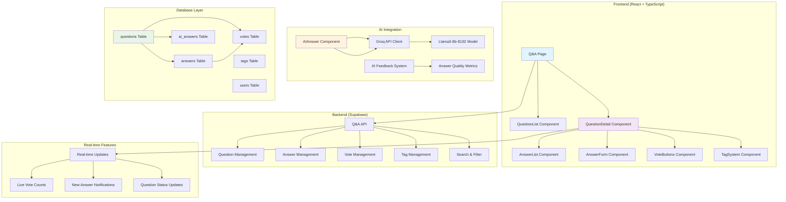
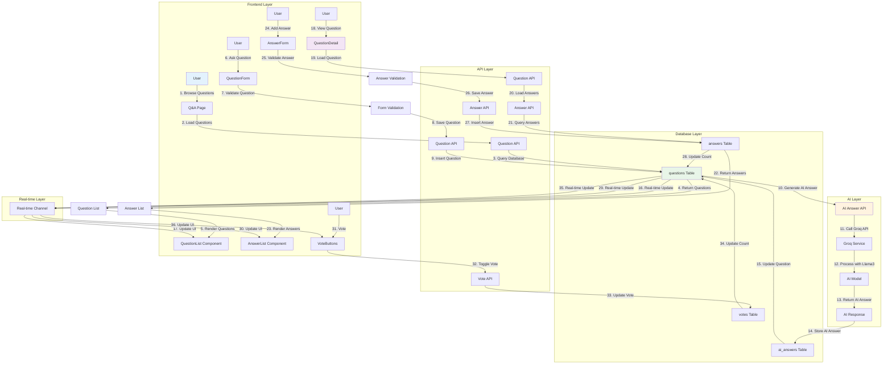
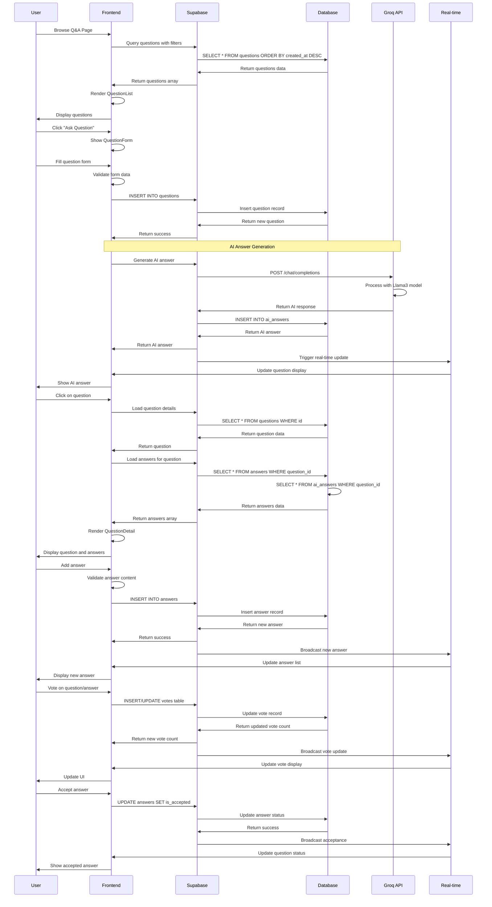
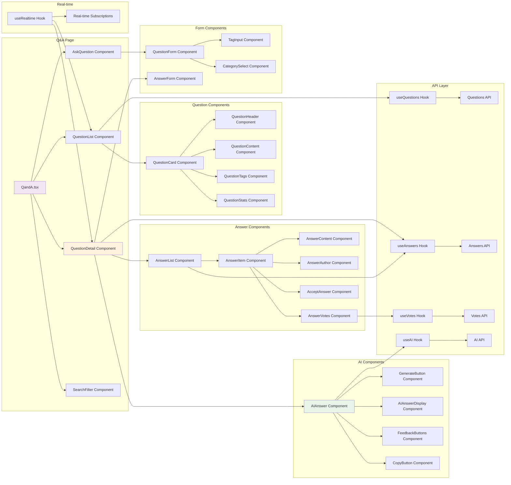
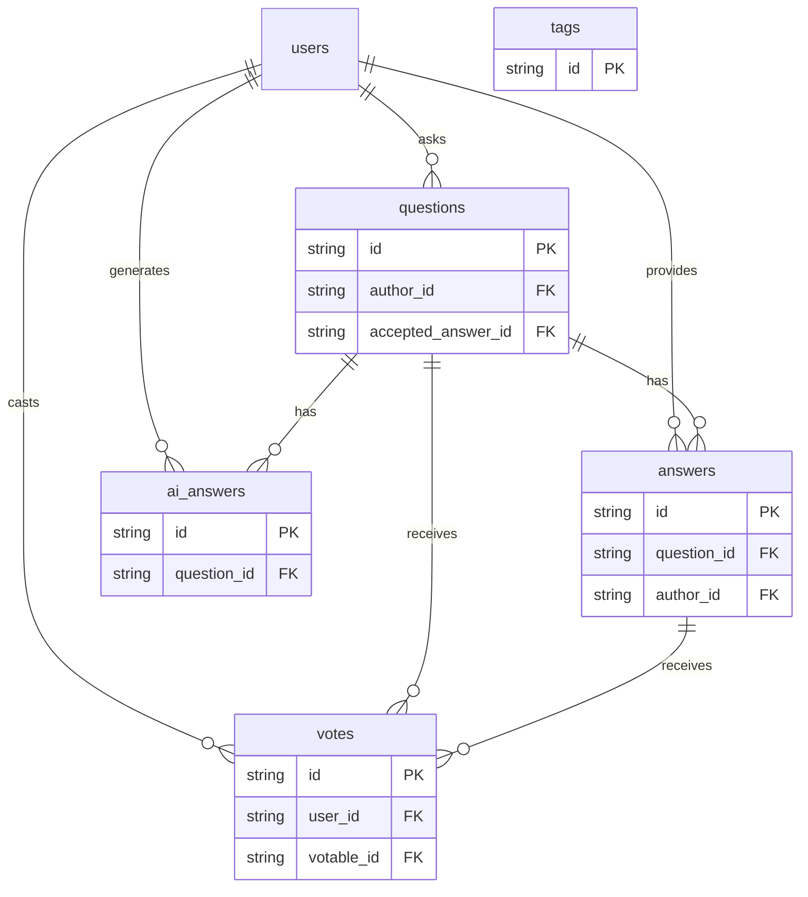
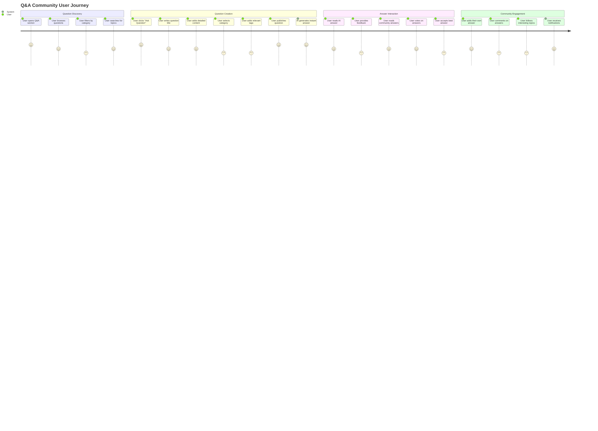
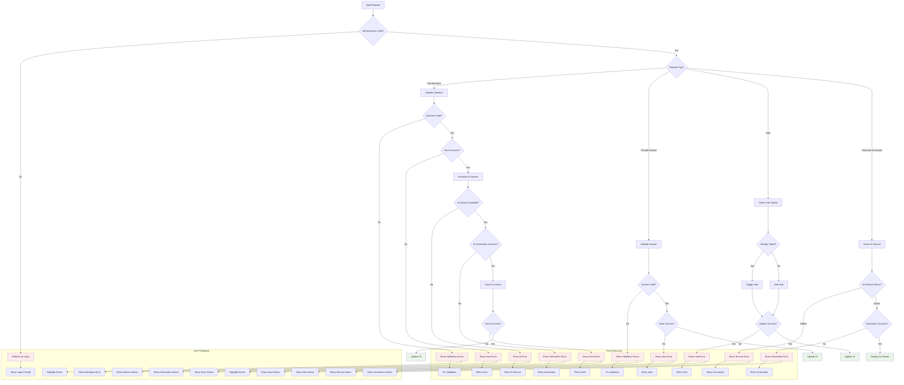

# Q&A Community System Flow Diagrams
## Focus Hub Social Learning Platform

---

## Table of Contents

1. [System Architecture Diagram](#1-system-architecture-diagram)
2. [Data Flow Diagram](#2-data-flow-diagram)
3. [Sequence Diagram](#3-sequence-diagram)
4. [Component Interaction Diagram](#4-component-interaction-diagram)
5. [Database Schema Diagram](#5-database-schema-diagram)
6. [User Journey Flow](#6-user-journey-flow)
7. [Use Case Diagram](#7-use-case-diagram)
8. [Error Handling Flow](#8-error-handling-flow)

---

## 1. System Architecture Diagram

---

## 2. Data Flow Diagram

---

## 3. Sequence Diagram

---

## 4. Component Interaction Diagram

---

## 5. Database Schema Diagram

---

## 6. User Journey Flow

---

## 7. Use Case Diagram

```mermaid
graph TB
    subgraph "Actors"
        A[Student User]
        B[Educator User]
        C[Admin User]
        D[Guest User]
    end
    
    subgraph "Question Management"
        E[Ask Question]
        F[Edit Question]
        G[Delete Question]
        H[Close Question]
        I[Reopen Question]
        J[Search Questions]
        K[Filter Questions]
        L[Bookmark Question]
    end
    
    subgraph "Answer Management"
        M[Provide Answer]
        N[Edit Answer]
        O[Delete Answer]
        P[Accept Answer]
        Q[Reject Answer]
        R[Comment on Answer]
        S[Report Answer]
    end
    
    subgraph "Voting System"
        T[Upvote Question]
        U[Downvote Question]
        V[Upvote Answer]
        W[Downvote Answer]
        X[Remove Vote]
    end
    
    subgraph "AI Integration"
        Y[Generate AI Answer]
        Z[Rate AI Answer]
        AA[Regenerate AI Answer]
        BB[Copy AI Answer]
    end
    
    subgraph "Community Features"
        CC[Follow Topics]
        DD[Follow Users]
        EE[Receive Notifications]
        FF[View User Profiles]
        GG[View Question History]
    end
    
    subgraph "System Features"
        HH[Content Moderation]
        II[Spam Detection]
        JJ[Quality Scoring]
        KK[Analytics Tracking]
    end
    
    A --> E
    A --> F
    A --> G
    A --> H
    A --> I
    A --> J
    A --> K
    A --> L
    A --> M
    A --> N
    A --> O
    A --> P
    A --> R
    A --> T
    A --> U
    A --> V
    A --> W
    A --> X
    A --> Y
    A --> Z
    A --> AA
    A --> BB
    A --> CC
    A --> DD
    A --> EE
    A --> FF
    A --> GG
    
    B --> E
    B --> F
    B --> G
    B --> H
    B --> I
    B --> J
    B --> K
    B --> L
    B --> M
    B --> N
    B --> O
    B --> P
    B --> Q
    B --> R
    B --> S
    B --> T
    B --> U
    B --> V
    B --> W
    B --> X
    B --> Y
    B --> Z
    B --> AA
    B --> BB
    B --> CC
    B --> DD
    B --> EE
    B --> FF
    B --> GG
    
    C --> E
    C --> F
    C --> G
    C --> H
    C --> I
    C --> J
    C --> K
    C --> L
    C --> M
    C --> N
    C --> O
    C --> P
    C --> Q
    C --> R
    C --> S
    C --> T
    C --> U
    C --> V
    C --> W
    C --> X
    C --> Y
    C --> Z
    C --> AA
    C --> BB
    C --> CC
    C --> DD
    C --> EE
    C --> FF
    C --> GG
    C --> HH
    C --> II
    C --> JJ
    C --> KK
    
    D --> J
    D --> K
    D --> FF
    
    E --> HH
    M --> HH
    S --> II
    Y --> JJ
    E --> KK
    M --> KK
    
    style A fill:#e3f2fd
    style B fill:#f3e5f5
    style C fill:#fff3e0
    style D fill:#e8f5e8
```

---

## 8. Error Handling Flow

---

*These diagrams provide comprehensive visualization of the Q&A Community system architecture, data flow, user interactions, and error handling in the Focus Hub platform.* 