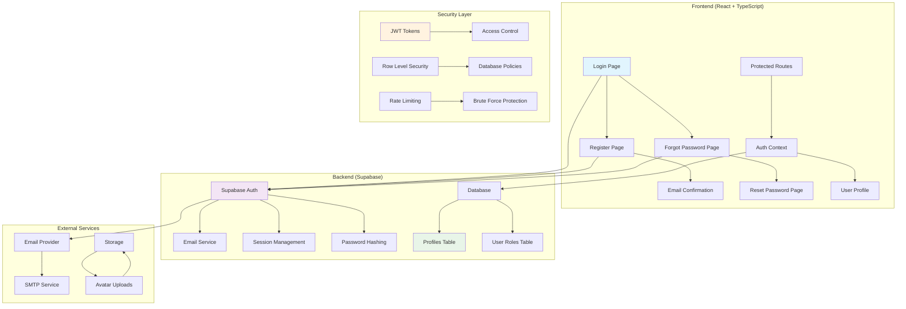
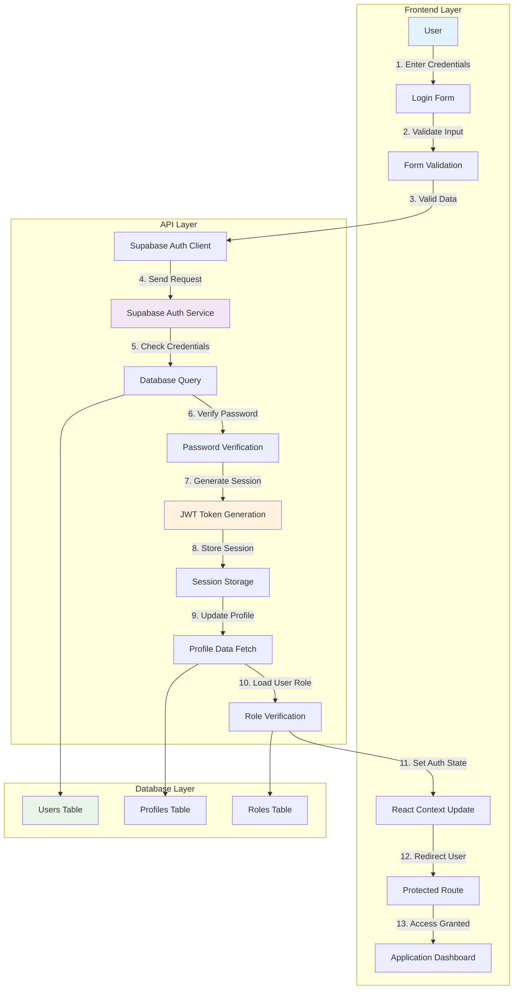
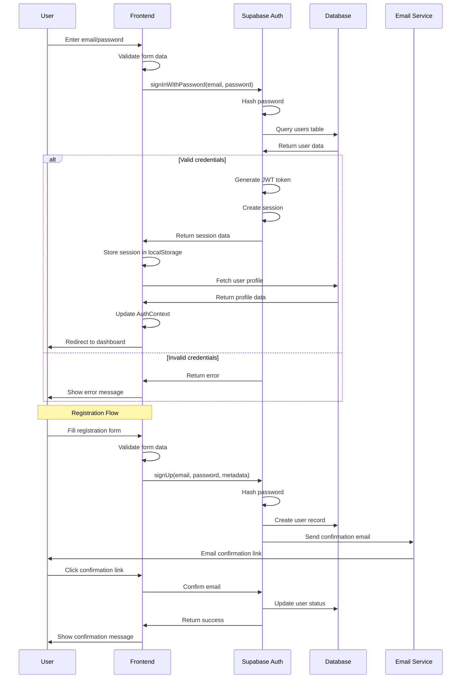
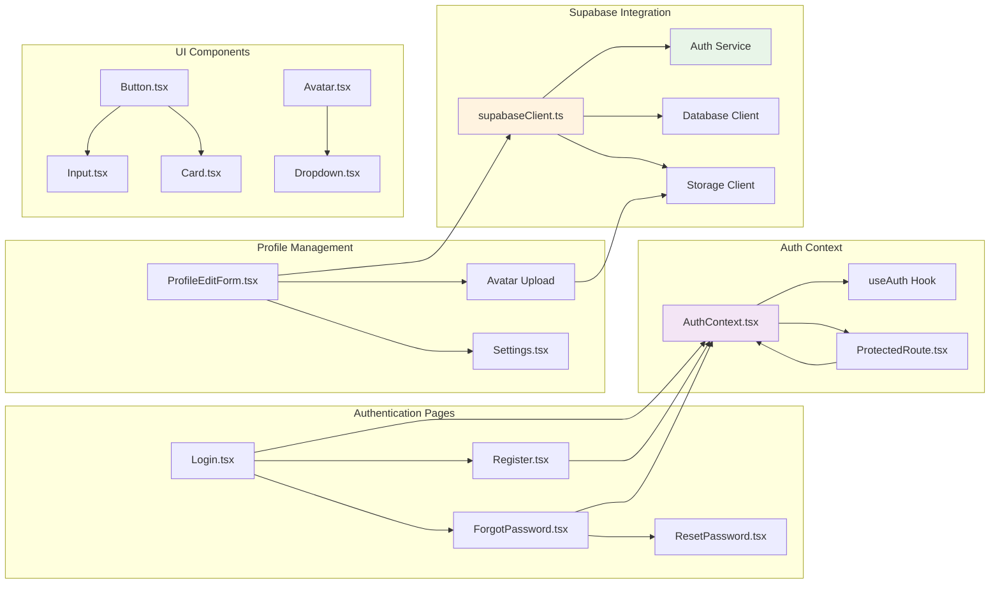
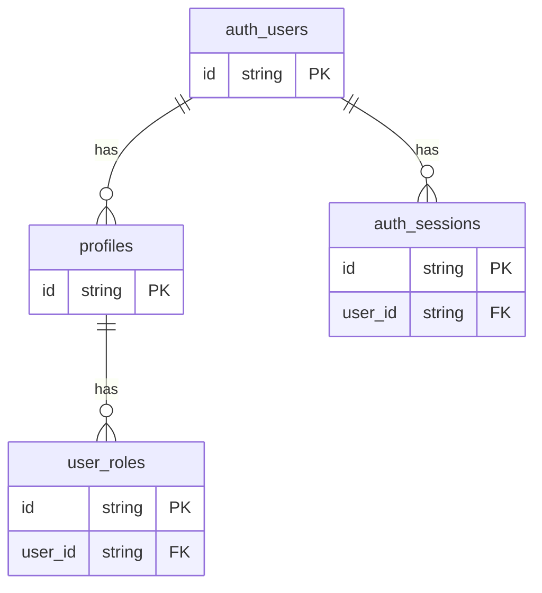
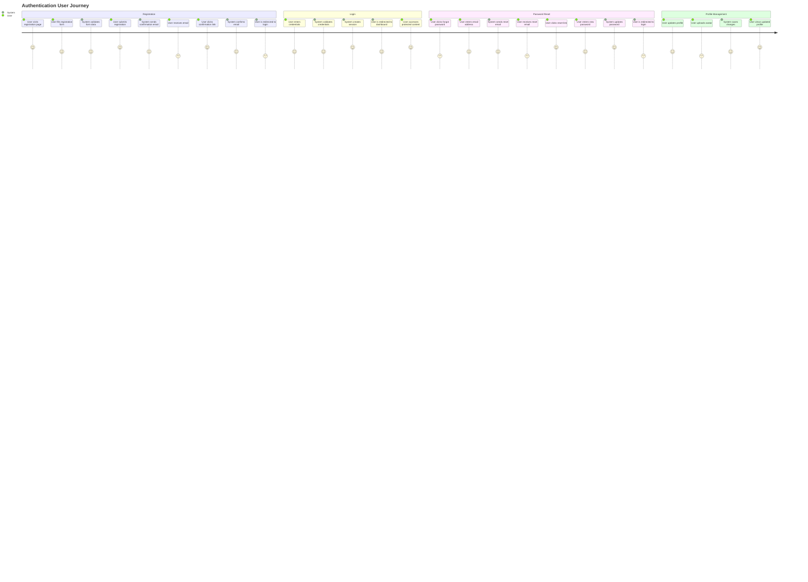
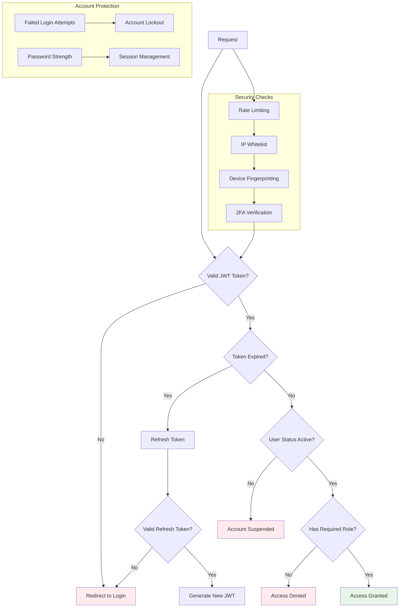
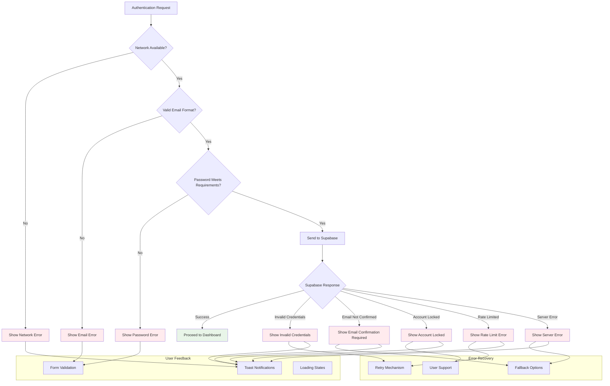

# Authentication System Flow Diagrams
## Focus Hub Social Learning Platform

---

## Table of Contents

1. [System Architecture Diagram](#1-system-architecture-diagram)
2. [Data Flow Diagram](#2-data-flow-diagram)
3. [Sequence Diagram](#3-sequence-diagram)
4. [Component Interaction Diagram](#4-component-interaction-diagram)
5. [Database Schema Diagram](#5-database-schema-diagram)
6. [User Journey Flow](#6-user-journey-flow)
7. [Use Case Diagram](#7-use-case-diagram)
8. [Security Flow Diagram](#8-security-flow-diagram)
9. [Error Handling Flow](#9-error-handling-flow)

---

## 1. System Architecture Diagram

---

## 2. Data Flow Diagram

---

## 3. Sequence Diagram

---

## 4. Component Interaction Diagram

---

## 5. Database Schema Diagram

---

## 6. User Journey Flow

---

## 7. Use Case Diagram

```mermaid
graph TB
    subgraph "Actors"
        A[Student User]
        B[Educator User]
        C[Admin User]
        D[Guest User]
        E[System Administrator]
    end
    
    subgraph "Authentication Use Cases"
        F[Register Account]
        G[Login to Platform]
        H[Logout from Platform]
        I[Reset Password]
        J[Change Password]
        K[Verify Email]
        L[Enable Two-Factor Auth]
        M[Disable Two-Factor Auth]
        N[Manage Sessions]
        O[Delete Account]
    end
    
    subgraph "Profile Management"
        P[Update Profile Information]
        Q[Upload Avatar]
        R[Update Email Address]
        S[View Profile]
        T[Set Privacy Settings]
        U[Export Personal Data]
    end
    
    subgraph "Security Features"
        V[View Login History]
        W[Revoke Active Sessions]
        X[Set Security Alerts]
        Y[Configure Backup Codes]
        Z[Review Security Log]
        AA[Set Account Recovery]
    end
    
    subgraph "System Features"
        BB[Account Verification]
        CC[Session Management]
        DD[Password Policy Enforcement]
        EE[Rate Limiting]
        FF[Account Lockout]
        GG[Audit Logging]
    end
    
    A --> F
    A --> G
    A --> H
    A --> I
    A --> J
    A --> K
    A --> L
    A --> M
    A --> N
    A --> O
    A --> P
    A --> Q
    A --> R
    A --> S
    A --> T
    A --> U
    A --> V
    A --> W
    A --> X
    A --> Y
    A --> Z
    A --> AA
    
    B --> F
    B --> G
    B --> H
    B --> I
    B --> J
    B --> K
    B --> L
    B --> M
    B --> N
    B --> O
    B --> P
    B --> Q
    B --> R
    B --> S
    B --> T
    B --> U
    B --> V
    B --> W
    B --> X
    B --> Y
    B --> Z
    B --> AA
    
    C --> F
    C --> G
    C --> H
    C --> I
    C --> J
    C --> K
    C --> L
    C --> M
    C --> N
    C --> O
    C --> P
    C --> Q
    C --> R
    C --> S
    C --> T
    C --> U
    C --> V
    C --> W
    C --> X
    C --> Y
    C --> Z
    C --> AA
    C --> BB
    C --> CC
    C --> DD
    C --> EE
    C --> FF
    C --> GG
    
    D --> F
    D --> G
    D --> S
    
    E --> BB
    E --> CC
    E --> DD
    E --> EE
    E --> FF
    E --> GG
    E --> V
    E --> W
    E --> X
    E --> Y
    E --> Z
    E --> AA
    
    F --> BB
    G --> CC
    J --> DD
    G --> EE
    G --> FF
    G --> GG
    N --> CC
    V --> GG
    W --> CC
    X --> GG
    Y --> GG
    Z --> GG
    AA --> GG
    
    style A fill:#e3f2fd
    style B fill:#f3e5f5
    style C fill:#fff3e0
    style D fill:#e8f5e8
    style E fill:#fce4ec
```

---

## 8. Security Flow Diagram

---

## 9. Error Handling Flow

---

*These diagrams provide comprehensive visualization of the authentication system architecture, data flow, security measures, and user interactions in the Focus Hub platform.* 