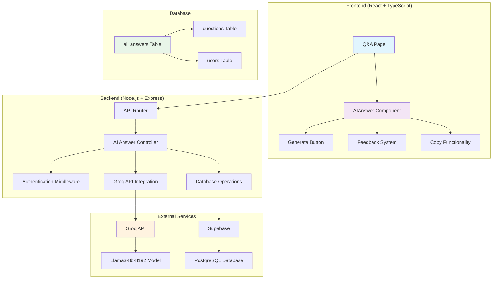
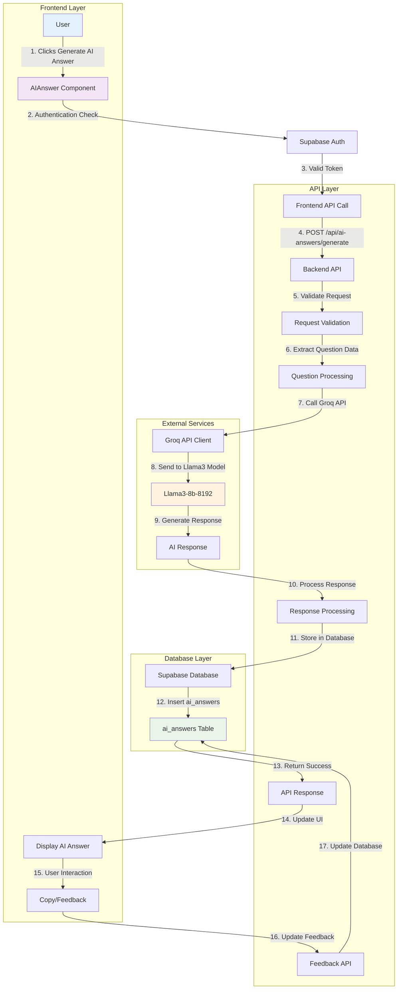
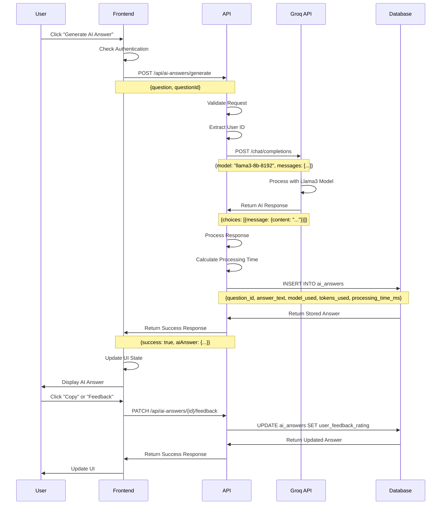
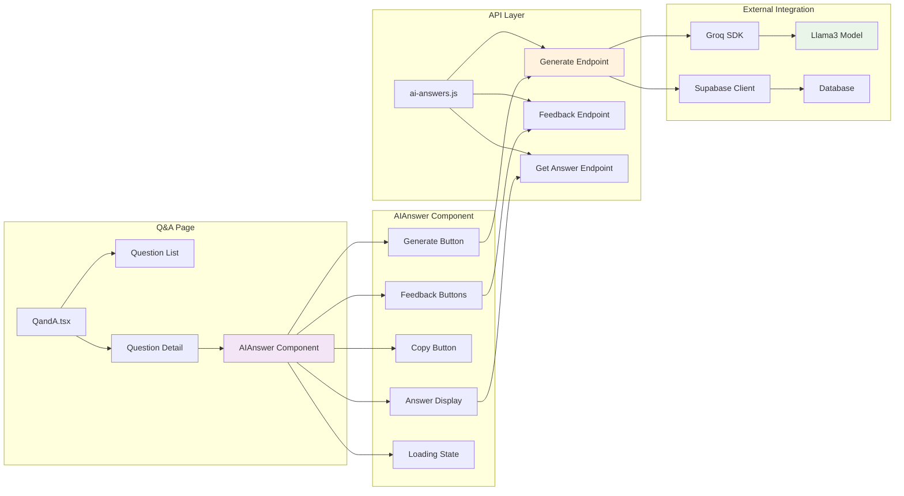
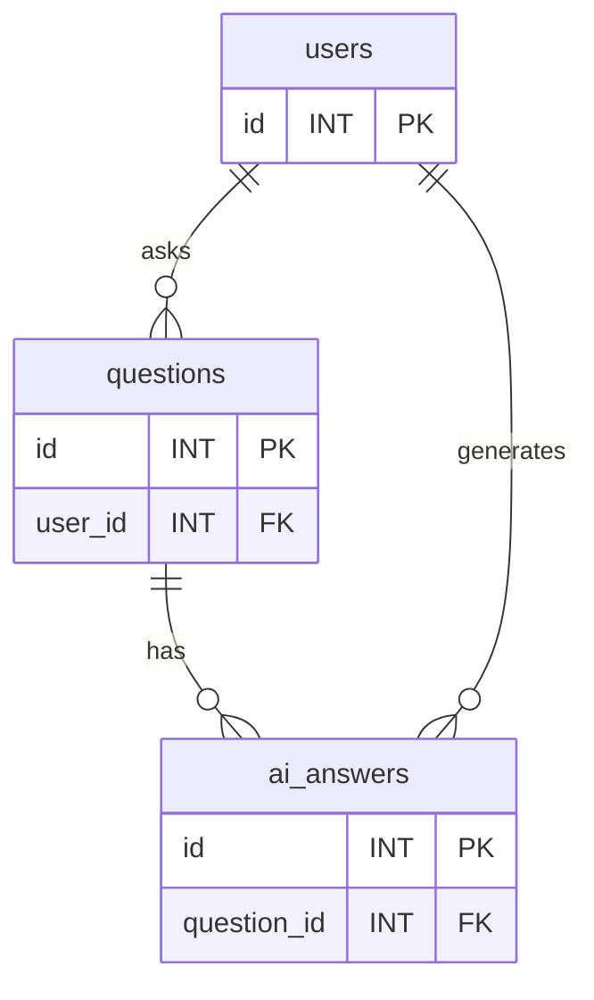
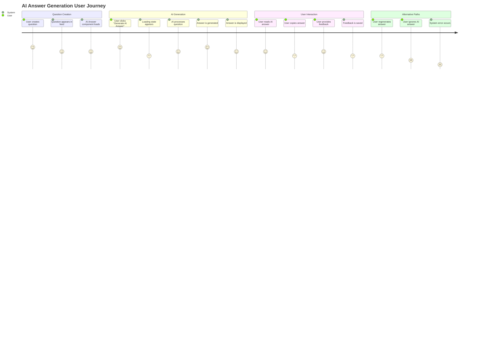
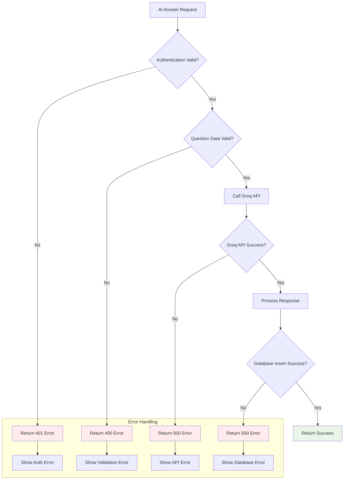

# AI Answer Generation Flow Diagrams
## Focus Hub Social Learning Platform

---

## Table of Contents

1. [System Architecture Diagram](#1-system-architecture-diagram)
2. [Data Flow Diagram](#2-data-flow-diagram)
3. [Sequence Diagram](#3-sequence-diagram)
4. [Component Interaction Diagram](#4-component-interaction-diagram)
5. [Database Schema Diagram](#5-database-schema-diagram)
6. [User Journey Flow](#6-user-journey-flow)
7. [Use Case Diagram](#7-use-case-diagram)
8. [Performance Metrics Flow](#8-performance-metrics-flow)
9. [Error Handling Flow](#9-error-handling-flow)

---

## 1. System Architecture Diagram



---

## 2. Data Flow Diagram



---

## 3. Sequence Diagram



---

## 4. Component Interaction Diagram



---

## 5. Database Schema Diagram



---

## 6. User Journey Flow



---

## 7. Use Case Diagram

```mermaid
graph TB
    subgraph "Actors"
        A[Student User]
        B[Educator User]
        C[Admin User]
        D[Guest User]
        E[AI System]
    end
    
    subgraph "AI Answer Generation"
        F[Generate AI Answer]
        G[Regenerate AI Answer]
        H[View AI Answer]
        I[Copy AI Answer]
        J[Rate AI Answer]
        K[Report AI Answer]
        L[Save AI Answer]
    end
    
    subgraph "Question Management"
        M[Ask Question]
        N[Edit Question]
        O[Delete Question]
        P[View Question]
        Q[Search Questions]
        R[Filter Questions]
    end
    
    subgraph "Feedback System"
        S[Provide Positive Feedback]
        T[Provide Negative Feedback]
        U[Submit Detailed Feedback]
        V[View Feedback History]
        W[Analyze Feedback Trends]
    end
    
    subgraph "Content Moderation"
        X[Flag Inappropriate Content]
        Y[Review Flagged Content]
        Z[Approve AI Answer]
        AA[Reject AI Answer]
        BB[Edit AI Answer]
    end
    
    subgraph "Analytics & Monitoring"
        CC[View Generation Statistics]
        DD[Monitor AI Performance]
        EE[Track User Engagement]
        FF[Analyze Answer Quality]
        GG[Generate Reports]
    end
    
    subgraph "System Features"
        HH[Content Filtering]
        II[Quality Assessment]
        JJ[Rate Limiting]
        KK[Model Selection]
        LL[Token Management]
        MM[Error Handling]
    end
    
    A --> F
    A --> G
    A --> H
    A --> I
    A --> J
    A --> K
    A --> L
    A --> M
    A --> N
    A --> O
    A --> P
    A --> Q
    A --> R
    A --> S
    A --> T
    A --> U
    A --> V
    A --> X
    
    B --> F
    B --> G
    B --> H
    B --> I
    B --> J
    B --> K
    B --> L
    B --> M
    B --> N
    B --> O
    B --> P
    B --> Q
    B --> R
    B --> S
    B --> T
    B --> U
    B --> V
    B --> X
    B --> Y
    B --> Z
    B --> AA
    B --> BB
    B --> CC
    B --> DD
    B --> EE
    B --> FF
    B --> GG
    
    C --> F
    C --> G
    C --> H
    C --> I
    C --> J
    C --> K
    C --> L
    C --> M
    C --> N
    C --> O
    C --> P
    C --> Q
    C --> R
    C --> S
    C --> T
    C --> U
    C --> V
    C --> W
    C --> X
    C --> Y
    C --> Z
    C --> AA
    C --> BB
    C --> CC
    C --> DD
    C --> EE
    C --> FF
    C --> GG
    C --> HH
    C --> II
    C --> JJ
    C --> KK
    C --> LL
    C --> MM
    
    D --> P
    D --> Q
    D --> R
    
    E --> F
    E --> G
    E --> HH
    E --> II
    E --> JJ
    E --> KK
    E --> LL
    E --> MM
    
    F --> HH
    F --> II
    F --> JJ
    F --> KK
    F --> LL
    G --> HH
    G --> II
    G --> JJ
    G --> KK
    G --> LL
    K --> Y
    S --> FF
    T --> FF
    U --> FF
    V --> GG
    W --> GG
    X --> Y
    Y --> Z
    Y --> AA
    Y --> BB
    CC --> GG
    DD --> GG
    EE --> GG
    FF --> GG
    
    style A fill:#e3f2fd
    style B fill:#f3e5f5
    style C fill:#fff3e0
    style D fill:#e8f5e8
    style E fill:#fce4ec
```



---

## 8. Performance Metrics Flow

```mermaid
graph TD
    A[AI Answer Request] --> B[Start Timer]
    B --> C[Call Groq API]
    C --> D[Model Processing]
    D --> E[Response Received]
    E --> F[End Timer]
    F --> G[Calculate Processing Time]
    G --> H[Extract Token Count]
    H --> I[Store Metrics]
    I --> J[Return to User]
    
    subgraph "Metrics Collected"
        K[Processing Time (ms)]
        L[Token Usage]
        M[Model Used]
        N[User Feedback]
        O[Generation Attempts]
    end
    
    G --> K
    H --> L
    C --> M
    J --> N
    I --> O
    
    style K fill:#e3f2fd
    style L fill:#f3e5f5
    style M fill:#fff3e0
```

---

## 9. Error Handling Flow



---

*These diagrams provide comprehensive visualization of the AI answer generation system architecture, data flow, and user interactions in the Focus Hub platform.* 