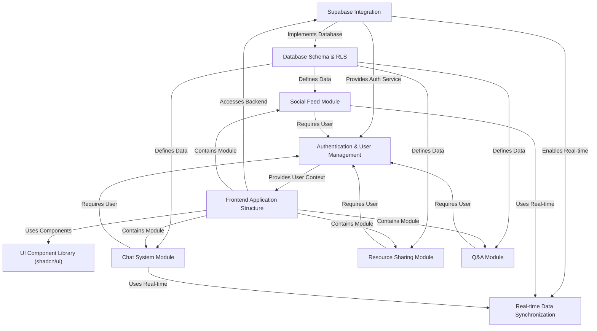

# Tutorial: focus_hub

Focus Hub is a **collaboration platform** designed for a community,
likely students and alumni, providing features like a *social feed*,
*real-time chat*, *resource sharing*, and a *Q&A forum*.
It leverages **Supabase** as its backend-as-a-service for database,
authentication, and storage, while the frontend is built with **React**
using the **shadcn/ui** component library for a consistent look and feel.

## Visual Overview

## Chapters

1. [Supabase Integration
](01_supabase_integration_.md)
2. [Authentication & User Management
](02_authentication___user_management_.md)
3. [Database Schema & RLS
](03_database_schema___rls_.md)
4. [Real-time Data Synchronization
](04_real_time_data_synchronization_.md)
5. [Frontend Application Structure
](05_frontend_application_structure_.md)
6. [UI Component Library (shadcn/ui)
](06_ui_component_library__shadcn_ui__.md)
7. [Social Feed Module
](07_social_feed_module_.md)
8. [Chat System Module
](08_chat_system_module_.md)
9. [Resource Sharing Module
](09_resource_sharing_module_.md)
10. [Q&A Module
](10_q_a_module_.md)

---

 