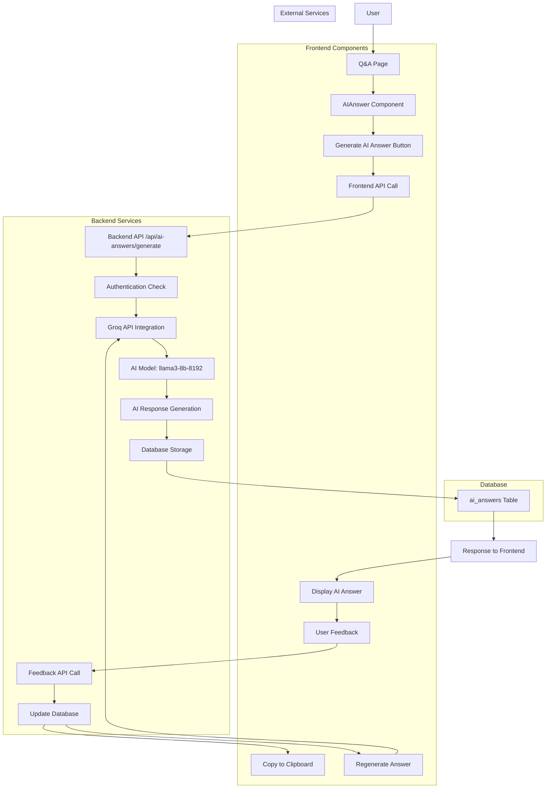
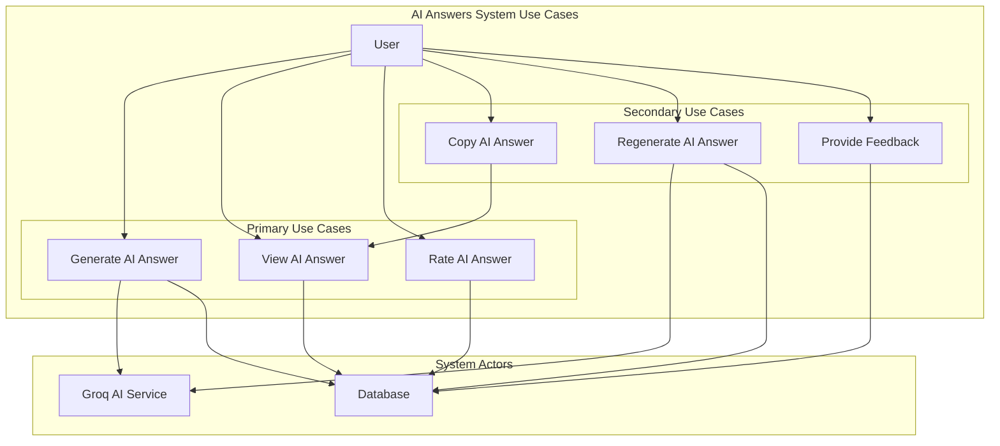
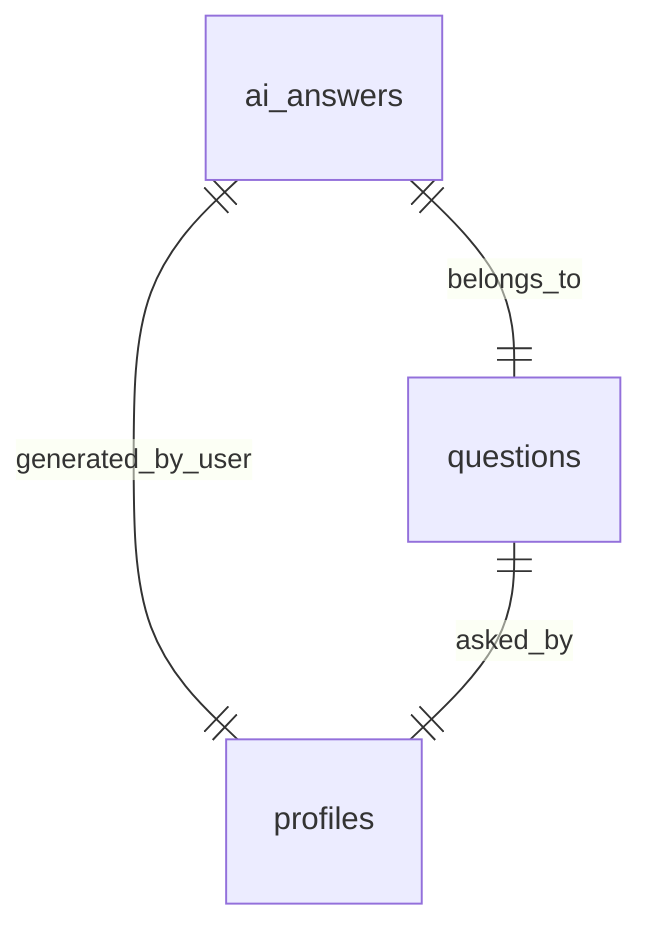

# AI Answers Module

## Introduction
The AI Answers module provides a comprehensive system for generating, storing, and managing AI-powered answers to user questions in the Q&A platform. It integrates with the Groq API to deliver fast, high-quality, and cost-effective AI-generated responses with user feedback capabilities.

---

## Purpose
- Enable instant, AI-generated answers for questions posted in the Q&A module
- Store, retrieve, and manage AI answers in the database with metadata
- Allow users to rate and provide feedback on AI answers (helpful/not helpful)
- Support regeneration, copying, and feedback workflows
- Provide real-time answer generation with loading states and error handling

---

## System Architecture

### Data Flow Diagram (DFD)



### Use Case Diagram



### Entity Relationship Diagram (ERD)



---

## API Endpoints

### POST `/api/ai-answers/generate`
Generates an AI answer for a given question using the Groq API.

**Authentication:** Required (Bearer token)

**Request Body:**
```json
{
  "question": "What is React?",
  "questionId": 123
}
```

**Response:**
```json
{
  "success": true,
  "aiAnswer": {
    "id": "uuid",
    "question_id": 123,
    "answer_text": "React is a JavaScript library for building user interfaces...",
    "generated_by": "groq",
    "user_id": "uuid",
    "model_used": "llama3-8b-8192",
    "tokens_used": 123,
    "processing_time_ms": 250,
    "user_feedback_rating": null,
    "generation_attempts": 1,
    "created_at": "2024-01-01T00:00:00Z"
  },
  "message": "AI answer generated successfully"
}
```

### GET `/api/ai-answers/:id`
Retrieves a specific AI answer by its ID.

**Response:**
```json
{
  "aiAnswer": {
    "id": "uuid",
    "question_id": 123,
    "answer_text": "React is a JavaScript library...",
    "generated_by": "groq",
    "user_id": "uuid",
    "model_used": "llama3-8b-8192",
    "tokens_used": 123,
    "processing_time_ms": 250,
    "user_feedback_rating": 1,
    "generation_attempts": 1,
    "created_at": "2024-01-01T00:00:00Z"
  }
}
```

### PATCH `/api/ai-answers/:id/feedback`
Updates the user feedback rating for an AI answer.

**Authentication:** Required (Bearer token)

**Request Body:**
```json
{
  "user_feedback_rating": 1
}
```

**Response:**
```json
{
  "success": true,
  "aiAnswer": {
    "id": "uuid",
    "question_id": 123,
    "answer_text": "React is a JavaScript library...",
    "user_feedback_rating": 1,
    "updated_at": "2024-01-01T00:00:00Z"
  }
}
```

---

## Frontend Components

### AIAnswer Component (`src/components/AIAnswer.tsx`)

**Props:**
- `questionId: number` - ID of the question
- `question: string` - Question text for AI processing
- `onAnswerGenerated?: (answer: Tables<'ai_answers'>) => void` - Callback when answer is generated

**Features:**
- Automatic fetching of existing AI answers
- Generate new AI answers with loading states
- Copy answer to clipboard functionality
- User feedback system (helpful/not helpful)
- Regenerate answer capability
- Error handling with toast notifications

**State Management:**
```typescript
const [aiAnswer, setAiAnswer] = useState<Tables<'ai_answers'> | null>(null);
const [loading, setLoading] = useState(false);
const [generating, setGenerating] = useState(false);
const [copied, setCopied] = useState(false);
const [helpful, setHelpful] = useState<'helpful' | 'not-helpful' | null>(null);
```

### Integration with Q&A Page

The AI Answer component is integrated into the Q&A page (`src/pages/QandA.tsx`) and appears in the question detail dialog:

```typescript
<AIAnswer 
  questionId={selectedQuestion.id}
  question={selectedQuestion.title + "\n\n" + selectedQuestion.body}
  onAnswerGenerated={(answer) => {
    fetchAnswers(selectedQuestion.id);
  }}
/>
```

---

## Backend Implementation

### AI Answer Generation Flow

1. **Authentication Check:** Verify user session and access token
2. **Input Validation:** Ensure question and questionId are provided
3. **AI Processing:** Call Groq API with optimized parameters
4. **Database Storage:** Store answer with metadata
5. **Response:** Return generated answer to frontend

### Groq API Configuration

```javascript
const groq = new Groq({
  apiKey: process.env.GROQ_API_KEY,
});

const completion = await groq.chat.completions.create({
  model: "llama3-8b-8192", // Fast and cost-effective model
  messages: [
    {
      role: "system",
      content: `You are a helpful expert on a professional networking platform. 
      Provide concise, accurate, and helpful answers to questions. 
      Keep answers under 200 words and focus on being practical and actionable.
      Format your response in a clear, professional manner.`
    },
    {
      role: "user",
      content: question
    }
  ],
  max_tokens: 300,
  temperature: 0.7,
});
```

### Database Schema

**Table:** `ai_answers`

| Column | Type | Description |
|--------|------|-------------|
| `id` | UUID | Primary key |
| `question_id` | UUID | Foreign key to questions table |
| `answer_text` | TEXT | The generated AI answer content |
| `generated_by` | TEXT | AI service used (e.g., 'groq') |
| `user_id` | UUID | User who requested the answer |
| `model_used` | TEXT | AI model identifier |
| `tokens_used` | INTEGER | Number of tokens consumed |
| `processing_time_ms` | INTEGER | Time taken to generate answer |
| `user_feedback_rating` | INTEGER | User rating (1=helpful, 0=not helpful, null=no rating) |
| `generation_attempts` | INTEGER | Number of generation attempts |
| `created_at` | TIMESTAMP | Creation timestamp |
| `updated_at` | TIMESTAMP | Last update timestamp |

---

## User Interface Features

### Answer Display States

1. **Loading State:** Shows spinner while fetching existing answer
2. **Empty State:** Displays generate button when no answer exists
3. **Answer State:** Shows generated answer with interactive features

### Interactive Features

- **Copy to Clipboard:** One-click copying with visual feedback
- **Feedback System:** Thumbs up/down rating system
- **Regenerate:** Ability to generate new answer
- **Toast Notifications:** Success/error feedback

### Visual Design

- **Primary Styling:** Uses primary color theme with subtle background
- **Badge Indicators:** AI Answer badge and generation date
- **Loading Animations:** Smooth transitions and spinners
- **Responsive Design:** Works on mobile and desktop

---

## Error Handling

### Frontend Error Handling

- Network request failures with retry options
- Invalid input validation
- Authentication errors with user prompts
- Copy to clipboard failures

### Backend Error Handling

- API key validation
- Rate limiting protection
- Database connection errors
- AI service failures with fallback options

---

## Performance Considerations

### Optimization Strategies

1. **Caching:** Existing answers are cached and fetched on component mount
2. **Lazy Loading:** AI answers are generated on-demand
3. **Token Management:** Limited token usage for cost control
4. **Processing Time Tracking:** Monitor and optimize generation speed

### Monitoring

- Token usage tracking
- Processing time metrics
- User feedback analytics
- Error rate monitoring

---

## Security Features

### Authentication

- Bearer token validation for all protected endpoints
- User session verification
- Rate limiting on generation requests

### Data Protection

- Input sanitization
- SQL injection prevention
- XSS protection in frontend

---

## Customization Options

### AI Model Configuration

- **Model Selection:** Change between different Groq models
- **Token Limits:** Adjust max_tokens for answer length
- **Temperature:** Control creativity vs consistency
- **System Prompts:** Customize AI behavior and style

### UI Customization

- **Styling:** Modify component appearance
- **Features:** Enable/disable specific features
- **Localization:** Support for multiple languages

---

## Integration Points

### Backend Dependencies
- **Express.js:** API framework
- **Supabase:** Database and authentication
- **Groq SDK:** AI service integration
- **Environment Variables:** API key management

### Frontend Dependencies
- **React:** Component framework
- **TypeScript:** Type safety
- **Shadcn/UI:** Component library
- **Lucide React:** Icons
- **React Hook Form:** Form handling

---

## Related Documentation
- [AI Integration Setup](../AI_INTEGRATION_SETUP.md)
- [Groq AI Integration Setup](../GROQ_AI_INTEGRATION_SETUP.md)
- [QandA Module](./QandA.md)
- [API Layer](./ApiModules.md)
- [Components](./Components.md)
- [Database Design](./DatabaseDesign.md)

---

## Implementation Files
- **Backend:** `src/api/ai-answers.js`
- **Frontend Component:** `src/components/AIAnswer.tsx`
- **Integration:** `src/pages/QandA.tsx`
- **Types:** `src/integrations/supabase/types.ts` 