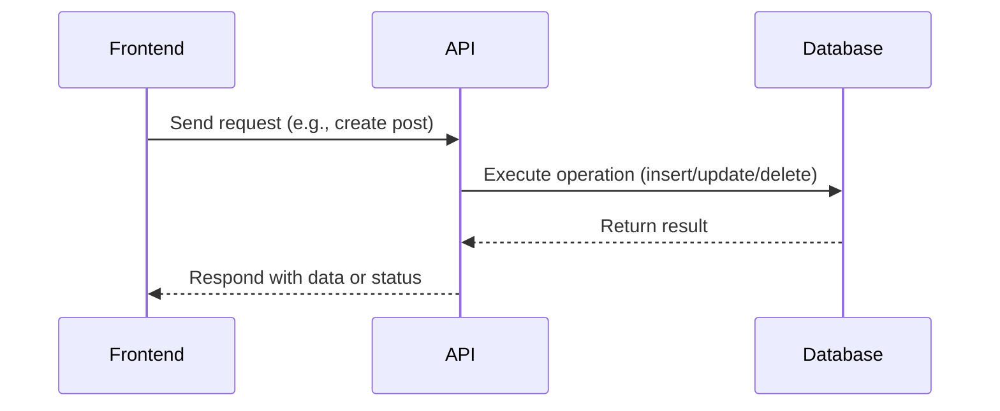
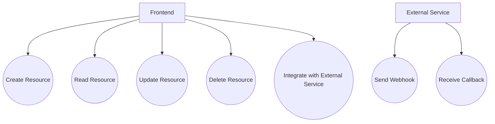
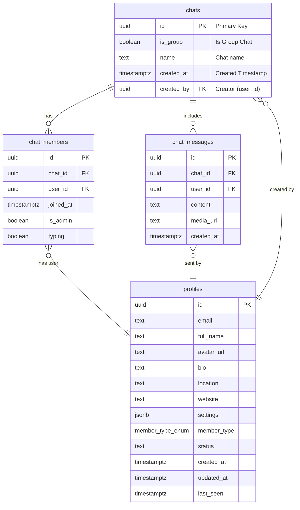

# API Layer

## Introduction
The API Layer acts as the bridge between the frontend application and the backend database, handling all data operations such as creating, reading, updating, and deleting resources. It abstracts the complexity of direct database access and enforces business logic and security.

## Data Flow Diagram Context



## Use Cases Diagram Context



## Database Design



---
The API Layer ensures all data operations are secure, validated, and consistent across the application. 

## AI Answer Generation API

The API layer exposes endpoints for AI-powered answer generation in the Q&A module, using the Groq API backend integration.

### POST /api/ai-answers/generate
Generates an AI answer for a question.

**Request Body:**
```json
{
  "question": "What is React?",
  "questionId": "uuid-of-question"
}
```

**Response:**
```json
{
  "success": true,
  "aiAnswer": {
    "id": "uuid",
    "question_id": "uuid",
    "answer": "React is a JavaScript library...",
    "generated_by": "groq",
    "created_at": "2024-01-01T00:00:00Z"
  }
}
```

### GET /api/ai-answers/question/:id
Retrieves the AI answer for a specific question.

**Response:**
```json
{
  "aiAnswer": {
    "id": "uuid",
    "question_id": "uuid",
    "answer": "React is a JavaScript library...",
    "generated_by": "groq",
    "created_at": "2024-01-01T00:00:00Z"
  }
}
```

For setup and customization, see [AI Integration Setup](../AI_INTEGRATION_SETUP.md). 