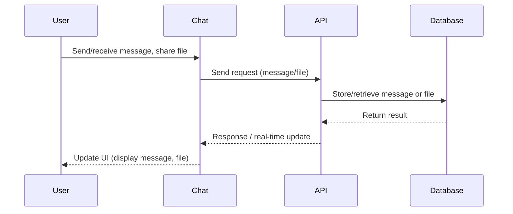
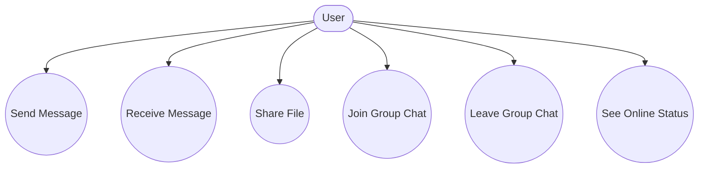
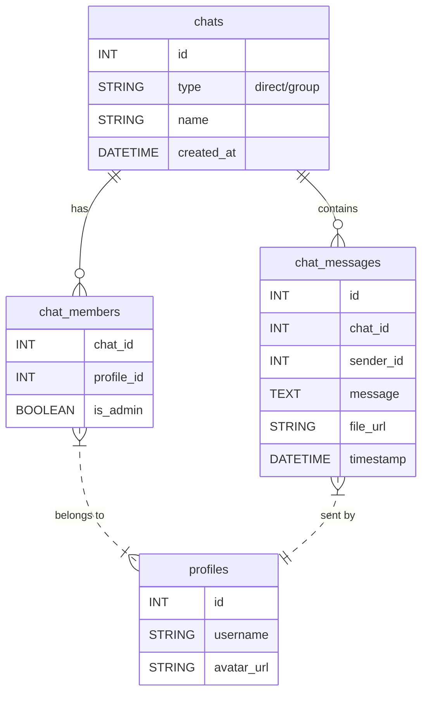

# Chat

## Introduction
The Chat page enables real-time messaging between users, supporting both direct and group conversations, file sharing, and presence indicators.

## Data Flow Diagram Context

## Use Cases Diagram Context

## Database Design

## Summary
The Chat page powers private and group communication with real-time updates and file sharing. 