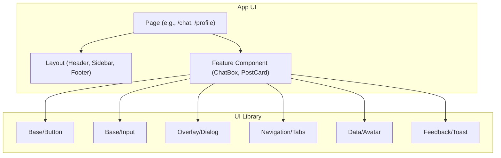

<summary><strong>Component Relationship (Click to expand)</strong></summary>




## Available Components

**Base UI Components (src/components/ui):**
- Accordion
- Alert
- AlertDialog
- AspectRatio
- Avatar
- Badge
- Breadcrumb
- Button
- Calendar
- Card
- Carousel
- Chart
- Checkbox
- Collapsible
- Command
- ContextMenu
- Dialog
- Drawer
- DropdownMenu
- Form
- HoverCard
- Input
- InputOtp
- Label
- Menubar
- NavigationMenu
- Pagination
- Popover
- Progress
- RadioGroup
- Resizable
- ScrollArea
- Select
- Separator
- Sheet
- Skeleton
- Slider
- Sonner
- Switch
- Table
- Tabs
- Textarea
- Toast
- Toaster
- Toggle
- ToggleGroup
- Tooltip
- UseToast

**App Layout Components:**
- AppSidebar
- Header
- Layout
- Sidebar
- ThemeToggle

**Feature Components:**
- AnimatedAtom
- BackgroundAtom
- ChatNotification
- CreateChat
- CreatePost
- FileCard
- FlagFeature
- FlaggedContentAdmin
- FollowersStats
- NotificationDropdown
- PostCard
- ProfileEditForm
- ProfileFollowButton

**Utility/Other Components:**
- ProtectedRoute
- theme-provider

```bash
src/
├── components/
│   ├── ui/                  # Base UI components (from shadcn)
│   │   ├── Accordion.tsx           # Collapsible content panels
│   │   ├── Alert.tsx               # Display important messages
│   │   ├── AlertDialog.tsx         # Modal dialog for critical alerts
│   │   ├── AspectRatio.tsx         # Maintain aspect ratio for content
│   │   ├── Avatar.tsx              # User or entity avatar image
│   │   ├── Badge.tsx               # Small status or label indicator
│   │   ├── Breadcrumb.tsx          # Navigation breadcrumb trail
│   │   ├── Button.tsx              # Standard button component
│   │   ├── Calendar.tsx            # Calendar date picker
│   │   ├── Card.tsx                # Card container for grouped content
│   │   ├── Carousel.tsx            # Horizontal/vertical content slider
│   │   ├── Chart.tsx               # Data visualization/charting
│   │   ├── Checkbox.tsx            # Checkbox input
│   │   ├── Collapsible.tsx         # Expand/collapse content
│   │   ├── Command.tsx             # Command palette UI
│   │   ├── ContextMenu.tsx         # Right-click context menu
│   │   ├── Dialog.tsx              # Modal dialog window
│   │   ├── Drawer.tsx              # Slide-in panel from edge
│   │   ├── DropdownMenu.tsx        # Dropdown menu for actions
│   │   ├── Form.tsx                # Form context and fields
│   │   ├── HoverCard.tsx           # Card shown on hover
│   │   ├── Input.tsx               # Text input field
│   │   ├── InputOtp.tsx            # OTP (One-Time Password) input
│   │   ├── Label.tsx               # Form field label
│   │   ├── Menubar.tsx             # Horizontal menu bar
│   │   ├── NavigationMenu.tsx      # Navigation menu component
│   │   ├── Pagination.tsx          # Pagination controls
│   │   ├── Popover.tsx             # Floating popover panel
│   │   ├── Progress.tsx            # Progress bar indicator
│   │   ├── RadioGroup.tsx          # Group of radio buttons
│   │   ├── Resizable.tsx           # Resizable panel group
│   │   ├── ScrollArea.tsx          # Custom scrollable area
│   │   ├── Select.tsx              # Select dropdown input
│   │   ├── Separator.tsx           # Visual separator line
│   │   ├── Sheet.tsx               # Overlay sheet panel
│   │   ├── Skeleton.tsx            # Loading skeleton placeholder
│   │   ├── Slider.tsx              # Range slider input
│   │   ├── Sonner.tsx              # Toast notification system
│   │   ├── Switch.tsx              # Toggle switch input
│   │   ├── Table.tsx               # Table for tabular data
│   │   ├── Tabs.tsx                # Tabbed navigation
│   │   ├── Textarea.tsx            # Multiline text input
│   │   ├── Toast.tsx               # Toast notification
│   │   ├── Toaster.tsx             # Toast notification container
│   │   ├── Toggle.tsx              # Toggle button
│   │   ├── ToggleGroup.tsx         # Group of toggle buttons
│   │   ├── Tooltip.tsx             # Tooltip for hints
│   │   └── UseToast.ts             # Toast notification hook
│   ├── layout/              # App layout blocks
│   │   ├── AppSidebar.tsx         # Sidebar navigation for the app
│   │   ├── Header.tsx             # Top header bar
│   │   ├── Layout.tsx             # Main app layout with sidebar and header
│   │   ├── Sidebar.tsx            # Sidebar component with groups and menus
│   │   └── ThemeToggle.tsx        # Theme (light/dark) toggle button
│   ├── features/            # Feature components
│   │   ├── AnimatedAtom.tsx         # Animated visual atom effect
│   │   ├── BackgroundAtom.tsx       # Animated background atom effect
│   │   ├── ChatNotification.tsx     # Notification for chat events
│   │   ├── CreateChat.tsx           # Form to create a new chat
│   │   ├── CreatePost.tsx           # Form to create a new post
│   │   ├── FileCard.tsx             # Card displaying file info and actions
│   │   ├── FlagFeature.tsx          # Feature to flag/report content
│   │   ├── FlaggedContentAdmin.tsx  # Admin view for flagged content
│   │   ├── FollowersStats.tsx       # Display follower statistics
│   │   ├── NotificationDropdown.tsx # Dropdown for notifications
│   │   ├── PostCard.tsx             # Card displaying a post and comments
│   │   ├── ProfileEditForm.tsx      # Form to edit user profile
│   │   └── ProfileFollowButton.tsx  # Button to follow/unfollow a profile
│   ├── utility/
│   │   ├── ProtectedRoute.tsx       # Route guard for authenticated access
│   │   └── theme-provider.tsx       # Context provider for app theme
│   └── index.ts             # Barrel file to export all components
```

| Area            | Best Practice                                                                 |
|-----------------|-------------------------------------------------------------------------------|
| Reusability     | Use small UI units (`ui/`) inside shared or feature components                |
| Consistency     | Use `shadcn/ui` base components styled with Tailwind                          |
| Accessibility   | Favor `shadcn/ui` components for built-in a11y (e.g., modals, alerts)         |
| Variants        | Use Tailwind-based `variant` props (e.g., `variant="ghost"` for buttons)      |
| Theming         | Customize via `tailwind.config.js` and `className` composition                |
| Docs            | Document props/types in JSDoc or use Storybook/Ladle for live preview         |
| Testing         | Test shared components with `@testing-library/react` or `jest`                |
