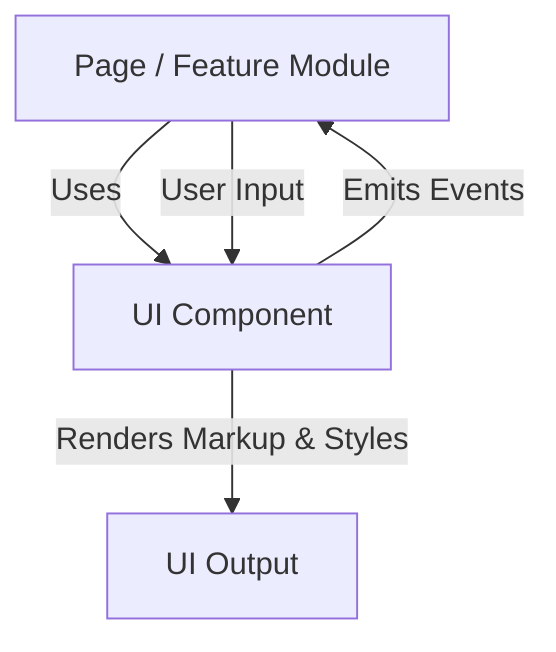
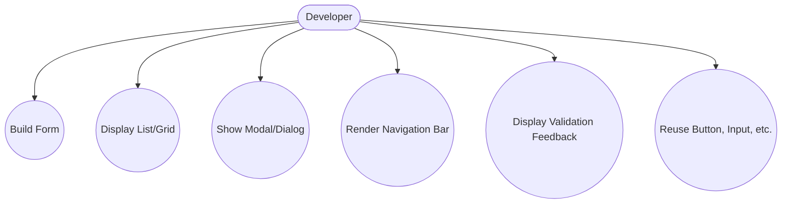

# UI Component Library

## Introduction
The UI Component Library provides a set of reusable, accessible, and customizable building blocks for constructing the application's user interface. It ensures a consistent look and feel across all pages and features.

## Data Flow Diagram Context

## Use Cases Diagram Context

## Database Design
_Not applicable: UI components do not directly interact with the database._

---
The UI Component Library is the foundation for a cohesive and user-friendly interface.

## AIAnswer Component

The `AIAnswer` component displays and manages AI-generated answers in the Q&A interface. It provides:
- A button to generate an AI answer for a question
- Loading and error states
- Display of the AI answer with copy and feedback options
- Regeneration and rating features

**Props:**
- `questionId: string` – The ID of the question
- `question: string` – The question text

For usage and customization, see [AI Integration Setup](../AI_INTEGRATION_SETUP.md). 