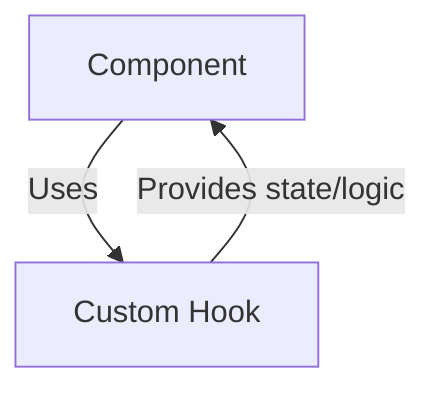
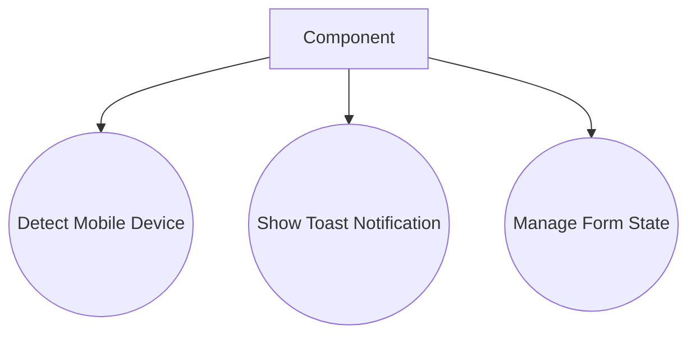

# Custom React Hooks

## Introduction
Custom React Hooks encapsulate reusable logic for state management, side effects, and UI behavior, making it easy to share functionality across components.

## Data Flow Diagram Context

## Use Cases Diagram Context

## Database Design
_Not applicable: hooks encapsulate logic, not direct data storage._

---
Custom React Hooks empower developers to build modular and maintainable UI logic. 