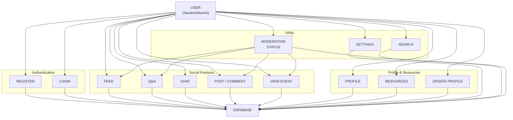
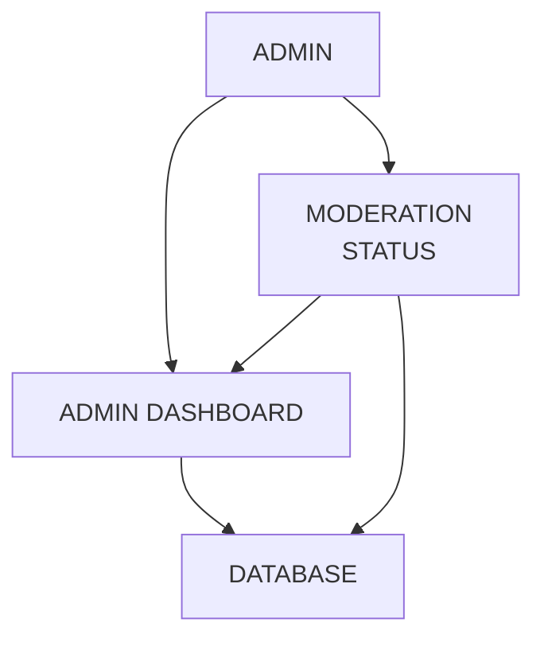

```mermaid
flowchart TB
    User["USER<br/>(Student/Alumni)"]

    %% Authentication
    subgraph Auth [Authentication]
      Register["REGISTER"]
      Login["LOGIN"]
    end

    %% Social
    subgraph Social [Social Features]
      Feed["FEED"]
      QandA["Q&A"]
      Chat["CHAT"]
      PostComment["POST / COMMENT"]
      ViewEvent["VIEW EVENT"]
    end

    %% Profile & Resources
    subgraph ProfileRes [Profile & Resources]
      Profile["PROFILE"]
      Resources["RESOURCES"]
      UpdateProfile["UPDATE PROFILE"]
    end

    %% Utility
    subgraph Utility [Utility]
      Settings["SETTINGS"]
      Search["SEARCH"]
      Moderation["MODERATION<br/>STATUS"]
    end

    Database["DATABASE"]

    %% Flows
    User --> Register
    User --> Login
    User --> Feed
    User --> QandA
    User --> Chat
    User --> PostComment
    User --> ViewEvent
    User --> Profile
    User --> Resources
    User --> UpdateProfile
    User --> Settings
    User --> Search
    User --> Moderation

    Register --> Database
    Login --> Database
    Feed --> Database
    QandA --> Database
    Chat --> Database
    PostComment --> Database
    ViewEvent --> Database
    Profile --> Database
    Resources --> Database
    UpdateProfile --> Database
    Settings --> Database
    Search --> Database
    Moderation --> Database

    Moderation --> PostComment
    Moderation --> Feed
    Moderation --> QandA
    Moderation --> ViewEvent
```

```mermaid
flowchart TD
    %% Actor
    Admin["ADMIN"]

    %% Admin-Only Processes
    AdminDashboard["ADMIN DASHBOARD"]
    Moderation["MODERATION<br/>STATUS"]

    %% Data Store
    Database["DATABASE"]

    %% Flows
    Admin --> AdminDashboard
    Admin --> Moderation

    AdminDashboard --> Database
    Moderation --> Database

    Moderation --> AdminDashboard

```