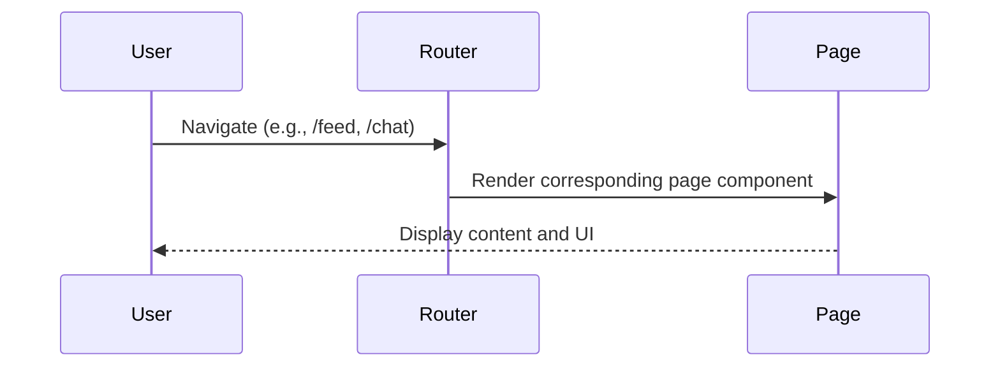
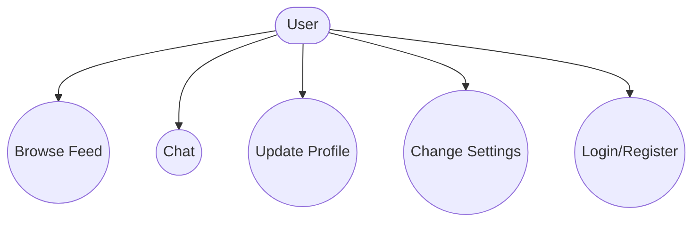
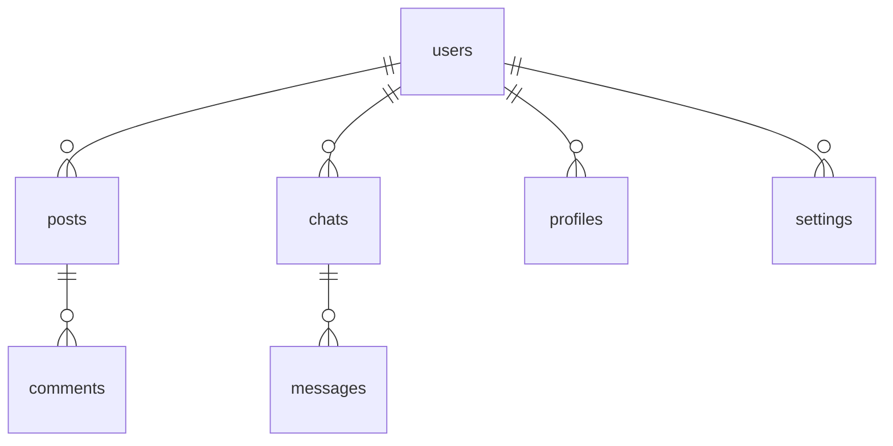

# Main Application Pages

## Introduction
The Main Application Pages represent the core user-facing screens of the platform, such as the feed, chat, profile, settings, and authentication flows. Each page is designed to provide a seamless and interactive experience, leveraging modular components and real-time data.

## Data Flow Diagram Context

## Use Cases Diagram Context

## Database Design

---
Main Application Pages are the entry points for all user interactions and workflows in the platform.

## Q&A Page – AI Answer Integration

The Q&A page features integrated AI-powered answer generation. Users can:
- Instantly generate AI answers for posted questions
- Regenerate, copy, and rate AI answers
- Benefit from fast, cost-effective, and privacy-focused AI models (Groq)

**Workflow:**
- Users request an AI-generated answer for any question
- The backend calls Groq API, stores the answer, and displays it in the Q&A interface
- Users can provide feedback, copy, or regenerate the AI answer

For setup and customization, see [AI Integration Setup](../AI_INTEGRATION_SETUP.md). 