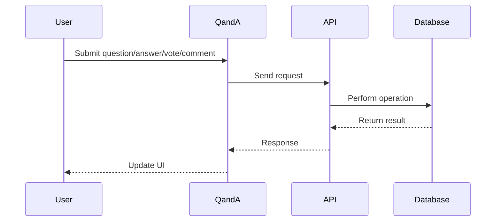
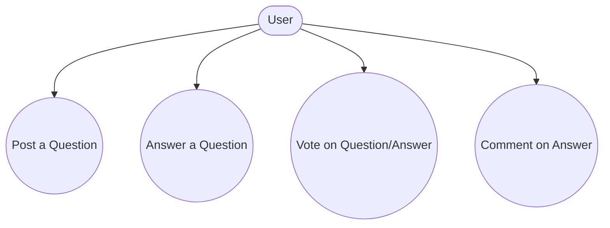
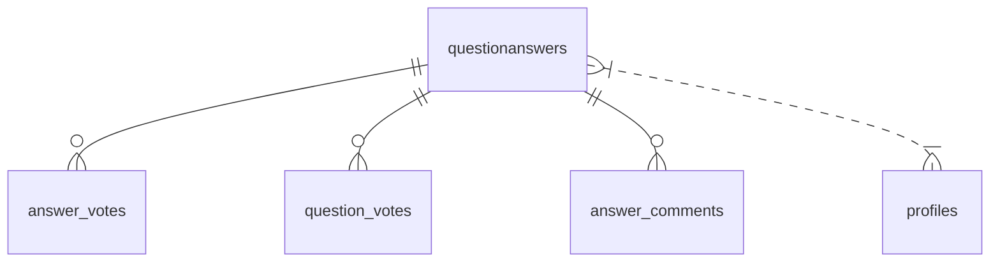

# QandA

## Introduction
The QandA page enables users to ask questions, provide answers, vote, and comment, building a collaborative knowledge base within the platform.

## Data Flow Diagram Context

## Use Cases Diagram Context

## Database Design

## Summary
The QandA page is central to community-driven knowledge sharing and interaction.

---

## AI-Powered Answer Generation

The Q&A module features integrated AI-powered answer generation using the Groq API. Users can:
- Instantly generate high-quality answers to questions
- Regenerate, copy, and rate AI answers
- Benefit from fast, cost-effective, and privacy-focused AI models

**Workflow:**
- Users request an AI-generated answer for any question
- The backend calls Groq API, stores the answer, and displays it in the Q&A interface
- Users can provide feedback, copy, or regenerate the AI answer

For setup and customization, see [AI Integration Setup](../AI_INTEGRATION_SETUP.md). 