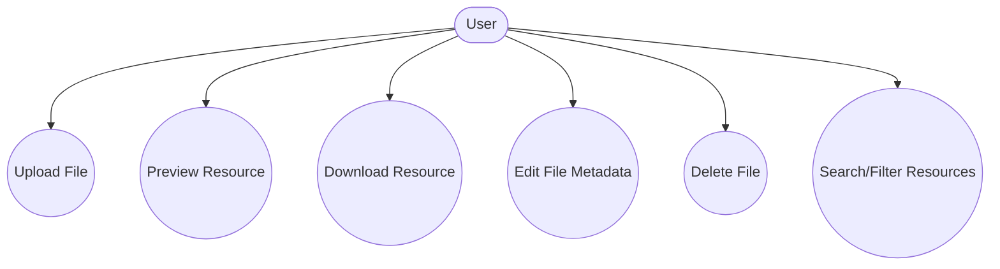

# Resources

## Introduction
The Resources page enables users to upload, share, preview, and manage files and documents, acting as a central library for the community.

## Data Flow Diagram Context

## Use Cases Diagram Context

## Database Design

## Summary
The Resources page is the platform's digital library, supporting secure and organized file sharing. 