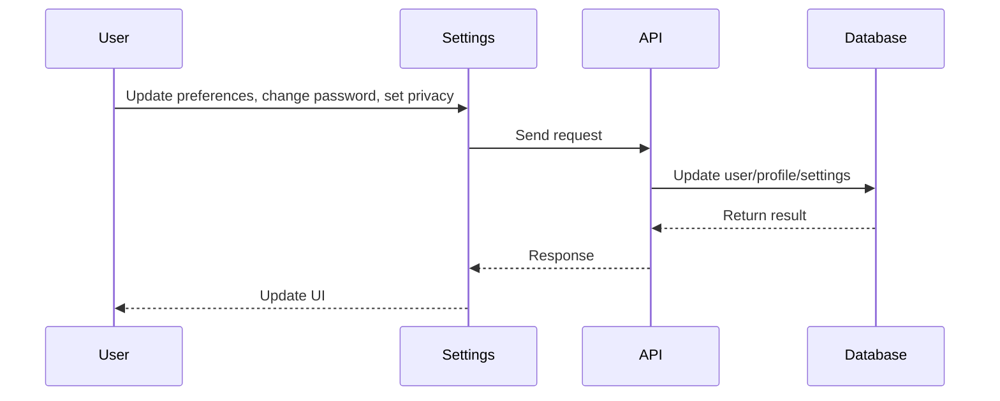
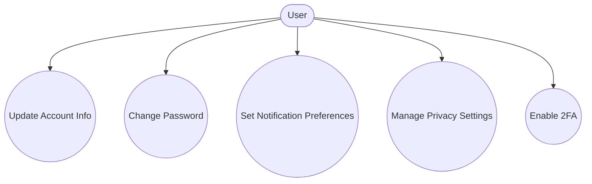
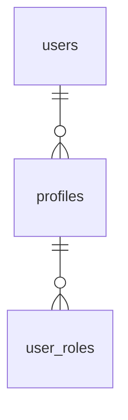

# Settings

## Introduction
The Settings page allows users to manage their account preferences, notification settings, privacy controls, and security options.

## Data Flow Diagram Context

## Use Cases Diagram Context

## Database Design

## Summary
The Settings page empowers users to personalize and secure their account experience. 