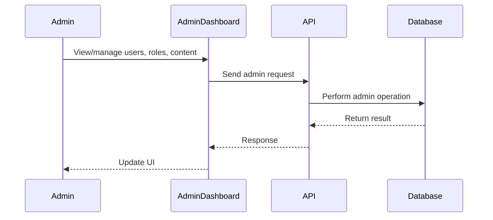
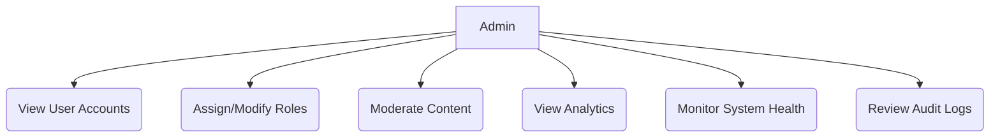
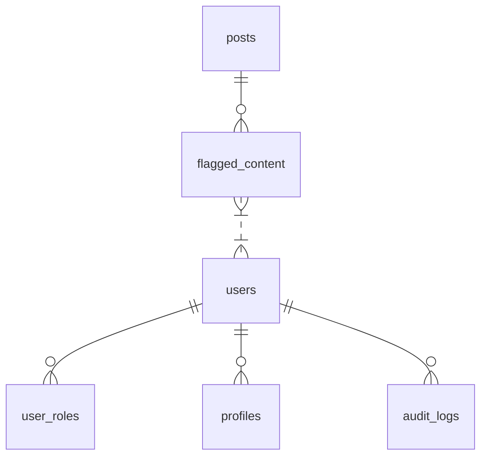

# Admin Dashboard

## Introduction
The Admin Dashboard provides administrators with tools to manage users, roles, content moderation, analytics, and system health for the platform.

## Data Flow Diagram Context

## Use Cases Diagram Context

## Database Design

## Summary
The Admin Dashboard is the control center for platform administrators, supporting user management, moderation, analytics, and system monitoring. 