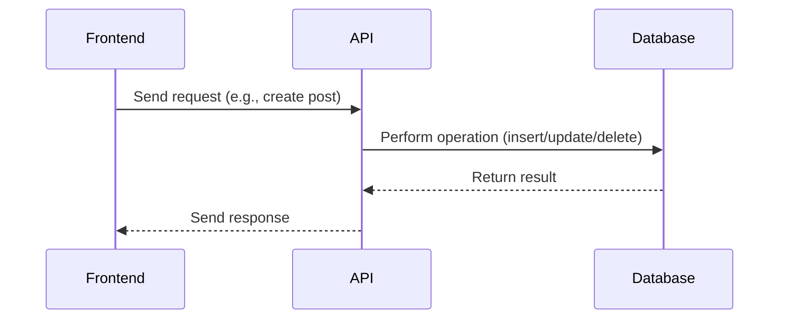
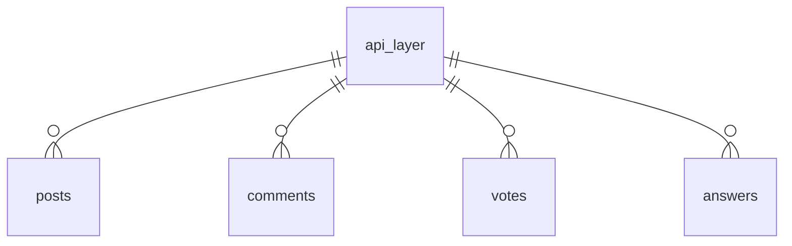

# API Layer

## Introduction
The API Layer acts as the bridge between the frontend application and the backend database, handling all data operations such as creating, reading, updating, and deleting resources. It abstracts the complexity of direct database access and enforces business logic and security.

## Data Flow Diagram Context


## Use Cases Diagram Context
```mermaid
usecaseDiagram
  actor Frontend
  Frontend --> (Create Resource)
  Frontend --> (Read Resource)
  Frontend --> (Update Resource)
  Frontend --> (Delete Resource)
  Frontend --> (Integrate with External Service)
```

## Database Design


---
The API Layer ensures all data operations are secure, validated, and consistent across the application. 