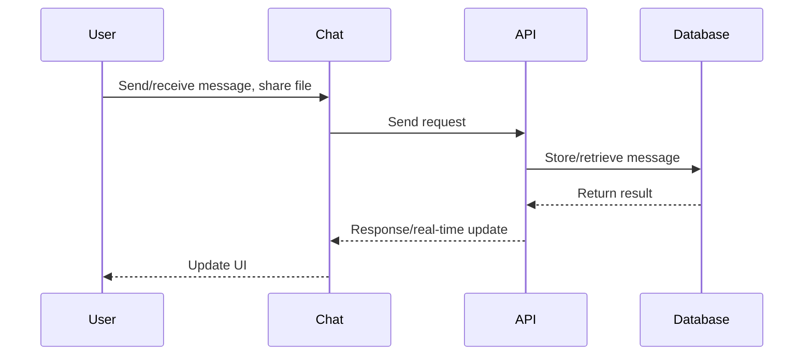

# Chat

## Introduction
The Chat page enables real-time messaging between users, supporting both direct and group conversations, file sharing, and presence indicators.

## Data Flow Diagram Context

## Use Cases Diagram Context
- User sends and receives messages in real time.
- User shares files in chat.
- User participates in group conversations.

## Database Design
- Tables: `chats`, `chat_members`, `chat_messages`, `profiles`.

## Summary
The Chat page powers private and group communication with real-time updates and file sharing. 