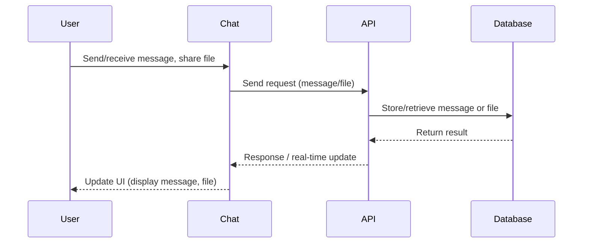
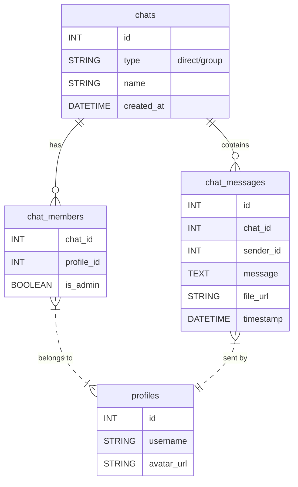

# Chat

## Introduction
The Chat page enables real-time messaging between users, supporting both direct and group conversations, file sharing, and presence indicators.

## Data Flow Diagram Context



## Use Cases Diagram Context
```mermaid
usecaseDiagram
  actor User
  User --> (Send Message)
  User --> (Receive Message)
  User --> (Share File)
  User --> (Join Group Chat)
  User --> (Leave Group Chat)
  User --> (See Online Status)
```


## Database Design



## Summary
The Chat page powers private and group communication with real-time updates and file sharing. 