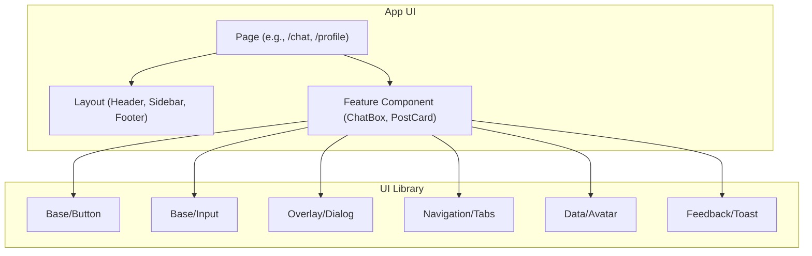

<summary><strong>Component Relationship (Click to expand)</strong></summary>




```bash
src/
├── components/
│   ├── ui/                  # Base UI components (from shadcn)
│   │   ├── button.tsx
│   │   ├── input.tsx
│   │   ├── dialog.tsx
│   │   ├── toast.tsx
│   │   └── ...
│   ├── shared/              # Composed utilities / reusable chunks
│   │   ├── AvatarWithName.tsx
│   │   └── FormFieldWrapper.tsx
│   ├── layout/              # App layout blocks
│   │   ├── Header.tsx
│   │   ├── Sidebar.tsx
│   │   └── Footer.tsx
│   ├── features/            # Page-specific component groups
│   │   ├── Chat/
│   │   │   ├── ChatBox.tsx
│   │   │   └── ChatBubble.tsx
│   │   ├── Profile/
│   │   │   └── ProfileCard.tsx
│   └── index.ts             # Barrel file to export all components
```

| Area            | Best Practice                                                                 |
|-----------------|-------------------------------------------------------------------------------|
| Reusability     | Use small UI units (`ui/`) inside shared or feature components                |
| Consistency     | Use `shadcn/ui` base components styled with Tailwind                          |
| Accessibility   | Favor `shadcn/ui` components for built-in a11y (e.g., modals, alerts)         |
| Variants        | Use Tailwind-based `variant` props (e.g., `variant="ghost"` for buttons)      |
| Theming         | Customize via `tailwind.config.js` and `className` composition                |
| Docs            | Document props/types in JSDoc or use Storybook/Ladle for live preview         |
| Testing         | Test shared components with `@testing-library/react` or `jest`                |
```

```tsx
import { Button } from "@/components/ui/button"

export default function DeleteDialog() {
  return (
    <>
      <Button variant="destructive">Delete</Button>
      <Button variant="ghost">Cancel</Button>
    </>
  )
}
```
