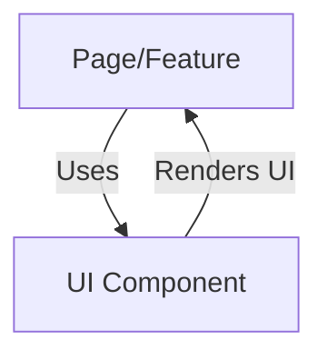

# UI Component Library

## Introduction
The UI Component Library provides a set of reusable, accessible, and customizable building blocks for constructing the application's user interface. It ensures a consistent look and feel across all pages and features.

## Data Flow Diagram Context


## Use Cases Diagram Context
```mermaid
usecaseDiagram
  actor Developer
  Developer --> (Build Form)
  Developer --> (Display List)
  Developer --> (Show Dialog)
  Developer --> (Render Navigation)
  Developer --> (Provide Feedback)
```

## Database Design
_Not applicable: UI components do not directly interact with the database._

---
The UI Component Library is the foundation for a cohesive and user-friendly interface. 