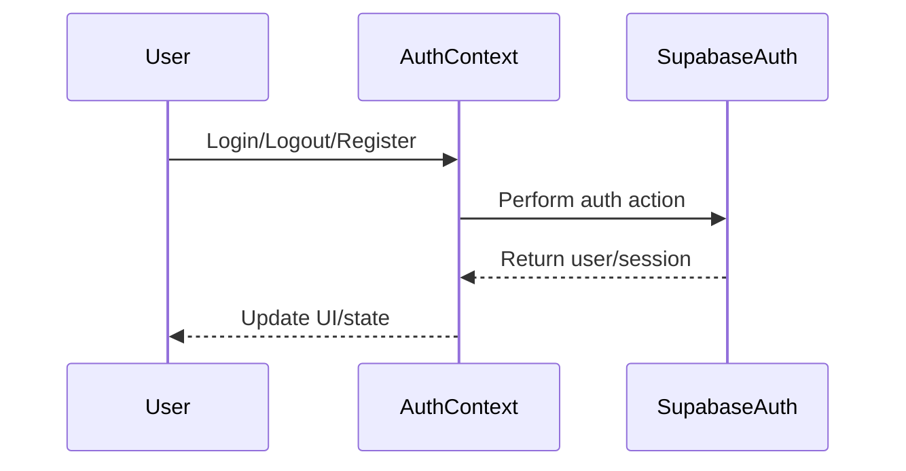
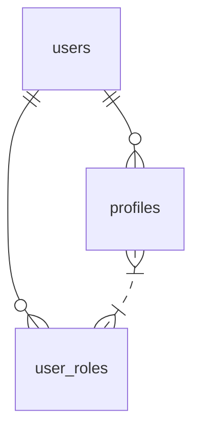

# Authentication Context

## Introduction
The Authentication Context manages user authentication state and provides user information and role-based access throughout the application. It ensures that only authenticated users can access protected resources and features.

## Data Flow Diagram Context


## Use Cases Diagram Context
```mermaid
usecaseDiagram
  actor User
  User --> (Login)
  User --> (Register)
  User --> (Logout)
  User --> (Session Persistence)
  User --> (Role-based Access)
```

## Database Design


---
The Authentication Context is the backbone of secure and personalized user experiences in the application. 