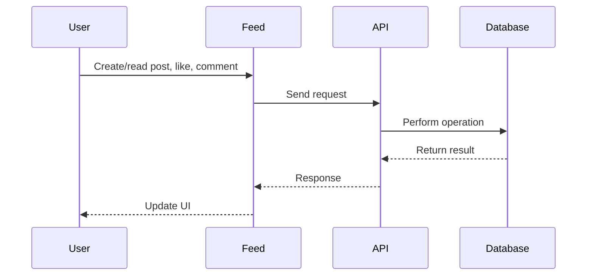

# Feed

## Introduction
The Feed page displays the social feed, allowing users to create posts, like, comment, and interact with content in real time.

## Data Flow Diagram Context

## Use Cases Diagram Context
- User creates a post.
- User likes or comments on a post.
- User views the feed.

## Database Design
- Tables: `posts`, `comments`, `likes`, `profiles`.

## Summary
The Feed page is the central hub for social interaction and content discovery. 