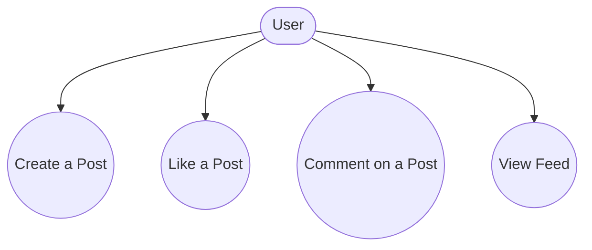
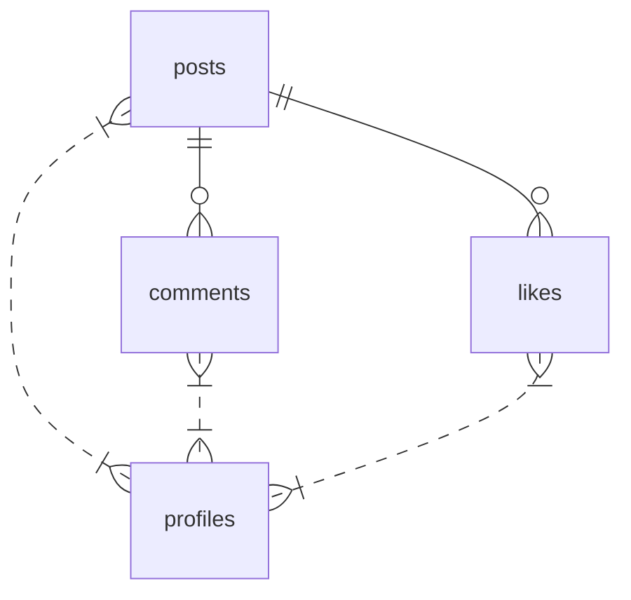

# Feed

## Introduction
The Feed page displays the social feed, allowing users to create posts, like, comment, and interact with content in real time.

## Data Flow Diagram Context

## Use Cases Diagram Context

## Database Design

## Summary
The Feed page is the central hub for social interaction and content discovery. 