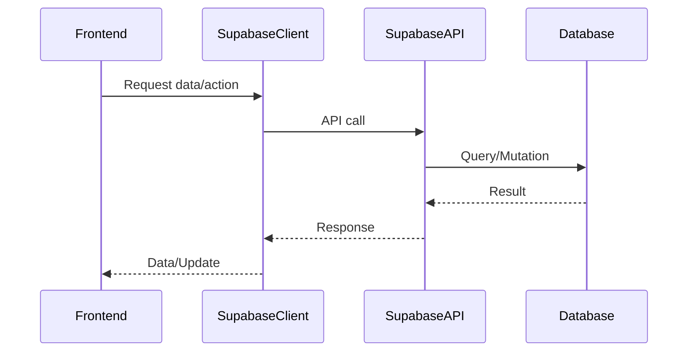
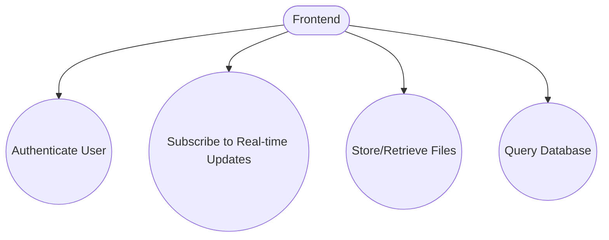
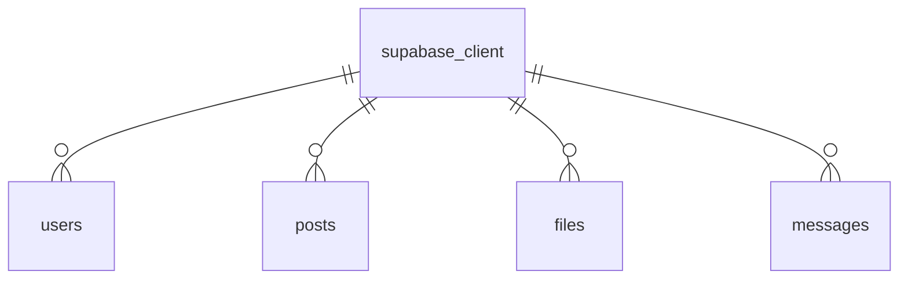

# External Integrations

## Introduction
External Integrations connect the application to third-party services such as Supabase for database, authentication, and real-time features. They enable the app to leverage powerful backend capabilities without building everything from scratch.

## Data Flow Diagram Context

## Use Cases Diagram Context

## Database Design

---
External Integrations are the foundation for scalable, secure, and feature-rich application development. 