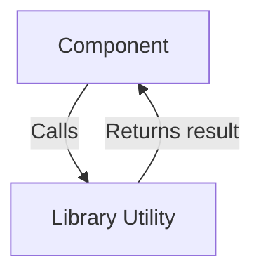

# Library Utilities

## Introduction
Library Utilities provide reusable helper functions and abstractions that simplify common tasks throughout the application. They help keep the codebase DRY (Don't Repeat Yourself) and maintainable.

## Data Flow Diagram Context


## Use Cases Diagram Context
```mermaid
usecaseDiagram
  actor Component
  Component --> (Format Data)
  Component --> (Handle API Error)
  Component --> (Transform Data)
```

## Database Design
_No direct database tables; utilities are used across modules._

---
Library Utilities are the building blocks that support the main features of the application, ensuring consistency and efficiency. 