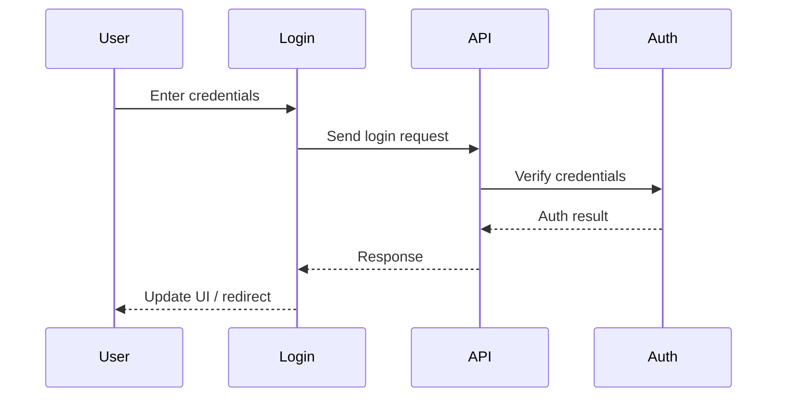

# Login

## Introduction
The Login page provides secure authentication for users, enabling access to protected features and personalized content.

## Data Flow Diagram Context

## Use Cases Diagram Context
- User logs in with email and password.
- User receives feedback on authentication success or failure.
- User is redirected to the main application upon successful login.

## Database Design
- Tables: `users`, `profiles` (for user lookup and session creation).

## Summary
The Login page is the gateway to the platform, ensuring only authorized users can access protected resources. 