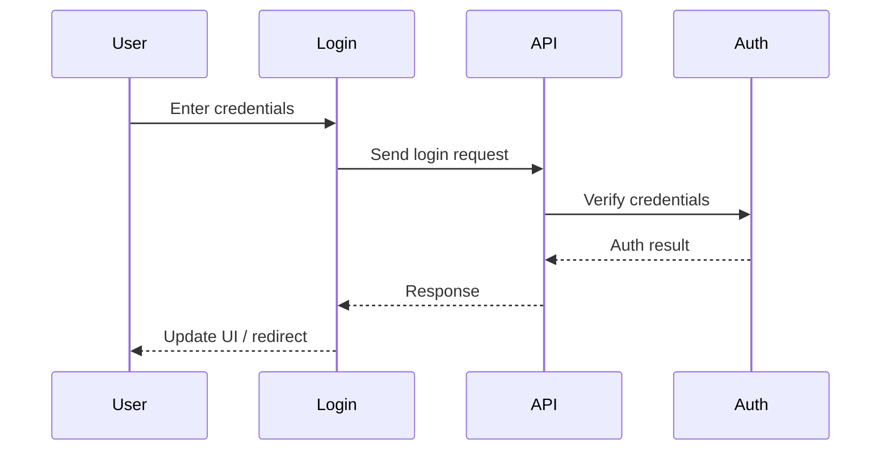
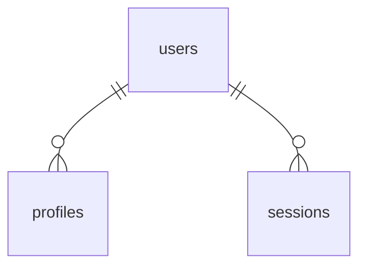

# Login

## Introduction
The Login page provides secure authentication for users, enabling access to protected features and personalized content.

## Data Flow Diagram Context


## Use Cases Diagram Context
```mermaid
usecaseDiagram
  actor User
  User --> (Login with Email/Password)
  User --> (Receive Feedback)
  User --> (Redirect to App)
```

## Database Design


## Summary
The Login page is the gateway to the platform, ensuring only authorized users can access protected resources. 