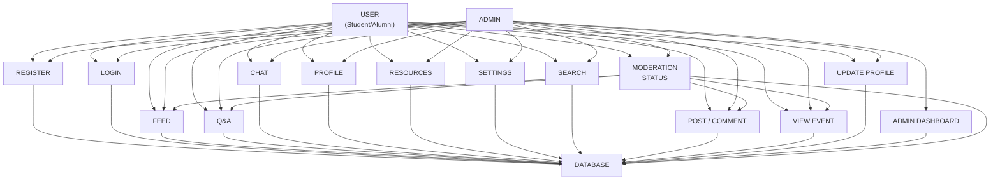

```mermaid

flowchart TD
    %% Actors
    User["USER<br/>(Student/Alumni)"]
    Admin["ADMIN"]

    %% Processes (Modules/Pages/Features)
    Register["REGISTER"]
    Login["LOGIN"]
    Feed["FEED"]
    QandA["Q&A"]
    Chat["CHAT"]
    Profile["PROFILE"]
    Resources["RESOURCES"]
    Settings["SETTINGS"]
    Search["SEARCH"]
    PostComment["POST / COMMENT"]
    ViewEvent["VIEW EVENT"]
    UpdateProfile["UPDATE PROFILE"]
    AdminDashboard["ADMIN DASHBOARD"]
    Moderation["MODERATION<br/>STATUS"]

    %% Data Store
    Database["DATABASE"]

    %% User Flows
    User --> Register
    User --> Login
    User --> Feed
    User --> QandA
    User --> Chat
    User --> Profile
    User --> Resources
    User --> Settings
    User --> Search
    User --> PostComment
    User --> ViewEvent
    User --> UpdateProfile
    User --> Moderation

    %% Admin Flows
    Admin --> Register
    Admin --> Login
    Admin --> Feed
    Admin --> QandA
    Admin --> Chat
    Admin --> Profile
    Admin --> Resources
    Admin --> Settings
    Admin --> Search
    Admin --> PostComment
    Admin --> ViewEvent
    Admin --> UpdateProfile
    Admin --> AdminDashboard
    Admin --> Moderation

    %% Process to Database
    Register --> Database
    Login --> Database
    Feed --> Database
    QandA --> Database
    Chat --> Database
    Profile --> Database
    Resources --> Database
    Settings --> Database
    Search --> Database
    PostComment --> Database
    ViewEvent --> Database
    UpdateProfile --> Database
    AdminDashboard --> Database
    Moderation --> Database

    %% Moderation Feedback
    Moderation --> PostComment
    Moderation --> Feed
    Moderation --> QandA
    Moderation --> ViewEvent

```