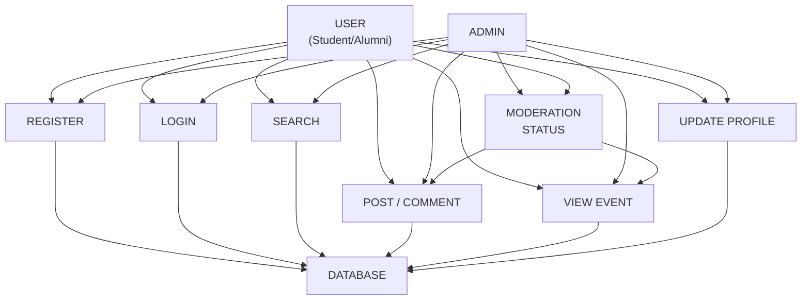

```mermaid

flowchart TD
    %% Actors
    User["USER<br/>(Student/Alumni)"]
    Admin["ADMIN"]

    %% Processes
    Register["REGISTER"]
    Login["LOGIN"]
    Search["SEARCH"]
    PostComment["POST / COMMENT"]
    ViewEvent["VIEW EVENT"]
    UpdateProfile["UPDATE PROFILE"]

    %% Data Stores
    Database["DATABASE"]
    Moderation["MODERATION<br/>STATUS"]

    %% Flows
    User --> Register
    User --> Login
    User --> Search
    User --> PostComment
    User --> ViewEvent
    User --> UpdateProfile

    Admin --> Register
    Admin --> Login
    Admin --> Search
    Admin --> PostComment
    Admin --> ViewEvent
    Admin --> UpdateProfile

    Register --> Database
    Login --> Database
    Search --> Database
    PostComment --> Database
    ViewEvent --> Database
    UpdateProfile --> Database

    Admin --> Moderation
    User --> Moderation
    Moderation --> PostComment
    Moderation --> ViewEvent

```