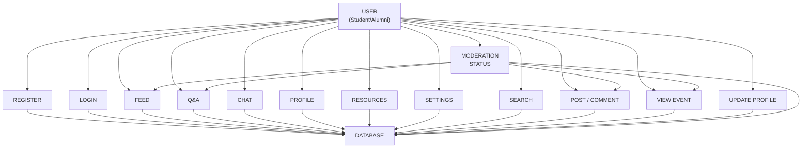

```mermaid
flowchart TD
    %% Actor
    User["USER<br/>(Student/Alumni)"]

    %% User Processes
    Register["REGISTER"]
    Login["LOGIN"]
    Feed["FEED"]
    QandA["Q&A"]
    Chat["CHAT"]
    Profile["PROFILE"]
    Resources["RESOURCES"]
    Settings["SETTINGS"]
    Search["SEARCH"]
    PostComment["POST / COMMENT"]
    ViewEvent["VIEW EVENT"]
    UpdateProfile["UPDATE PROFILE"]
    Moderation["MODERATION<br/>STATUS"]

    %% Data Store
    Database["DATABASE"]

    %% Flows
    User --> Register
    User --> Login
    User --> Feed
    User --> QandA
    User --> Chat
    User --> Profile
    User --> Resources
    User --> Settings
    User --> Search
    User --> PostComment
    User --> ViewEvent
    User --> UpdateProfile
    User --> Moderation

    Register --> Database
    Login --> Database
    Feed --> Database
    QandA --> Database
    Chat --> Database
    Profile --> Database
    Resources --> Database
    Settings --> Database
    Search --> Database
    PostComment --> Database
    ViewEvent --> Database
    UpdateProfile --> Database
    Moderation --> Database

    Moderation --> PostComment
    Moderation --> Feed
    Moderation --> QandA
    Moderation --> ViewEvent

```

```mermaid

flowchart TD
    %% Actor
    User["USER<br/>(Student/Alumni)"]

    %% User Processes
    Register["REGISTER"]
    Login["LOGIN"]
    Feed["FEED"]
    QandA["Q&A"]
    Chat["CHAT"]
    Profile["PROFILE"]
    Resources["RESOURCES"]
    Settings["SETTINGS"]
    Search["SEARCH"]
    PostComment["POST / COMMENT"]
    ViewEvent["VIEW EVENT"]
    UpdateProfile["UPDATE PROFILE"]
    Moderation["MODERATION<br/>STATUS"]

    %% Data Store
    Database["DATABASE"]

    %% Flows
    User --> Register
    User --> Login
    User --> Feed
    User --> QandA
    User --> Chat
    User --> Profile
    User --> Resources
    User --> Settings
    User --> Search
    User --> PostComment
    User --> ViewEvent
    User --> UpdateProfile
    User --> Moderation

    Register --> Database
    Login --> Database
    Feed --> Database
    QandA --> Database
    Chat --> Database
    Profile --> Database
    Resources --> Database
    Settings --> Database
    Search --> Database
    PostComment --> Database
    ViewEvent --> Database
    UpdateProfile --> Database
    Moderation --> Database

    Moderation --> PostComment
    Moderation --> Feed
    Moderation --> QandA
    Moderation --> ViewEvent

```