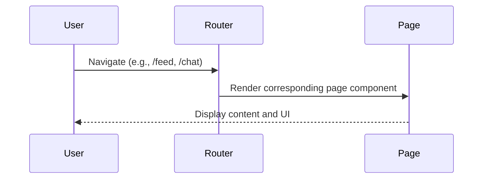
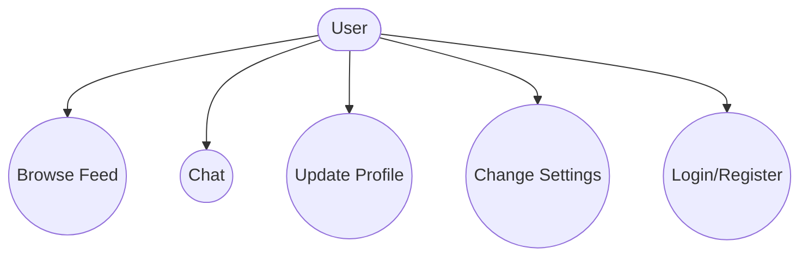
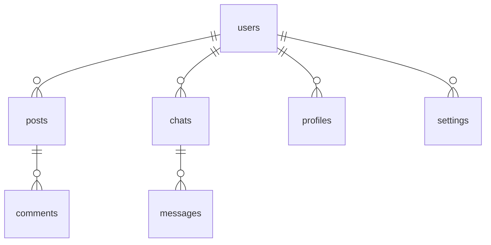

# Main Application Pages

## Introduction
The Main Application Pages represent the core user-facing screens of the platform, such as the feed, chat, profile, settings, and authentication flows. Each page is designed to provide a seamless and interactive experience, leveraging modular components and real-time data.

## Data Flow Diagram Context

## Use Cases Diagram Context

## Database Design

---
Main Application Pages are the entry points for all user interactions and workflows in the platform. 