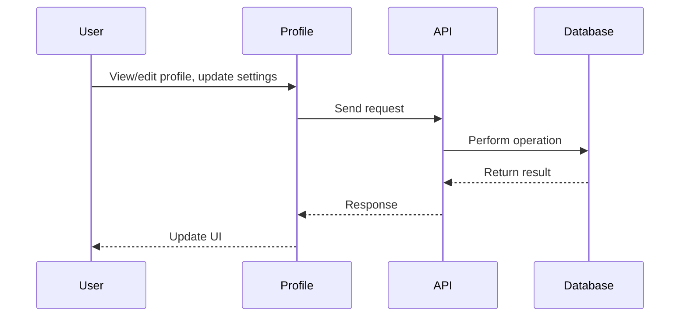
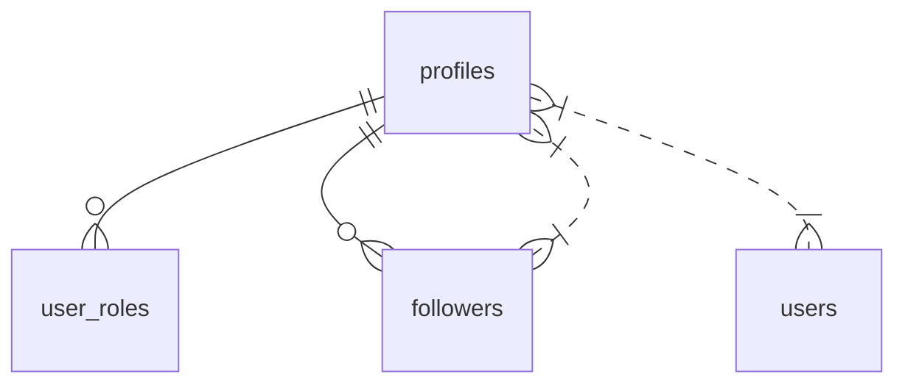

# Profile

## Introduction
The Profile page allows users to view and edit their personal information, manage privacy settings, and showcase their activity and achievements.

## Data Flow Diagram Context


## Use Cases Diagram Context
```mermaid
usecaseDiagram
  actor User
  User --> (View Profile)
  User --> (Edit Profile)
  User --> (Change Privacy Settings)
  User --> (Upload Avatar)
```

## Database Design


## Summary
The Profile page is the user's personal hub for managing their identity and presence on the platform. 