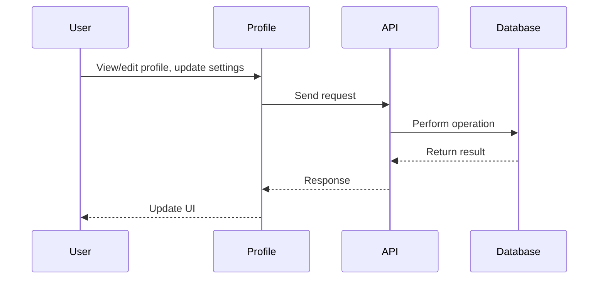

# Profile

## Introduction
The Profile page allows users to view and edit their personal information, manage privacy settings, and showcase their activity and achievements.

## Data Flow Diagram Context

## Use Cases Diagram Context
- User views their profile and activity.
- User edits personal information and privacy settings.
- User uploads an avatar or customizes their profile.

## Database Design
- Tables: `profiles`, `user_roles`, `followers`, `users`.

## Summary
The Profile page is the user's personal hub for managing their identity and presence on the platform. 