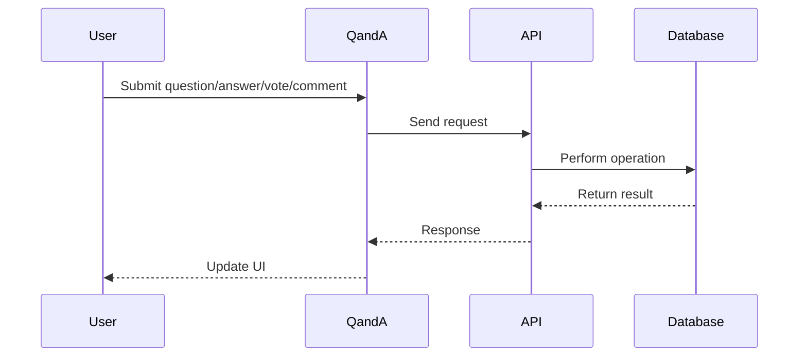
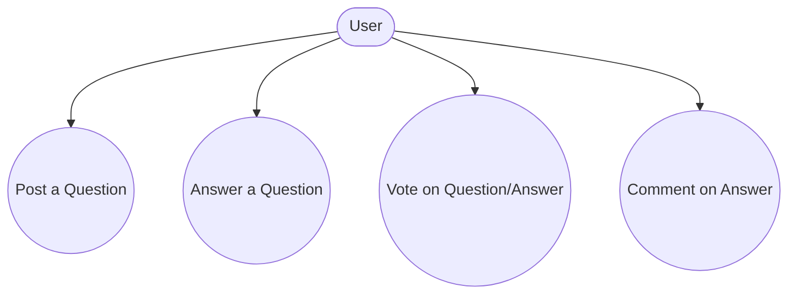
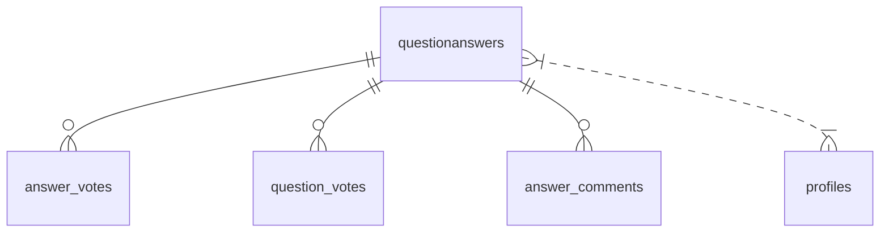

# QandA

## Introduction
The QandA page enables users to ask questions, provide answers, vote, and comment, building a collaborative knowledge base within the platform.

## Data Flow Diagram Context

## Use Cases Diagram Context

## Database Design

## Summary
The QandA page is central to community-driven knowledge sharing and interaction. 