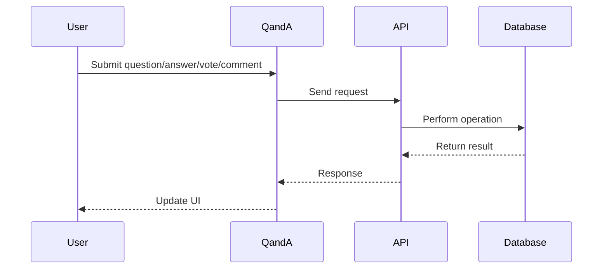

# QandA

## Introduction
The QandA page enables users to ask questions, provide answers, vote, and comment, building a collaborative knowledge base within the platform.

## Data Flow Diagram Context

## Use Cases Diagram Context
- User posts a question.
- User answers a question.
- User votes on a question/answer.
- User comments on an answer.

## Database Design
- Tables: `questionanswers`, `answer_votes`, `question_votes`, `answer_comments`, `profiles`.

## Summary
The QandA page is central to community-driven knowledge sharing and interaction. 