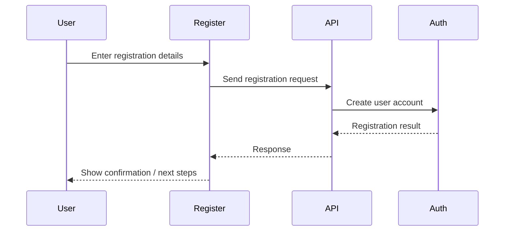
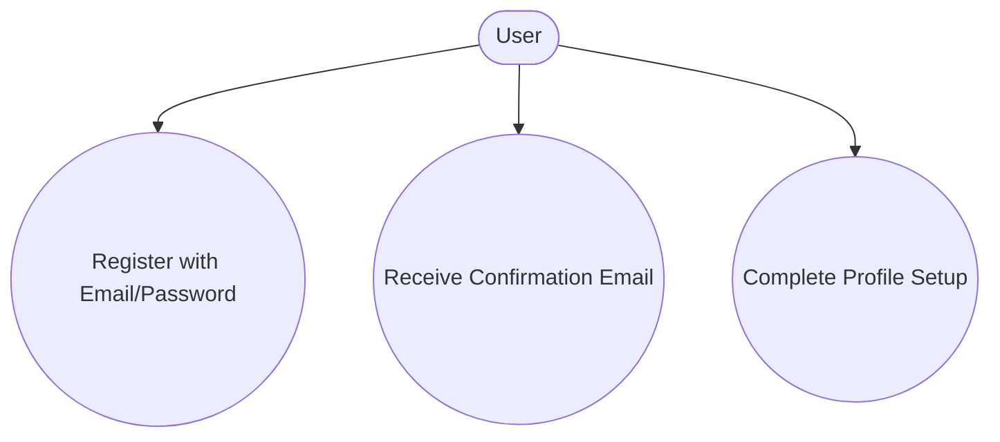
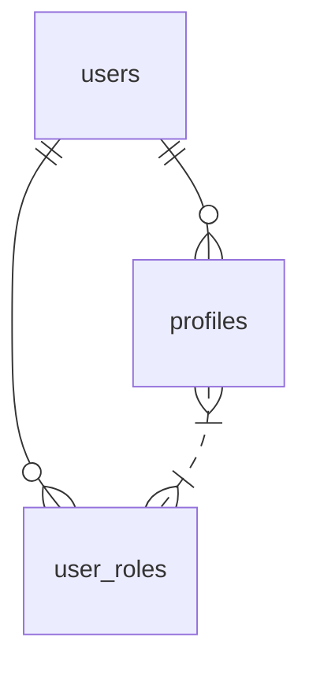

# Register

## Introduction
The Register page enables new users to create an account, providing secure onboarding and initial profile setup for the platform.

## Data Flow Diagram Context

## Use Cases Diagram Context

## Database Design

## Summary
The Register page is the entry point for new users, ensuring secure account creation and a smooth onboarding experience. 