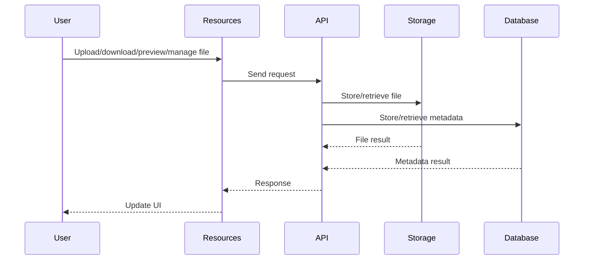

# Resources

## Introduction
The Resources page enables users to upload, share, preview, and manage files and documents, acting as a central library for the community.

## Data Flow Diagram Context

## Use Cases Diagram Context
- User uploads a file or document.
- User previews or downloads a resource.
- User edits metadata or deletes their own files.
- User searches and filters resources.

## Database Design
- Tables: `filemodels`, `profiles`, Supabase Storage buckets (e.g., `uploads`).

## Summary
The Resources page is the platform's digital library, supporting secure and organized file sharing. 