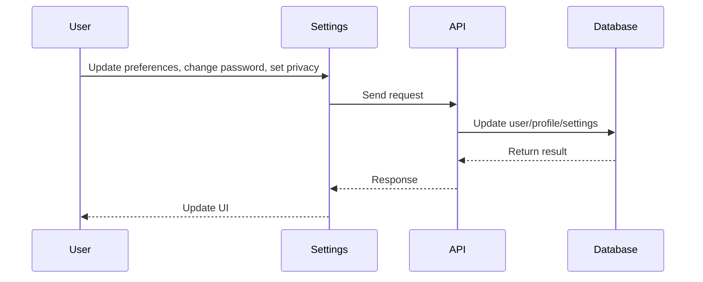

# Settings

## Introduction
The Settings page allows users to manage their account preferences, notification settings, privacy controls, and security options.

## Data Flow Diagram Context

## Use Cases Diagram Context
- User updates account information or password.
- User customizes notification and privacy settings.
- User manages security options (e.g., 2FA).

## Database Design
- Tables: `users`, `profiles`, `user_roles`.

## Summary
The Settings page empowers users to personalize and secure their account experience. 